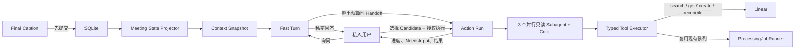

# LiveCaption Studio

## Private Meeting Assistant

> 当前源码中的私人会议助手已统一为标准插件 `com.matinier.meeting-assistant@1.0.0`，不再使用独立会议卡片。
> 用户从助手侧栏进入；安装/启用插件、显示侧栏、为本次字幕会话开启分析是三个独立动作。源码与隔离验收已完成，
> 当前本地运行环境仍待增量迁移、标准安装和受控重启，因此插件未出现在现有 `/plugins` 页面时不代表实现缺失。

Matinier 将现有实时字幕工作台扩展为**低存在感、证据可追溯的私人会议 Agent**。它不会
作为机器人在会议里主动插话：字幕和翻译继续实时运行，回答、建议和执行状态只展示给当前
用户；联网/任务查询由用户发起，外部写入必须来自显式的“执行到 Linear”操作和有界授权。

当前实现包含两条相互隔离、共享持久化底座的 Agent 路径：

- **Fast Turn**：低延迟私密问答；冻结 Meeting State Head、用户消息和最新尚未投影的
  Final tail，最多进行两轮模型决策，只能使用只读或本地工具。
- **Action Run**：持久化慢通道；使用 evidence、conflict、linear research 三个并行只读
  Subagent、Critic 和自主 Agent Loop 完成授权目标。不同 Action Run 可以并发、独立等待和恢复。
- **Fast → Slow Handoff**：快通道在预算内无法安全完成时，原子创建一个持久化 Action Run，
  保留 root/parent、Snapshot、证据和用户目标，不要求用户重新提交。
- **外部动作安全**：`ActionGrant` 约束目标、能力、Candidate、固定 Linear Team、最大 Issue 数和
  有效期；`ToolCall`、幂等键和外部 action claim 防止普通重试重复写入。
- **可审计证据**：Meeting State 和 ActionCandidate 保存字段级证据；Execution 使用不可变
  Context Snapshot，Frozen Package 创建后追加 Package/version/hash 映射而不改写历史。



首个外部平台为 Linear；通用 Web/数据库查询 Adapter、日历和邮件尚未接入。启用 Assistant
至少需要设置 `ASSISTANT_ENABLED=true` 和有效的 DeepSeek 配置；启用真实外部动作还需要
`TASK_SYSTEM_PROVIDER=linear`、`LINEAR_API_KEY`、`LINEAR_TEAM_ID`，并应只连接专用演示 Team。
服务启动前必须执行 `alembic upgrade head`；仓库当前 schema head 为 `20260831_0027`。

`GET /health/ready` 的 `assistant` 字段报告 Projector 新鲜度、Fast/Action 活跃数、Action
队列和最老排队时间、`unknown/reconciling` ToolCall、恢复 backlog 及 Task Adapter 可用性；
该探针不会向 Linear 或模型 Provider 发起请求。Assistant 生命周期日志使用 trace/root execution、
execution 和 tool call ID 关联持久 Trace，只包含状态、阶段、耗时、重试和错误码，不记录用户问题、
任务描述或密钥。

### Agent 实现与验收状态

截至 2026-09-02，自动化实现与本地验收已完成；真实浏览器和真实 Provider 仍需人工验收：

| 项目 | 状态 | 说明 |
|---|---|---|
| 12-case × 3 trials Agent Eval | 通过 | 36/36；Trace、路由、工具、证据、安全与恢复硬 Gate 全部通过（`scripted_local`） |
| 本地媒体全链路 | 通过 | 2/2；WAV 解码到 Fast→Slow、Fake Linear 和 recovery，Trace integrity 与 evidence join 均为 100%（`local_media_diagnostic`） |
| 后端全量回归 | 通过 | `815 passed, 4 skipped, 1 warning` |
| 前端 test / typecheck / build | 通过 | 17 个测试文件、120 项测试；TypeScript 与 Next production build 退出 0 |
| 一键离线演示 | 通过 | `meeting_agent_demo.cmd`：42/42 硬 Gate、36 条产品 Trace、2 条全链路 Trace、5 条面试故事 Trace |
| GitHub Actions workflow | 已编写，本地等价门禁通过 | 远端 workflow 尚未实际完成前，不能写“CI passing” |
| 真实 Linear 专用 Team | **待人工执行** | 自动化测试不会创建未经授权的真实 Issue |
| 浏览器 WebRTC 与两条页面演示 | **待人工执行** | 需要记录 Session/MediaSession/trace_id，不与离线指标混算 |

未知 `issueCreate` 的 reconciliation 现同时核对 action key 与规范化标题；未解析负责人会保留
原文并显示固定 UI 警告；直接 Action Run 会记录独立 `action.context_frozen`。协议无关
`ToolProvider` 已供现有任务系统使用，action-only 工具只允许慢 Agent。项目没有添加 MCP SDK、
MCP runtime、RAG、Memory 或 OTel；后续 MCP 只能作为慢路径 Provider 的可选实现。

指标、Trace 和简历边界见 [`docs/meeting-agent-case-study.md`](docs/meeting-agent-case-study.md)，发布清单见
[`docs/agent-product-release-checklist.md`](docs/agent-product-release-checklist.md)。两条人工面试演示、数据库预检、
单 Issue 限制和清理步骤见 [`docs/private-meeting-agent-operations.md`](docs/private-meeting-agent-operations.md)；完整设计与实现任务书见
[`docs/plans/2026-08-11-private-meeting-agent-design.md`](docs/plans/2026-08-11-private-meeting-agent-design.md) 和
[`docs/plans/2026-08-11-private-meeting-agent.md`](docs/plans/2026-08-11-private-meeting-agent.md)。

## 媒体助手插件框架

会议助手之上现有一层与场景无关的本地插件框架。字幕 Session 会旁路投影为通用
`MediaSession`/`MediaEvent`；会议、直播、普通音频和视频观看助手都可以作为独立 OCI 插件订阅
事件，而不进入字幕延迟关键路径。插件代码不在 API 或浏览器进程内执行，前端只渲染主机验证过的
声明式 `panel`/`overlay` 视图。

插件安装采用“检查 → 展示签名指纹和权限 → 明确确认”的两阶段流程。启用后的每个插件版本运行在
无网络、只读根文件系统、无 Linux capability、`no-new-privileges` 和资源上限约束的 Docker
容器中；媒体读取、状态、UI、网络和未来外部写入都只能走主机 Capability Broker。安装权限是
必要条件，`media.*`、网络及外部写入还要求短时、会话绑定、范围受限的 Grant。权限或 Grant
撤销后，下一次调用立即默认拒绝。

管理页面为 `/plugins`。直播控制台左侧活动栏可切换“直播空间”和“助手”；右上角“助手工作区”也会
就地展开侧栏，不再跳转离开采集页面。侧栏跟随当前字幕任务，可折叠、拖动调整宽度，隐藏时仍刷新，
切换多个已安装插件不会停止音轨。视图、表单状态和可信文档按 plugin ID 隔离。独立 `/assistants`
保留历史 Session 选择；侧栏的“历史工作区”、插件管理和文档下载均在新标签页打开。关闭或刷新原
采集标签页仍会停止采集，初次更新界面前请先停止旧采集。本地使用前至少配置随机
`PLUGIN_ADMIN_TOKEN`、启动 Docker Desktop，并运行 `alembic upgrade head`。插件 SDK、JSON Schema
和诊断示例位于 [`plugin-sdk`](plugin-sdk)；开发、
签名及兼容规则见 [`docs/plugin-authoring.md`](docs/plugin-authoring.md)，启停、恢复与回滚见
[`docs/plugin-operations.md`](docs/plugin-operations.md)，威胁模型见
[`docs/plugin-security.md`](docs/plugin-security.md)。

仓库内场景插件包括 `com.matinier.course-organizer` 和 `com.matinier.meeting-assistant`。本地开发实例设置
`PLUGIN_BUILTIN_BUILD_ENABLED=true` 和仓库外绝对 `PLUGIN_BUILTIN_WORK_DIR` 后，可在 `/plugins` 的
“项目内置插件”中依次检查、核对发布者指纹、接受精确权限、安装并启用；动态构建仍经过同一签名包和
二阶段安装边界，生产环境拒绝开启。离线发布仍可使用仓库外 Ed25519 私钥运行
`backend/scripts/package_course_organizer_plugin.py` 或 `backend/scripts/package_meeting_assistant_plugin.py`，再走普通上传检查流程。

会议插件启用后默认不分析任何会话。在助手侧栏选择会议助手并明确“开启本次会议分析”后，才补齐该会话
现有 Final 并继续增量处理；问答与标记不要求 Linear，只有选择待办并确认 Host 生成的团队、候选和预算预览
才会发起外部写入。取消不删除已经创建的任务，停用/卸载不删除 Host 历史，重新启用也不会重放旧外部动作。
它精确请求 `state.get`、`state.put`、`ui.publish`、`model.invoke`、`delivery.prepare`、
`delivery.query` 和 `document.publish` 七项权限；不请求 `network.fetch`，因此没有直接或代理联网
授权。课程播放期间插件只随 Final 原文/译文增量形成带媒体坐标的实时知识笔记，不持续生成最终
整理；用户点击“生成最终整理”产生 `interim` 版本，Session 正常结束后自动产生 `complete` 版本，
失败或取消则产生 `partial_terminal`。历史版本共存，Markdown/JSON 由可信 Host 路由下载。

文档语言默认优先采用首个实时译文语言，没有译文时采用源语言；用户可改为中文、英文或已观测到
的源语言，各语言维持独立文档 identity/version。标签页捕获只能提供字幕音频时间轴坐标，不读取
网页 DOM，也不承诺与外部播放器时钟逐帧一致、控制跳转或视频 seek。模型暂不可用时，实时面板保存
规则筛选笔记并显示 degraded 后有界重试；最终整理进入 `waiting_retry`，可自动重试或由用户再次点击。
最终文档只消费 Host 通过 `PackageBuilder` 从 Stage 1 Final 冻结出的 Package，并逐项校验 evidence。

课程插件 `1.0.3` 已修复真实字幕事件与交付证据 ID 不一致导致实时笔记未进入终稿的问题：使用 Host
提供的源 Segment ID 对齐原文/译文，无法确认来源的译文不猜测映射。旧版本状态和文档保留；受影响
的新版本状态从持久化事件重建。终稿模型处理按条数与字符数分批，避免一次返回过长而截断；终态重试
仍保留 `complete`/`partial_terminal` 语义，不降为手动的 `interim`。

当前边界是单 FastAPI 实例、单 SQLite 数据库和本机 Docker 隔离；不宣称多租户、横向扩展或比
已验证 Docker 配置更强的生产级沙箱。插件不能挂载项目目录、读取数据库/主机密钥、运行任意
HTML/JS/CSS，也不能自行联网。具体会议、直播或视频助手仍作为后续插件实现，本框架本身不内置
新的场景助手。

单机可演示的实时字幕工作台：浏览器音频、本地媒体或 M3U8 音频经 LiveKit 接入，Worker 调用百炼 ASR 生成 Partial/Final，并可并行调用百炼 LiveTranslate 生成目标语言字幕；Final 落库 SQLite，浏览器通过可靠 DataPacket 与 HTTP 快照消费原文/译文双轨字幕。也可调用 DeepSeek 生成只增不改、可追溯的整理版台本。

当前已完成阶段 0–6、Stage 1.5 稳定性收口，以及 Stage 2A–2F。Stage 1 已冻结；Final
可冻结为 Package，校对结果以不可变 Revision 保存并从 approved Revision 构建 Package
vNext。离线整理通过单进程后台 Job 消费 Frozen Package，并生成可追溯的 `clean_script` 与
`refined_translation`、`summary`、`chapter_outline` 与 `timeline_fact_review` Artifact；人工修改会
追加 reviewed 版本，批准新版本会 supersede 同 identity 的旧批准版本。尚不包含服务端文件上传
和最终 Delivery Artifact Bundle。

## 技术栈总览

| 层 | 技术 | 版本 / 说明 |
|---|---|---|
| 前端 | Next.js + React + TypeScript | Next `16.2.10`、React `19.2.7`、TS `6.0.3` |
| 实时客户端 | livekit-client | `2.20.2` |
| 后端 API | FastAPI + Uvicorn | FastAPI `≥0.116`、Uvicorn `≥0.35` |
| Worker | livekit-agents + livekit-api | Agents **钉死** `1.5.11` |
| 持久化 | SQLAlchemy + Alembic + SQLite | 默认 `backend/data/live_caption.db` |
| 实时媒体 | LiveKit Server（Docker） | 镜像 `livekit/livekit-server:v1.13.4` |
| 音频解码 | FFmpeg CLI | WAV/MP3 → 16 kHz / mono / PCM16 / 20 ms |
| 实时 ASR | 阿里云百炼 / DashScope | 默认 `fun-asr-realtime`（WebSocket） |
| 实时翻译 | 阿里云百炼 / DashScope | 默认 `qwen3.5-livetranslate-flash-realtime`（WebSocket，可选） |
| 台本整理 | DeepSeek Chat Completion | 默认 `deepseek-v4-flash`，JSON Output |
| 包管理 | uv（Python）、pnpm（Node） | Python `≥3.12,<3.14`；Node `≥20.9`；pnpm `11` |
| 测试 | pytest | 后端单元 / 纵向验收脚本 |

## 进程与数据流

FastAPI、Worker、Frontend 是三个独立应用进程；LiveKit Server 是本地实时媒体基础设施。

```text
Browser / Replay CLI / FastAPI HLS Publisher ──Audio Track──> LiveKit :7880 ──> Worker
                              ▲                │
                              │                ├──WebSocket──> 百炼 ASR
                              │                ├──WebSocket──> 百炼 LiveTranslate（可选）
                              │                └──Final 先写──> SQLite（原文/译文分表）
Browser / Next.js :3000
      ├──WebRTC / DataPacket (livecaption.events.v1)
      └──HTTP──────────────────> FastAPI :8000 ──读写──> SQLite
                                      └──HTTPS──> DeepSeek（显式整理）
Worker ──带 Token 的低频 abort 控制请求──> FastAPI ──强制回收──> HLS / FFmpeg
```

主链路约定：

1. Replay 向 Room 发布 `replay-audio` Track
2. Worker 聚合音频块 → 百炼实时识别
3. Partial/Final 按 segment + revision 原位修订
4. **Final 先提交 SQLite，再经可靠 DataPacket 发布**
5. 启用目标语言时，同一份 PCM 并行送入 LiveTranslate；翻译失败仅降级译文轨
6. 页面可无 RTC 恢复原文与译文 Final 快照；两类正式导出分别读取各自 SQLite Final

Session 状态机：

```text
created → starting → running → finalizing → completed
```

任意非终态可进入 `failed` / `cancelled`；三个终态不可回退。

## 目录结构

```text
Matinier/
├── backend/                 # FastAPI + LiveKit Worker + 领域逻辑
│   ├── app/
│   │   ├── api/             # Session / Token / 导出 / 整理版 / health
│   │   ├── worker/          # livekit-agents 入口与 Job 生命周期
│   │   ├── replay/          # FFmpeg 解码与回放时钟
│   │   ├── transcription/   # 百炼 ASR 适配与背压
│   │   ├── translation/     # 百炼实时翻译、修订与独立失败隔离
│   │   ├── captions/        # Partial/Final 修订与事件发布
│   │   ├── sessions/        # Session 状态机
│   │   ├── persistence/     # SQLAlchemy 模型与仓储
│   │   ├── timeline/        # 历史时间线
│   │   ├── export/          # JSON / SRT / VTT / Markdown
│   │   ├── packages/        # Stage 2A 冻结成果包、校验与 ZIP
│   │   ├── revisions/       # Stage 2B 校对快照、版本、批准与导出
│   │   ├── processing/      # Stage 2C Package Workflow 与异步 Job Runner
│   │   ├── artifacts/       # Stage 2C–2F 派生成果、人工版本与审批
│   │   ├── meeting_state/    # Final 增量投影、Mark、Candidate 与证据消息
│   │   ├── assistant/        # Fast/Slow 状态机、Handoff、Subagent、Tool 与恢复
│   │   ├── task_system/      # 平台无关任务域、Fake/Linear Adapter 与身份解析
│   │   └── text_processing/ # 通用 Structured Provider 与兼容解析器
│   ├── alembic/             # 数据库迁移
│   ├── tests/
│   └── pyproject.toml
├── frontend/                # Next.js 控制台
│   ├── app/                 # 页面入口
│   ├── components/          # Room 连接与字幕 UI
│   ├── lib/                 # API / captions 客户端
│   └── types/
├── docs/                    # 架构、API/事件合同、阶段记录
├── scripts/                 # 开发启动器与各阶段 verify / replay
├── docker-compose.yml       # 仅托管 LiveKit
└── .env.example
```

## 前端

- **框架**：Next.js App Router + React 19，无额外 UI 组件库
- **实时**：`livekit-client` 加入 Room，订阅 topic `livecaption.events.v1`
- **数据**：HTTP 拉取 Session / Final 快照 / Package / Revision / Job / Artifact；密钥不进浏览器
- **双语工作台**：源语种与目标语种独立选择，同屏显示 ORIGINAL / TRANSLATION 双轨字幕和翻译状态
- **后处理入口**：`/sessions/{sessionId}` 管理 Package/Revision，并创建、取消和查看整理 Job/Artifact
- **私人助手**：Room Studio 内显示 Meeting State 新鲜度、ActionCandidate、Mark、Ask/Execute、
  独立执行卡、NeedsInput、取消和 Linear 结果链接；不会把回答发布进 LiveKit Room
- **环境变量**：仅 `NEXT_PUBLIC_API_BASE_URL`（见 `frontend/.env.local.example`）
- **包管理**：pnpm `11.9.0`；TypeScript 锁定 `6.0.3`（与 Next 16 兼容路径相关）

## 后端

- **API 进程**：FastAPI 提供实时管理、确定性导出、Package/Revision、私人 Agent 与单进程后台 Artifact Job
- **Worker 进程**：`livekit-agents` 消费 Audio Track，并行驱动 ASR 与可选实时翻译，直写 Final，发布实时事件
- **内部控制面**：主 ASR 不可恢复失败后，Worker 调用不对前端开放的 source abort 接口；字幕事件仍只走 LiveKit
- **配置**：`pydantic-settings` 读取根目录 `.env`；缺关键 LiveKit 变量时启动即失败
- **依赖管理**：uv + `uv.lock`；运行命令形如 `uv run uvicorn ...`

### 后端模块职责

| 模块 | 职责 |
|---|---|
| `api` | HTTP 边界与 Token 签发 |
| `worker` | Room Job、Track 订阅、生命周期 |
| `replay` | FFmpeg 解码、帧时钟、Track 发布 |
| `transcription` | 百炼 WebSocket、100 ms 块聚合、背压队列 |
| `translation` | LiveTranslate WebSocket、译文修订、失败隔离 |
| `captions` | 原文/译文标准化事件、revision 修订、可靠发布 |
| `sessions` | 状态迁移与终态错误 |
| `persistence` | Session / Segment / Package / Revision / Job / Artifact 落库 |
| `export` | 四种源文/译文格式的确定性导出 |
| `packages` | Final → Frozen Package 的唯一边界、哈希校验与确定性 ZIP |
| `revisions` | Package 上的不可变校对、批准与 Package vNext |
| `processing` | Package-only Workflow 注册、证据校验与 asyncio Job Runner |
| `artifacts` | 派生成果、稳定 identity、人工版本、审批与证据持久化 |
| `meeting_state` | Final 增量投影、Mark、ActionCandidate、证据修订和新鲜度 |
| `assistant` | Context Snapshot、Fast Turn、Action Run、Handoff、Grant、Tool、Subagent 与恢复 |
| `task_system` | 平台中立任务模型、身份防错、去重策略及 Fake/Linear Adapter |
| `text_processing` | DeepSeek 通用结构化调用、分块与 JSON 解析 |

## 基础设施与外部服务

### LiveKit

- Compose 固定 `v1.13.4`，避免 `latest` 漂移
- 本地 `--dev`：`ws://localhost:7880` + `devkey` / `secret`（不可用于生产）
- 非本机 LiveKit 配置要求至少 32 bytes 的 API Secret；本地开发组合的 PyJWT
  短密钥提示会被定向忽略，不影响其他环境的安全校验
- 端口：`7880`（信令）、`7881`（TCP）、`7882/udp`（ICE）

### SQLite + Alembic

- Final Segment 是源字幕权威数据；译文写入 `translation_segments`；成果包与校对分别写入 `result_packages/package_documents`、`transcript_revisions`；后台任务和整理成果写入 `processing_jobs`、`derived_artifacts`；Meeting State、Agent Execution、Grant、ToolCall 和 Package Binding 使用独立持久化表
- `DATA_DIR` 默认为 `backend/data`；相对值始终按项目根目录解析，与进程工作目录无关
- `DATABASE_URL` 留空时，Settings 会生成指向 `DATA_DIR/live_caption.db` 的绝对 SQLite URL；显式旧式相对 SQLite URL 固定按 `backend/` 解析
- API、Worker 与 Alembic 共用同一 Settings 解析；文件库连接统一启用 WAL、`synchronous=NORMAL`、外键和 5 秒 busy timeout
- API 启动日志会记录脱敏后的绝对数据库位置与实际 PRAGMA，Worker 启动日志会记录同一脱敏位置
- 迁移：`uv run alembic upgrade head`（仓库当前 head 为 `20260831_0027`）

数据目录可在开发机和后续单实例容器中使用相同配置合同：

```dotenv
# Windows（正斜杠可避免转义歧义）
DATA_DIR=E:/LiveCaption/data
DATABASE_URL=

# Linux / 单实例容器挂载点
DATA_DIR=/data
DATABASE_URL=sqlite:////data/live_caption.db
```

两种写法最终都解析为绝对路径；SQLite 文件、WAL 和 SHM sidecar 位于同一目录。
同一根目录还固定包含 `exports/`、`logs/`、`reports/` 和 `worker-health/`；开发启动器
的 stdout/stderr 也写入 `DATA_DIR/logs/dev-<timestamp>`，不再新建仓库根运行目录。

### FFmpeg

- `FFMPEG_BIN` 默认为 `ffmpeg`，也可配置为绝对路径
- 输出合同：16 kHz、单声道、PCM16、20 ms 帧
- ASR 默认聚合为 100 ms 块；输入队列约 2 秒，满则硬失败（不静默丢帧）

### 百炼 ASR

- 凭据：`DASHSCOPE_API_KEY`、`DASHSCOPE_WORKSPACE_ID`、`DASHSCOPE_REGION`、`BAILIAN_ASR_MODEL`
- `BAILIAN_WORKSPACE_ID` 可作为 Workspace 兼容别名；勿与 `DASHSCOPE_WORKSPACE_ID` 同时设置
- WebSocket 默认直连，不继承系统代理；部署确需代理时显式设置 `DASHSCOPE_WEBSOCKET_PROXY_URL`
- 本地 Fake Provider 验收无需真实 Key

### 百炼实时翻译

- 使用与 ASR 相同的 DashScope 凭据；默认模型为 `qwen3.5-livetranslate-flash-realtime`
- Room 启动字幕前可选择目标语言；源语种与目标语种不能相同
- 原文和译文使用独立事件、状态与 SQLite 表；LiveTranslate 失败不会终止原文 ASR

### DeepSeek

- 凭据：`DEEPSEEK_API_KEY`（可选）；模型 `deepseek-v4-flash` / `deepseek-v4-pro`
- 仅服务端调用；生成失败不写半成品；不修改 Final 与源导出

## 能力边界（阶段 0–6）

| 阶段 | 能力 |
|---|---|
| 0 | 空房间连通、Session / Token、空 Worker、SQLite 骨架 |
| 1 | FFmpeg 固定文件实时回放、`replay-audio` Track |
| 2 | 百炼实时 ASR、块聚合 / 背压 / 归一化事件 |
| 3 | Partial 原位修订、Final 落库、快照恢复、实时字幕 UI |
| 4 | 历史时间线（可无 RTC）、JSON / SRT / VTT / Markdown 确定性导出 |
| 5 | DeepSeek 整理版（引用校验、版本历史、独立 Markdown） |
| 6 | 状态机 / 错误 / 超时统一、开发启动器、纵向验收 |

阶段 0–6 之后已追加实时双语字幕和 Stage 2 成果工作台。尚未实现：Draft 持久化、服务端上传、
多人协同编辑和分布式任务队列。供应商原始字段与凭据不得泄漏到字幕层、导出或浏览器。
`LOG_PROVIDER_PAYLOADS` 默认关闭；只应在受控本机环境中临时开启厂商原始响应日志，因为其中可能
含完整识别文本。

私人会议 Agent 是上述阶段之后的旁路能力：当前支持 Meeting State、Mark、ActionCandidate、
Fast Turn、Action Run、Fast→Slow Handoff、Linear search/get/create/reconciliation、Frozen
Package Binding 和复用 ProcessingJobRunner。当前不支持通用联网搜索、数据库查询、日历、邮件、
Standing Grant、Assistant TTS 或向会议参与者广播 Agent 回答。

更细的架构与事件合同见：

- [`docs/architecture.md`](docs/architecture.md)
- [`docs/api-events.md`](docs/api-events.md)
- [`docs/stage-records.md`](docs/stage-records.md)

## 关键约束

- **Python 3.12**；`livekit-agents==1.5.11`。`1.6.x` 在 Windows 中文路径加载 `livekit-local-inference` 可能触发 access violation
- LiveKit 本地 `devkey` / `secret` 仅用于开发
- Final **幂等先提交再发布**；导出/历史只读 Final
- 服务端密钥只放根目录 `.env`，禁止写入 `frontend/.env.local` 或 `NEXT_PUBLIC_*`

## 快速启动

### 环境要求

Python 3.12、[uv](https://docs.astral.sh/uv/)、Node.js ≥ 20.9、pnpm 11、Docker Desktop（或可用的 LiveKit）、FFmpeg。

### Windows 一键演示（推荐）

完成下面的“首次配置”后，直接双击根目录的 `start_demo.cmd`，或在
PowerShell 中运行：

```powershell
.\start_demo.cmd
```

启动器会自动检查并按需启动 Docker Desktop，启动本地 LiveKit，执行数据库
迁移，监督 API、Worker、Frontend 三个进程，等待健康检查通过后打开
[http://127.0.0.1:3000](http://127.0.0.1:3000)。

保持启动器窗口开启；按 `Ctrl+C` 会精确停止本次启动的三个应用进程。如果
LiveKit 原本没有运行，启动器还会一并执行 `docker compose down`；原本已在
运行的 LiveKit 不会被它关闭。启动器不会自动发送音频或调用百炼/DeepSeek，
打开页面后先创建或选择 Room。控制台会自动加入 LiveKit，并显示当前控制台
和字幕 Worker；随后可选择浏览器麦克风、标签页/系统音频、本地媒体文件或
公开 M3U8 直播流，点击“开始生成字幕”观察实时草稿和 Final 台本。

### Room 调试控制台

调试版以 Room 为长期空间，以 CaptionRun（后端继续复用 Session）表示一次
字幕任务。同一 Room 同时只运行一个字幕任务，任务结束后不关闭 Room，可继续
发起下一次任务。当前页面支持：

- 新建、选择、重命名和关闭 Room；
- 浏览器麦克风、Chrome 标签页/系统共享音频、本地音视频文件和公网 M3U8
  音频输入；
- 实时查看参与者、音视频轨道、Partial/Final 字幕和任务历史；
- 移除普通远端参与者，并导出当前任务的 JSON/SRT/VTT/Markdown 台本。

直播字幕现在会根据字幕栏的实际宽度、语言边界、标点和可用音频时长自适应
分句，每条最多两行；这只改变屏幕上的阅读节奏，不改写后端保存的 Final
字幕及其导出结果。高频 Partial 会先合并再刷新，匹配的 Final 原位替换，减少
逐字跳动和重复闪烁。

“Room 内字幕效果”标题右侧提供“悬浮字幕”开关。桌面版 Chrome 或 Edge 会
打开类似音乐软件歌词窗的 Document Picture-in-Picture 窗口：默认显示译文，
也可切换原文或双语，并可调整字号与背景透明度。没有启用译文或翻译失败时
会自动回退原文；关闭悬浮窗会同步关闭开关。悬浮窗依赖原控制台页面继续运行，
不提供原生无边框或鼠标穿透能力；不支持该浏览器能力时，页面会提示改用桌面版
Chrome 或 Edge。

标签页/系统音频依赖浏览器能力：在 Chrome 的共享对话框中选择标签页，并勾选
“共享标签页音频”。

M3U8 输入由 API 进程调用 FFmpeg 拉流，只提取音频并发布到 LiveKit，不在页面
播放视频。第一版仅支持无需 Cookie、登录、自定义请求头或 DRM 的公开
HTTP/HTTPS 地址；地址中的用户名、密码和私网目标会被拒绝，查询参数不会写入
数据库或普通日志。点击“停止输入”会正常收尾并保留字幕；强制取消或关闭 Room
则按取消处理。Session 业务终态与 HLS 资源状态相互独立：即使 Session 已进入
`failed/completed/cancelled`，停止接口仍会幂等调用 HLS Manager。主 ASR 失败时
Worker 使用 `INTERNAL_API_BASE_URL` 和 `INTERNAL_CONTROL_TOKEN` 请求 API 强制
回收 FFmpeg、Track、AudioSource 和 Publisher Room；
`INTERNAL_CONTROL_TIMEOUT_SECONDS` 必须大于 `HLS_STOP_TIMEOUT_SECONDS`。
开始前可用以下命令确认直播包含音频：

```powershell
ffprobe -v error -show_entries stream=index,codec_type,codec_name `
  -of json "<public-m3u8-url>"
```

API 重启不会自动恢复已中断的 M3U8 拉流，遗留任务会被标记为失败。RTMP、SRT
和 OBS Ingress 尚未接入。

若要在不申请浏览器媒体权限的情况下验证新轨道合同，可在服务运行时执行：

```powershell
backend\.venv\Scripts\python.exe scripts\verify_room_input.py `
  --file backend\tests\fixtures\demo_audio.wav
```

### 首次配置

```powershell
Copy-Item .env.example .env
Copy-Item frontend/.env.local.example frontend/.env.local

Set-Location backend
uv sync
uv run alembic upgrade head
Set-Location ..

Set-Location frontend
pnpm install --frozen-lockfile
Set-Location ..
```

私人 Assistant 默认关闭。仅演示私密问答时，至少配置：

```dotenv
ASSISTANT_ENABLED=true
DEEPSEEK_API_KEY=<your-key>
TASK_SYSTEM_PROVIDER=disabled
```

需要执行到 Linear 时，再改为以下配置。Team 和可选 Project 均由服务端固定，不能由 Planner
覆盖；请使用专用演示 Team，并确保其中没有上一次演示遗留的 Matinier Issue。

```dotenv
ASSISTANT_ENABLED=true
DEEPSEEK_API_KEY=<your-key>
TASK_SYSTEM_PROVIDER=linear
LINEAR_API_KEY=<dedicated-key>
LINEAR_TEAM_ID=<dedicated-team-id>
LINEAR_DEFAULT_PROJECT_ID=
```

启动器默认执行迁移。若手动启动，在启动 API 前确认：

```powershell
Set-Location backend
.\.venv\Scripts\alembic.exe upgrade head
.\.venv\Scripts\alembic.exe current
# 预期：20260831_0027 (head)
Set-Location ..
```

### 启动

```powershell
# 1. LiveKit（使用 start_demo.cmd 时可省略）
docker compose up -d livekit

# 2. API + Worker + Frontend（开发模式）
powershell -NoProfile -ExecutionPolicy Bypass -File scripts\start_dev.ps1
```

演示模式仅检查不启动：`scripts\start_dev.ps1 -Demo -CheckOnly`。普通开发模式
仅检查不启动：`scripts\start_dev.ps1 -CheckOnly`。POSIX：
`bash scripts/start_dev.sh`。

手动四终端顺序：LiveKit → `uv run uvicorn app.main:app --reload --port 8000` → `uv run python -m app.worker.entrypoint dev` → `pnpm dev`。

打开 [http://localhost:3000](http://localhost:3000)，创建 `file` Session 并连接；可用 `scripts/run_demo_replay.py` 向同一 Session 推送音频。

验收与排障脚本见 `scripts/`；阶段级细节以 `docs/` 为准。

## Stage 1.5 有界长稳诊断

`scripts/run_stage1_5_longrun.py` 用于生成可复核的 JSON 和 Markdown
报告，默认写入 `backend/data/reports/`。它只使用现有的本地媒体或
M3U8 输入边界，不是新的产品输入链路。

无云费用的短时预检示例：

```powershell
backend\.venv\Scripts\python.exe scripts\run_stage1_5_longrun.py `
  transport-only --duration-minutes 0.1 --source-type local-media `
  --source backend\tests\fixtures\demo_audio.wav

backend\.venv\Scripts\python.exe scripts\run_stage1_5_longrun.py `
  fake-provider --duration-minutes 0.1 --source-type local-media `
  --source backend\tests\fixtures\demo_audio.wav --with-translation `
  --inject duplicate-final --inject stale-partial `
  --fake-chunks-per-segment 60
```

可用的有界故障注入为 `duplicate-final`、`stale-partial`、
`translation-failure`、`asr-failure`、`slow-consumer` 和
`provider-timeout`。真实百炼验证只允许 3–10 分钟，必须显式加
`--allow-cloud`；未经云调用授权不应执行该模式。完整长时验收和真实
Provider smoke 属于 C4，不在常规单元测试中自动运行。

Fake 长测默认每 60 个 100 ms 音频块形成一个约 6 秒的 Segment，仍按
Partial v1、Partial v2、Final v3 经过 Reconciler、SQLite 和 LiveKit 事件边界；
可用 `--fake-chunks-per-segment 3..600` 调整。该参数只影响诊断 CLI，不改变
生产 Worker、百炼 Provider 或 Fake Provider 类本身的默认行为。

## Stage 2A 规范化成果包

`PackageBuilder` 是 Stage 2 离线域唯一允许读取 `sessions`、源字幕 Final 和实时译文
Final 的边界。构建成功后，Package 以 `frozen` 状态保存 manifest、七类文档及各自
SHA-256；重复构建创建新版本并把上一 frozen 版本标为 `superseded`，不修改旧内容。

```text
Stage 1 Final (SQLite)
    └── PackageBuilder
          └── Frozen Canonical Transcript Package
                ├── source_raw / live_translation
                ├── timeline_index / evidence_index
                ├── session / provider / metrics snapshots
                └── on-demand deterministic ZIP + checksums
```

工作台的字幕任务记录提供“后处理”入口，也可直接打开
`http://127.0.0.1:3000/sessions/<session-id>`。Package API：

```text
POST /api/sessions/{session_id}/packages
GET  /api/sessions/{session_id}/packages
GET  /api/packages/{package_id}
GET  /api/packages/{package_id}/manifest
GET  /api/packages/{package_id}/export
POST /api/packages/{package_id}/validate
```

本地纵向验证（不调用百炼或 DeepSeek）：

```powershell
backend\.venv\Scripts\python.exe scripts\verify_stage2_package.py `
  --session-id <session-id> --output <temporary-package.zip>
```

ZIP 只在请求或显式验证时渲染，不作为内部处理输入，也不默认长期保存。

## Stage 2B 非破坏式字幕校对

后处理页在 Package 之上提供校对编辑器。首次创建 Revision 时复制 Package 的有效源文档；
修改文字、时间、合并或拆分后，“保存”始终创建新版本，不覆盖旧快照。合并与拆分使用新 UUID，
并由服务端强制检查全部 `source_segment_ids` 仍被保留。批准新版本时，同一 Session/源语言的
旧 approved Revision 变为 superseded。

```text
Frozen Package v1
    └── Revision v1 (saved)
          └── Revision v2 (approved)
                └── Frozen Package v2
                      ├── source_raw
                      ├── source_approved  ← effective source
                      └── timeline / evidence rebuilt from approved items
```

Revision API：

```text
POST /api/packages/{package_id}/revisions
GET  /api/sessions/{session_id}/revisions
GET  /api/revisions/{revision_id}
POST /api/revisions/{revision_id}/versions
POST /api/revisions/{revision_id}/approve
POST /api/revisions/{revision_id}/packages
GET  /api/revisions/{revision_id}/export?format=srt|vtt|markdown
```

工作台支持原始 Final 对照、校对文字和时间、相邻项合并、单项拆分、版本历史、父版本差异、
恢复旧版本为新版本、批准、Revision 导出和 Package vNext 构建。正式离线处理仍只消费构建后的
Frozen Package，不直接消费 Revision。

本地纵向验证（不调用百炼或 DeepSeek）：

```powershell
backend\.venv\Scripts\python.exe scripts\verify_stage2_revision.py `
  --session-id <session-id> --output <temporary-package.zip>
```

## Stage 2C–2F Package Processor、Artifact 与审核

FastAPI lifespan 持有 concurrency=1 的本地 asyncio Job Runner。创建任务立即返回 `202` 和
`job_id`；前端轮询状态，并在完成后加载 Artifact。Runner 只把 Frozen/Superseded Package
交给注册的 Workflow，Workflow 无权读取 `segments` 或 `translation_segments`。Registry 当前注册
`clean_script`、`refined_translation`、`summary`、`chapter_outline` 与
`timeline_fact_review`；DeepSeek 仅负责结构化模型调用，来源条目到 Segment ID、时间范围和证据
摘录的映射由服务端完成。精译以 effective source 为事实权威，匹配语言的 Package live
translation 只作为可缺省、可纠正的措辞参考；事实复核只判断 Package 内忠实度，不做 Web 搜索。

```text
Frozen Package
    └── Processing Job (queued → running → completed/failed/cancelled)
          └── Clean / Translation / Summary / Chapter / Fact Review Workflow
                + shared chunk/retry/strict JSON Provider boundary
                └── Derived Artifact vN
                      ├── pinned package version/content hash
                      ├── source_item_ids
                      └── server-derived segment IDs and time range
```

Job 与 Artifact API：

```text
POST /api/packages/{package_id}/jobs
GET  /api/packages/{package_id}/jobs
GET  /api/processing-jobs/{job_id}
POST /api/processing-jobs/{job_id}/cancel
GET  /api/packages/{package_id}/artifacts
GET  /api/artifacts/{artifact_id}
GET  /api/artifacts/{artifact_id}/export?format=json|markdown|srt|vtt
POST /api/artifacts/{artifact_id}/versions
POST /api/artifacts/{artifact_id}/approve
GET  /api/artifacts/{artifact_id}/history
GET  /api/packages/{package_id}/approved-artifacts
```

API 重启时遗留的 `queued/running` Job 会失败并记录
`error_code=api_process_restarted`；失败或取消不保存半成品 Artifact。旧
`/api/sessions/{id}/scripts` 路由标为 deprecated，内部已改走 Package/Job/Artifact；Alembic
`20260808_0016` 将历史 `processed_scripts` 映射到 `derived_artifacts`，旧表不再接收新写入；
`20260810_0017` 回填稳定 `identity_key`，并用 SQLite 部分唯一索引保证每个 Package/identity
最多一个 current approved。
`20260811_0018` 为无语言的 Package 文档增加 SQLite 部分唯一索引，补足 `NULL` 不受普通
唯一约束限制的问题；若历史库已有冲突文档，迁移会明确失败且不会静默删除数据。

凭据无关的纵向验证：

```powershell
backend\.venv\Scripts\python.exe scripts\verify_stage2_processing.py `
  --session-id <session-id>

backend\.venv\Scripts\python.exe scripts\verify_stage2_review.py
```

页面可创建清稿、精译、摘要、章节和目标 Artifact 事实复核任务，查看 Artifact 正文、identity
版本链、章节时间轴和事实支持状态，并点击证据跳转到 Frozen Package 有效源条目。用户可在证据
拓扑锁定的结构化编辑器中追加人工版本、批准、重新生成和导出单项成果；若输入 Package 已不是
Session 最新 Frozen 版本，页面保留成果并明确提示版本差异。下载统一由服务端确定性生成：清稿
支持 JSON/Markdown，精译支持 JSON/Markdown/SRT/VTT，其余 Artifact 支持 JSON。

处理验收器使用 Fake Structured Provider，一次验证五个 Workflow、导出、事实复核目标绑定、Job
状态、Artifact 持久化、Package 哈希、证据闭合和 Stage 1 Final 不变。审核验收器使用临时 SQLite
和真实 FastAPI 路由验证人工父链、批准唯一性、自动 supersede、跨 Package 隔离及旧 Package 可读；
两者均不调用百炼、DeepSeek 或 Web 搜索。

## 配置与健康检查

根目录 `.env` 是后端、Worker 和启动器的唯一服务端配置源；至少需要核对：

| 类别 | 配置键 |
| --- | --- |
| 部署 | `APP_ENV`、`PUBLIC_API_BASE_URL`、`CORS_ORIGINS`、`LOG_LEVEL` |
| LiveKit | `LIVEKIT_URL`、`LIVEKIT_API_KEY`、`LIVEKIT_API_SECRET`、`LIVEKIT_AGENT_NAME` |
| 持久化 | `DATA_DIR`、`DATABASE_URL` |
| 媒体 | `FFMPEG_BIN`、`MAX_REMOTE_STREAM_DURATION_SECONDS`、`REMOTE_MEDIA_CONNECT_TIMEOUT_SECONDS`、`REMOTE_MEDIA_READ_TIMEOUT_SECONDS` |
| 内部控制 | `INTERNAL_API_BASE_URL`、`INTERNAL_CONTROL_TOKEN` |
| 百炼 | `DASHSCOPE_API_KEY`、`DASHSCOPE_WORKSPACE_ID`、`BAILIAN_ASR_MODEL`、`BAILIAN_TRANSLATION_MODEL` |
| DeepSeek | `DEEPSEEK_API_KEY`、`DEEPSEEK_MODEL` |
| 私人 Agent | `ASSISTANT_ENABLED`、`ASSISTANT_FAST_*`、`ASSISTANT_ACTION_*`、`ASSISTANT_SUBAGENT_*`、`ASSISTANT_TOOL_TIMEOUT_SECONDS` |
| Meeting State | `MEETING_STATE_*` |
| Linear | `TASK_SYSTEM_PROVIDER`、`LINEAR_API_KEY`、`LINEAR_TEAM_ID`、`LINEAR_DEFAULT_PROJECT_ID` |
| 插件 Host | `PLUGIN_FRAMEWORK_ENABLED`、`PLUGIN_ADMIN_TOKEN`、`PLUGIN_CONTAINER_*`、`PLUGIN_MODEL_*`、`PLUGIN_DOCUMENT_MAX_BYTES`、`PLUGIN_DELIVERY_MAX_PAGE_ITEMS`、`PLUGIN_BUILTIN_BUILD_ENABLED`、`PLUGIN_BUILTIN_WORK_DIR` |

`APP_ENV=production` 会拒绝 localhost 的公开 API、LiveKit 和 CORS 默认值。浏览器只使用
`frontend/.env.local` 中的 `NEXT_PUBLIC_API_BASE_URL`，不得把上述 Secret 复制进去。

运行时探针：

```text
GET /health/live                  # API 进程存活
GET /health/ready                 # 上述检查 + Assistant 本地运行状态/队列/Projector/Adapter 配置
GET /internal/worker/health       # 需 X-Internal-Control-Token
GET /api/sessions/{id}/runtime    # 单 Session 数据链快照
```

readiness 不调用百炼、DeepSeek 或 Linear，因此 `task_adapter_available=true` 只表示本地配置与
Adapter 已装配，不代表刚刚完成了远端连通性探测。Worker 健康包含 `worker_alive`、
`livekit_connected`、`active_jobs` 和 `last_job_event_at`。

## 导出、真实 Provider 与故障注入

当前任务可下载源文或译文的 `json/srt/vtt/markdown`；正式文件只读取 SQLite Final：

```text
GET /api/sessions/{id}/export?format=vtt&content=source
GET /api/sessions/{id}/export?format=srt&content=translation
```

非终态导出会明确标为 partial。SRT 使用逗号毫秒，VTT 使用点号毫秒，全部为 UTF-8。

真实百炼只执行有限 smoke，且必须由操作者明确确认云调用：

```powershell
backend\.venv\Scripts\python.exe scripts\run_stage1_5_longrun.py `
  real-provider-smoke --duration-minutes 3 --source-type local-media `
  --source backend\tests\fixtures\demo_audio.wav --with-translation --allow-cloud
```

该命令不会被常规 pytest 自动触发。Fake Provider 和 transport-only 的命令见上一节；
故障注入保持有界，不通过无穷重试制造“稳定”假象。

## 已知限制与 Stage 2 后续边界

- SQLite 版本只支持 FastAPI 单实例和单个受控 Worker；不能横向扩容。
- M3U8 仅支持无需 Cookie、自定义 Header、登录或 DRM 的公网 HTTP(S) 音频源；RTMP、
  SRT 和 OBS Ingress 尚未接入。
- HLS Publisher 仍由 FastAPI 管理；API 重启不会恢复中断的直播拉流。
- 实时 Draft 不持久化；校对编辑器没有音频波形、多人协作、服务端上传或完整前端 RTL 布局。
- `DATA_DIR/exports` 是后续异步/对象存储导出的预留目录；当前下载由 FastAPI 从 SQLite
  即时生成，不额外落一份服务器文件。
- Job Queue 只存在于单个 FastAPI 进程内，默认并发 1；重启会明确终止遗留任务，不恢复执行。
- 当前 Processor Registry 注册五个 Stage 2C–2E Workflow；审核为单用户、整份 Artifact 快照版本，
  不支持多人协同或字段级合并。
- Assistant 与 Action Run 调度仍面向单 FastAPI 实例。崩溃、数据库锁、429/5xx、unknown、
  Grant 失效和并发同 action 已有本地故障测试与 Trace Gate，但尚未验证多实例调度。
- Linear reconciliation、身份提示和 `context_frozen` 已实现并自动验证；真实 Linear 专用 Team 的
  create/reconcile/cleanup 仍待明确授权后人工执行。
- 本地媒体诊断不经过真实浏览器 WebRTC、云 ASR、真实结构化模型或 Linear，因此报告时延只用于
  本机回归观察，不能作为真实服务 SLA。

Stage 2A–2F 已闭合。后续若继续扩展，应另行设计最终 Delivery Artifact Bundle、approved Artifact
聚合 ZIP、Package 导入和外部事实核验；当前版本不隐式提供这些能力。
