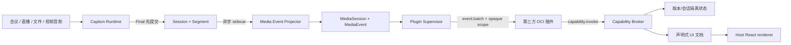

# LiveCaption Studio 架构

本文描述 Stage 1 Frozen、Stage 2A–2F 与 Private Meeting Assistant 的实际边界。系统面向单机演示和后续单实例容器：
浏览器、文件或公网 HLS 音频经 LiveKit 进入 Worker，百炼 ASR 和可选实时翻译产生
双轨字幕，Final 直接写 SQLite。Stage 2A 将 Final 冻结为可脱离实时运行使用的
Canonical Transcript Package；Stage 2B 在 Package 上创建不可变 Revision，并从批准版本构建
新的 Package；Stage 2C 建立 Package-only Job/Artifact 框架，Stage 2D 在同一框架执行清稿与
高质量精译并提供确定性导出，Stage 2E 增加基于 Package evidence 的摘要、章节和包内事实复核，
Stage 2F 增加 Artifact 人工快照版本和批准闭环。Private Meeting Assistant 作为 FastAPI 内的
旁路服务增量读取 Final，不阻塞字幕提交与发布；它提供私密 Fast Turn、持久 Action Run 和
显式授权的 Linear 任务动作。

## 部署进程边界

```text
Browser / Next.js (Frontend :3000)
    ├── WebRTC audio / DataPacket ───────────────┐
    └── HTTP snapshots / admin / exports ──┐    │
                                            ▼    ▼
                                      FastAPI :8000
                                      ├── SQLite ── Persistent Data Volume
                                      ├── HLS Publisher / FFmpeg
                                       ├── Package Builder / Validator / ZIP
                                       ├── Revision Service / Package vNext
                                       ├── Processing Job Runner ──> DeepSeek
                                       └── Meeting State / Assistant
                                           ├── Structured Planner ──> DeepSeek
                                           ├── Task Adapter ────────> Linear（可选）
                                           └── Typed Tool ─────────> Processing Job Runner
                                            │
                                            ▼
                                      LiveKit Server :7880
                                            │ Audio Track
                                            ▼
                                      Worker process
                                      ├── 百炼 ASR
                                      ├── 百炼 LiveTranslate（可选）
                                      └── SQLite Final 直写
```

| 组件 | 主要责任 | 明确不负责 |
| --- | --- | --- |
| Frontend | Room 管理、实时双语字幕、Final 恢复、Package/Revision/Job/Artifact 工作台、私人 Assistant | 持有服务端密钥、保存权威 Final、向 Room 广播 Agent 回答 |
| FastAPI | Room/Session、快照、HLS、导出、Package/Revision、单进程 Artifact Job、Meeting State 与双通道 Agent | 实时 ASR、无授权外部写入 |
| Worker | Audio Track 订阅、ASR/翻译、revision 调和、Final 先提交再发布、Job 清理 | 历史查询和导出 |
| LiveKit Server | Room、Track、DataPacket、Worker Job 派发 | 业务状态和字幕持久化 |
| Persistent Data Volume | SQLite、exports、logs、reports、Worker 健康桥接 | 横向共享数据库语义 |

HLS Publisher 当前归 FastAPI 所有，不拆成第四个应用服务。开发启动器只监督
FastAPI、Worker 和 Frontend；LiveKit 可由 Docker Compose 或外部实例提供。

## 输入与字幕主链

支持三类产品输入：

1. 浏览器麦克风或标签页/系统共享音频直接发布 LiveKit Track；
2. 本地媒体由浏览器发布，Replay CLI 仍保留为无 UI 验证入口；
3. 公网 M3U8 由 FastAPI 校验 URL 后，以 argv 方式启动 FFmpeg，只抽取音频并发布 Track。

Worker 将 20 ms PCM 帧聚合为有界 ASR 块。同一份 PCM 可并行进入源文 ASR 和
LiveTranslate；译文失败只把 Translation 标为 failed，不把主 Session 改成 failed。

Session 正常状态为：

```text
created -> starting -> running -> finalizing -> completed
```

任意非终态可进入 `failed` 或 `cancelled`。Source 使用独立
`starting/running/stopping/stopped/failed/lost`，Translation 使用独立
`disabled/starting/running/completed/failed`，三类状态不能互相代替。

## revision、持久化与恢复

调和器按稳定 `segment_id` 和递增 revision 接受 `Partial -> Partial -> Final`：

- Draft 只通过可靠 DataPacket 发布，不写 SQLite；
- Final 先幂等提交 SQLite，提交成功后才发布；
- 源文 Final 位于 `segments`，译文 Final 位于 `translation_segments`；
- 页面采用快照与实时事件合并，刷新后从 SQLite 恢复 Final；
- JSON/SRT/VTT/Markdown 源文和译文导出均只读取各自 SQLite Final；
- 运行中导出明确标记为 partial，终态导出保持确定性。

Stage 2C 后 DeepSeek Provider 不读取任何数据库；CleanScriptWorkflow 只接收 Package
有效源文档，服务端按 source item 计算 Segment/时间证据后向 `derived_artifacts` 追加版本。
任何失败整体回滚，不修改源 Final、Package 或正式导出。

## Stage 2A 离线边界

`PackageBuilder` 是唯一可读取 `sessions`、`segments.status=final` 和
`translation_segments.status=final` 的 Stage 2 入口。它复用时间线归一化后一次性生成：

- `source_raw` 与按语言分组的 `live_translation`；
- `timeline_index` 与由源文服务器计算的 `evidence_index`；
- Session、Provider、Metrics 脱敏快照；
- canonical JSON 文档哈希、Package 哈希与 manifest。

构建在单个数据库事务中经历 `building -> frozen`；失败整体回滚。新版本不会覆盖旧内容，
上一 frozen 版本只发生生命周期变更为 `superseded`。后续离线 Processor 必须通过
PackageReader/Repository 读取 frozen Package，禁止再次直接查询 Stage 1 证据表。

ZIP 是 Package 的按需确定性序列化：固定文件顺序和 ZIP 时间戳，`checksums.json` 覆盖
其余全部条目。数据库 ID、文件路径和 ZIP 时间戳不进入 Package content hash。当前没有
Package 导入；内部处理读取数据库中的领域对象，不把 ZIP 当作唯一输入。

## Stage 2B Revision 边界

`RevisionService` 只通过 `PackageRepository` 读取 frozen/superseded Package 的有效源文档，
不查询 `segments` 或 `translation_segments`。`transcript_revisions` 中每行是完整、不可变的
校对快照；新保存版本用 `parent_revision_id` 指向来源版本。恢复旧版本同样创建新行。

服务端校验每个 Revision：

- 条目文字非空、item ID 为 UUID 且版本内唯一；
- 时间非负、`end_ms >= start_ms`，条目按时间排序；
- 每项至少引用一个 Package 来源 Segment；
- 引用不得包含外来 Segment，全部 raw source Segment ID 的联集不得丢失；
- 合并继承相邻项来源 ID，拆分项允许共享同一来源 ID。

SQLite 部分唯一索引保证同一 Session/源语言最多一个 `approved` Revision。批准新版本只改变
版本生命周期，不修改其内容或旧 Package。`PackageBuilder.build_from_revision` 接收 approved
Revision 与基础 Package，复制 `source_raw`、实时译文和脱敏快照，新增 `source_approved`，
并以 approved 文档重建 timeline/evidence；该路径不读取 Stage 1 Final。结果仍经过 Package
Validator、canonical hash 与单事务冻结，旧 Package 内容不变。

Revision 可独立确定性导出 SRT/VTT/Markdown，供人工复核；后续正式 Processor 仍必须先消费
由 approved Revision 构建的 Frozen Package，而不能直接把 Revision 当成处理输入。

## Stage 2C Processor 与 Job 边界

`PackageReader` 通过 Repository 加载并校验 frozen/superseded Package，向 Workflow 暴露只读
有效源文档。`ProcessorRegistry` 注册 Stage 2C–2E 的五个 Workflow；
Workflow 共享分块、重试与严格 JSON/Pydantic 输出边界，通用 Structured Provider 只负责模型
调用。Processor 不注入也不查询 Segment/Translation Repository。

`ArtifactService` 在同一事务内运行 Workflow、由 `EvidenceValidator` 将 `source_item_ids` 映射为
Package 内的来源 Segment ID 与时间范围，并在全部验证成功后写入 `derived_artifacts`。Artifact
固定记录输入 Package version/content hash；失败不产生半成品，重复生成只追加 Artifact 版本。

`ProcessingJobRunner` 由 FastAPI lifespan 启停，使用单进程 asyncio Queue，默认 concurrency=1。
POST 创建任务只持久化 `queued` 并立即返回，Worker 执行 `running -> completed/failed`，允许对
queued/running 做有限取消。进程重启把遗留任务统一改为 `failed`，错误码为
`api_process_restarted`；不引入 Redis、Celery 或另一套后台服务。

历史 `processed_scripts` 由 Alembic 迁为 `clean_script` Artifact；无法绑定既有 Package 时创建
可校验的 legacy Package，保留原始快照和 Markdown。旧 scripts API 仅作 deprecated 兼容，内部
读取/创建 Package、Job 与 Artifact，不再写旧表。

## Stage 2D 精译与导出边界

`RefinedTranslationWorkflow` 只把 Package effective source 视为事实权威。它可按目标语言读取
Package 内的 `live_translation` 文档作为非权威参考；参考不存在时仍可正常生成，参考与源文冲突
时必须以源文为准。目标语言、术语表、风格与上下文窗口经严格 options 校验并持久化，Artifact
版本按稳定 `package + identity_key` 隔离追加；精译 identity 为
`refined_translation:<language>`。

模型输出只允许引用 `source_item_ids`；`source_segment_ids`、起止时间和源文对照均由服务器根据
Package evidence 回填。`ArtifactExporter` 每次从 SQLite Artifact 即时、确定性生成文件，不落第二
份服务器副本：清稿支持 JSON/Markdown，精译支持 JSON/Markdown/SRT/VTT。导出器会覆盖模型正文
中的非权威时间和 Segment ID，并拒绝 evidence、目标语言或结构不一致的 Artifact。

后处理工作台按源文、实时译文参考、最终精译三栏展示，附 Package/模型/语言/来源条目/warnings
与版本历史。前端只构造 Job options 和服务端导出 URL，不在浏览器重新拼装权威字幕文件。

## Stage 2E 事实型 Artifact 边界

`SummaryWorkflow` 与 `ChapterOutlineWorkflow` 只允许模型返回正文及 `evidence_item_ids`。共享
`FactualEvidenceBuilder` 按 effective source 顺序规范引用，并由服务器补齐 time ranges、Segment ID
和 evidence excerpts。摘要在长 Package 分块后按原顺序稳定合并；章节还执行全局起始时间单调
校验，允许相邻或重叠但拒绝倒序，失败不保存 Artifact。

`TimelineFactReviewWorkflow` 只接受同一 Package 的 `summary`、`clean_script`、
`refined_translation` 或 `chapter_outline` 作为目标。目标 ID 和版本写入 options，关系同时写入
`parent_artifact_id`；Workflow 把目标拆为 Claims，并仅对 Package 内忠实度输出 supported、
partially_supported、contradicted、unsupported 或 ambiguous。supported 必须有 Package 证据；
unsupported/ambiguous 可无证据；contradicted 必须有冲突证据或明确说明。空证据权限只对该
Workflow 显式开放，目标 Artifact 不会被修改。

工作台可发起三类 Stage 2E Job，显示摘要证据、章节时间轴、事实状态/时间/摘录，并通过锚点跳转
到 Frozen Package 有效源条目。所有任务继续复用同一 Processor Registry、单进程 Job Runner、
Structured Provider 和 Artifact 仓储；系统没有 Web 搜索或外部事实核验路径。

## Stage 2F Artifact 审核边界

Artifact 版本使用稳定 `identity_key`：清稿、摘要和章节使用类型名；精译附目标语言；事实复核附
被复核 Artifact ID。`parent_artifact_id` 只表达模型/人工版本父链，不再兼任 identity。人工保存
始终追加 `created_by=human`、`status=reviewed` 的完整内容快照，原版本及其 Package 绑定不变。

人工编辑可修改正文、标题、摘要、说明、状态、备注和 warnings，但不能改变 source/evidence item、
Segment、时间范围、事实 claim/target 或复核目标。批准只接受 generated/reviewed；批准新版本会先把
同 Package/identity 的旧 approved 改为 superseded。SQLite 部分唯一索引
`uq_derived_artifacts_current_approved` 是并发冲突的最终兜底。

工作台读取 identity 历史并显示父版本、状态和 Package 哈希。若 Artifact 哈希与 Session 最新
Frozen Package 不同，只提示“该成果基于 Package vN；当前最新为 vM”，不删除、不改写且不自动
重算。清稿/精译保留各自文本与字幕导出，摘要/章节/事实复核提供完整 JSON 单项导出。本阶段没有
最终 Delivery Bundle、approved Artifact 聚合 ZIP、Package 导入、多人协同或外部事实核验。

## 数据与单实例限制

`DATA_DIR` 是唯一持久根目录：

```text
DATA_DIR/
├── live_caption.db
├── exports/
├── logs/
├── reports/
└── worker-health/
```

Windows 默认映射为仓库 `backend/data`；未来容器映射为 `/data`。SQLite 文件连接
启用 WAL、`synchronous=NORMAL`、外键和 5 秒 busy timeout。

当前部署限制是 FastAPI 单实例，Worker 单实例或受控单机进程；不支持 FastAPI/Worker
横向扩容，也不把 SQLite 放在多节点共享卷上。进入多实例部署前必须迁移 PostgreSQL，
并把 Worker 健康和 Job 协调从本地文件桥接迁到共享控制面。

## Private Meeting Assistant 旁路

Assistant 只读取已经提交的 Final Segment，并通过增量 Projector 维护 Meeting State Head、
Projection Offset、Mark 和 ActionCandidate。CaptionRuntime 不导入 Assistant/Meeting State，
因此 Final 的持久化和可靠发布路径没有同步模型调用。

```mermaid
flowchart LR
    Final["SQLite Final Segment"] --> Projector["MeetingStateProjector"]
    Projector --> Head["Meeting State Head + Candidate"]
    User["私人用户"] -->|"ask"| Fast["Fast Turn"]
    Head --> Snapshot["Immutable Context Snapshot"]
    Snapshot --> Fast
    Fast -->|"bounded response"| User
    Fast -->|"atomic Handoff"| Action["Durable Action Run"]
    User -->|"execute + ActionGrant"| Action
    Action --> Parallel["Evidence / Conflict / Linear Research"]
    Parallel --> Critic["Critic + Planner Loop"]
    Critic --> Executor["Typed Tool Executor"]
    Executor --> Linear["Linear search/get/create/reconcile"]
    Executor --> Jobs["ProcessingJobRunner"]
```



Fast Turn 与 Action Run 使用不同状态机，但共享 Execution、Step、Observation、ToolCall、Event、
Grant 和外部 action claim 等持久化表。Fast Turn 受 5 秒/两轮默认预算约束，只能使用只读或
本地工具；不能安全完成时只创建一个 Handoff。Action Run 由进程内 Scheduler 有界并发执行，
多个 root execution 互不替换，重启后根据持久状态恢复或进入 reconciliation/NeedsInput。

工具通过协议无关的 `ToolProvider -> ToolRegistration -> ToolRegistry` 边界进入 Host。Provider
只返回数量受限的类型化 `ToolSpec` 与 Adapter，不携带 transport、URL、command 或 server
配置。当前 TaskSystem 的 search/get/create 已通过该 Provider 边界注册，因此这条扩展缝处于
实际运行路径。`ToolSpec.allowed_profiles` 由 Fast Turn 的 planner 可见工具过滤和 ToolExecutor
最终执行门共同校验；外部写无条件收紧为 `action_run`，即使未来 Provider 自报更宽权限也不会
进入 Fast Turn。ToolCall、ExternalActionClaim 和 Subagent 均由显式状态迁移表与 expected-status
条件更新保护，终态不能回退或覆盖原结果。

未来接入 MCP 时只新增 Provider Adapter：MCP discovery、schema 获取与协议错误归一化属于该
Adapter；profile、effect、Grant、幂等键、外部写线性化边界和 reconciliation 仍由 Host 决定。
MCP Provider 必须只向慢速 `action_run` 暴露工具。当前运行不依赖 MCP，也不包含 MCP SDK、
server discovery、transport 或配置项。

外部写入只能由显式 `intent_mode=execute` 创建，并由 ActionGrant 固定目标、Capability、Candidate、
Linear Team、最大副作用数和过期时间。TaskSystemAdapter 隔离平台领域，当前实现仅注册 Linear；
Projector 不调用 Linear 或其他外部查询源。身份解析按 explicit ID、唯一 email、确认绑定和唯一精确
显示名依次执行，无法确定时保留原文占位，不做模糊自动绑定。

Context Snapshot 保留本次执行所见的 Meeting State、Final tail、用户输入和证据哈希。后续创建
Frozen Package 时，PackageBuilder 在同一事务内把尚未绑定的 Execution 映射到 Package
ID/version/hash 和 effective-source item；Package/Revision 更新不改写旧执行依据。

当前边界：通用 Web/数据库查询和尚未确定的 MCP 工具未接入；真实 Linear 与两条人工演示尚未
执行。unknown create reconciliation 已同时校验 action key、唯一结果和规范化标题；未解析身份
由结构化占位字段生成固定 UI 提示；直接 Execute 会单独记录 `action.context_frozen`，事件只含
snapshot ID、Meeting State version 和 evidence count。完整状态见 Private Agent
[设计文档](plans/2026-08-11-private-meeting-agent-design.md#21-当前实现与验收边界2026-08-13)。

## 健康与诊断

- `GET /health/live`：只证明 FastAPI 进程可响应；兼容入口 `GET /health` 保留。
- `GET /health/ready`：验证 Settings、LiveKit 必需配置、SQLite 读/写事务和所有持久目录
  的实际读写，并返回 Assistant runtime、Projector、队列和 Task Adapter 的本地状态；不调用
  百炼、DeepSeek 或 Linear。
- `GET /internal/worker/health`：需要内部控制 Token，返回 `worker_alive`、
  `livekit_connected`、`active_jobs` 和 `last_job_event_at`。
- `GET /api/sessions/{id}/runtime`：返回单个 Session 的 HLS、FFmpeg、Track、ASR、翻译、
  队列和 Final 计数快照。

Worker 主进程与 Job 子进程通过 `DATA_DIR/worker-health` 写小型原子状态文件；字幕、
音频帧和 Provider payload 不进入该桥接目录。

## 资源所有权与失败语义

| 资源 | 所有者 | 释放边界 |
| --- | --- | --- |
| HLS FFmpeg / AudioSource / Publisher Room | FastAPI HLS Manager | 正常停止、最大时长、Room 关闭、主 ASR abort、API shutdown |
| 浏览器 Track / Room | 浏览器控制器 | 用户停止、切换 Room、页面卸载 |
| Worker AudioStream / ASR / Translation | 单 LiveKit Job | Track 结束、用户停止、失败或 Job shutdown |
| Meeting State Projector / Action Scheduler | FastAPI lifespan | API shutdown；Action 状态持久化供下次启动恢复 |
| Assistant Context / Grant / ToolCall | SQLite 事务与持久状态机 | 终态保留审计记录，不随请求结束删除 |
| SQLite Session | API 请求或单 Track runtime | 每个事务/运行时 finally |
| API/Worker/Frontend 子进程 | 开发启动器 | Ctrl+C 或任一受管进程异常退出 |

主 ASR 失败时 Worker 通过带 Token 的内部 abort 请求让 FastAPI 回收 HLS 资源；翻译
失败不触发该主链 abort。所有 stop/close 都必须幂等，清理错误写入独立 cleanup 状态，
不能覆盖原始业务失败原因。

## MediaSession 与第三方插件 sidecar

插件框架不把会议语义写进 Host API。现有 caption `Session` 通过 durable bridge 映射到
`MediaSession`；Media Event Projector 在 Final 已提交后异步产生有序 `MediaEvent`。字幕发布不等待
Projector、插件或容器，因此插件不可用不会提高字幕延迟。



### 所有权与持久化

| 组件 | 所有权 | 持久事实 |
| --- | --- | --- |
| Media Event Projector | FastAPI lifespan | bridge offset、event sequence |
| Package Store | Host 管理面 | immutable package、签名、publisher trust、accepted permissions |
| Plugin Supervisor | FastAPI 单实例 | 进程/generation；binding、health、ack 持久化到 SQLite |
| Capability Broker | 每次已认证 RPC | invocation、grant、state、view、audit |
| Plugin container | 单个 `plugin_id@version` | 无主机挂载；只通过 RPC 访问 Host |
| UI renderer | Frontend | 不执行插件代码；只渲染服务端已校验 document |

一个启用的 package version 对应一个受监督容器，可承载多个 MediaSession 逻辑 binding。每个 binding
有随机 `session_scope`；scope 与 plugin identity、version、generation、media session 同时绑定。崩溃
先使旧 scope 失效，再按 crash-window/backoff 重启，`session.open` 从 durable ack 继续。

事件批次发送前更新 `last_delivered_sequence`，插件确认后更新
`last_acknowledged_sequence`。重复投递因此是允许且必须幂等的，Host 不把未确认批次误记为完成。
Projector 与 Supervisor 当前属于单实例所有权；SQLite/WAL 不提供跨主机租约。

### 包、协议和更新事务

包是含 `plugin.json`、OCI `image.tar`、`signature.json` 和可选 assets 的签名 ZIP。检查阶段验证
路径、链接、成员/字节上限、manifest、Host API、image/assets digest 和 Ed25519；确认阶段再次验证，
要求权限逐项一致并固定首次 publisher fingerprint，然后导入镜像。安装与启用分开。

容器通过 stdin/stdout newline JSON-RPC 2.0 运行：`plugin.initialize` → `session.open` →
`event.batch`/`command.execute`/`plugin.heartbeat` → `session.close`/`plugin.shutdown`。stdout 是协议专用，
stderr 才是日志。主机请求与响应有 line/message/pending/timeout 上限。

更新先安装候选版本并启动健康容器，再调用 `plugin.migrate_state`。Host 校验完整新快照，并在同一
数据库事务内写入候选版本状态和切换 preferred package。失败会停止候选且保留旧 preferred/state；
成功后，已打开 MediaSession 仍固定旧 version，新 binding 使用新 preferred。旧版本只有在没有
活动 binding 且运维明确处置时才可清理。

### Capability 与声明式 UI

Capability Registry 只允许 Host 注册 adapter。principal 来自受监督连接而不是插件 JSON；Broker
每次调用重新读取 accepted permission 和 Grant。`state.*`/`ui.publish` 是受限本地能力；
`media.*`、network effect 和未来 external_write 还要求未到期、未撤销、身份/版本/MediaSession/
scope/调用预算都匹配的短时 Grant。网络请求由 Host 执行并进行公网 DNS/redirect 校验，容器本身
始终 `--network none`。

插件 view 先从不可信 dict 解析为闭合 schema，限制组件、深度、节点、字符串、表格、options 与
actions。浏览器没有插件 bundle、webview 或 raw HTML 路径。`overlay` 可用于字幕伴随界面，
`panel` 用于完整助手面板；command 必须在 manifest 预声明并携带 expected view version。

### 课程整理参考插件

`com.matinier.course-organizer` 是框架上的第一个场景实现，不是 Host 内置特例。播放阶段仅在收到
`transcript.final`/`translation.final` 后异步更新实时知识笔记；字幕提交、LiveKit 发布和前端字幕
渲染都不等待插件或模型。默认输出语言采用首个已观测译文语言，否则退回源语言；显式切换语言会
追加该语言自己的文档版本，不覆盖其他语言。

用户命令触发 `interim`，`session.completed` 触发 `complete`，`session.failed/cancelled` 触发
`partial_terminal`。终稿链只能调用 `delivery.prepare/query` 取得由 `PackageBuilder` 从 Stage 1 Final
冻结的 Package，再通过 `document.publish` 逐项校验 evidence 后保存不可变 Markdown/JSON 文档。
模型不可用不会回写字幕：实时链先保存规则筛选结果并进入 degraded 有界重试，终稿链进入
`waiting_retry`。外部标签页的坐标来自捕获音频/字幕时间轴；Host 不读取课程网页 DOM，不控制播放
器或 seek，也不能保证该坐标与外部播放器时钟逐帧一致。

### Docker 信任边界与限制

容器参数固定包含 `--read-only --network none --cap-drop ALL --security-opt no-new-privileges`，以及
CPU、内存、PID 和 noexec/nosuid tmpfs 上限。没有项目、数据库、Docker socket、Secret 或任意主机
目录挂载；环境仅继承启动所需 allowlist。

此边界依赖受信任且已更新的 Windows/Linux、Docker Desktop/daemon 和容器内核，不是多租户或
形式化沙箱。进入多实例前需要 PostgreSQL、共享队列/租约与容器所有权协调。插件 authoring、运维
和完整威胁模型分别见
[`plugin-authoring.md`](plugin-authoring.md)、[`plugin-operations.md`](plugin-operations.md) 和
[`plugin-security.md`](plugin-security.md)。

## 安全与扩展边界

远程媒体只允许 HTTP(S)，DNS 和每次重定向后的最终地址必须是公网 IP；拒绝 localhost、
私网、link-local 和云元数据地址。连接、读取、重定向数和最大运行时长均有上限。
FFmpeg 永远使用参数数组，URL 查询串不写数据库或普通日志。

服务端 Secret 只存在根目录 `.env`；Frontend 只读取 `NEXT_PUBLIC_API_BASE_URL`。
Provider 原始 payload 默认不记录。Package 快照不保存密钥、完整 Provider payload 或
带查询参数的远程 URL。Processor 只消费已校验 Package，不得回读 Stage 1 Final 或直接处理
Revision；Job/Artifact 错误仅暴露稳定错误码与脱敏消息。

Assistant 的 DeepSeek/Linear 凭据同样只在服务端；Frontend 只能提交 Ask 或带可见范围的 Execute
请求。生命周期日志默认不包含用户问题、任务描述、隐藏推理、Provider 原始错误或 API Key。
