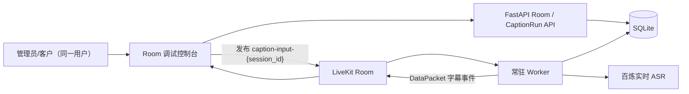

# Room 与输入流调试控制台设计

## 目标

把现有“先创建 Session、再旁观字幕”的演示页改造成以 Room 为中心的调试软件。单一用户同时拥有管理员和客户权限，可以创建、进入和关闭 Room，向 Room 发布音频输入，查看参与者与轨道，并在同一界面实时查看字幕和历史台本。

## 核心领域

- **Room**：长期存在的协作与传输空间，有稳定的 LiveKit room name，可被重复使用。
- **CaptionRun**：Room 内一次独立的字幕任务，继续复用现有 Session、Segment、导出和台本整理能力。
- **InputSource**：一次 CaptionRun 的音频来源。调试版支持浏览器麦克风、浏览器标签页/系统音频和本地媒体文件。
- **Participant / Track**：LiveKit 的运行时对象。控制台显示当前参与者与发布轨道，并允许管理员移除远端参与者。

一个 Room 同一时间只允许一个未结束的 CaptionRun；任务结束后，Room 保持连接并可继续创建下一次任务。

## 架构

## 页面交互

控制台采用三栏工作区：

1. 左栏是 Room 列表，支持新建、选择、刷新和关闭。
2. 中栏是直播工作区，显示连接状态、三种输入方式、当前任务状态、实时草稿与 Final 字幕。
3. 右栏是 Room 运行态，显示本地和远端参与者、轨道、任务历史，并提供移除参与者和导出入口。

输入启动流程：

1. 用户先选择浏览器输入并完成媒体授权。
2. 前端创建 CaptionRun。
3. 前端以 `caption-input-{session_id}` 作为轨道名发布音频。
4. Worker 从轨道名解析 Session ID，启动 ASR 并发布字幕事件。
5. 用户停止输入后，Worker 完成 ASR、固化 Final 字幕并结束本次 CaptionRun，但不退出 Room。

## API 与持久化

新增 `managed_rooms` 表，并在 `sessions` 增加可空的 `room_id` 外键。为允许一个 Room 拥有多个 CaptionRun，移除 `sessions.room_name` 的唯一约束；旧 Session 仍保持原有行为。

新增 API：

- `POST /api/rooms`
- `GET /api/rooms`
- `GET /api/rooms/{room_id}`
- `PATCH /api/rooms/{room_id}`
- `POST /api/rooms/{room_id}/close`
- `POST /api/rooms/{room_id}/token`
- `GET /api/rooms/{room_id}/caption-runs`
- `POST /api/rooms/{room_id}/caption-runs`
- `POST /api/rooms/{room_id}/caption-runs/{session_id}/cancel`
- `POST /api/rooms/{room_id}/participants/{identity}/remove`

## 兼容性与边界

- 保留原 `/api/sessions`、文件回放、导出和台本整理接口。
- 保留旧 `replay-*` 参与者和 `replay-audio` 轨道识别规则。
- 新浏览器输入仅依赖轨道名解析任务，不依赖参与者身份，因此用户可以在同一 Room 连续执行多次任务。
- RTMP、HLS、SRT 和 OBS Ingress 不在本调试批次中；后续可作为新的 InputSource 适配器接入，而不改变 Room/CaptionRun 模型。

## 架构决策记录

### ADR-001：Room 与 CaptionRun 分离

选择长期 Room + 短期 CaptionRun，而不是让一个 Session 等于一个 Room。这样 Room 管理、参与者管理和连续直播任务的语义清楚，历史台本也能按任务独立导出。

### ADR-002：浏览器直接向 LiveKit 发布调试输入

调试版让浏览器直接采集并发布音频，省去额外上传/转码服务，同时覆盖直播麦克风、标签页音频和本地文件三条最需要观察的交互链路。

### ADR-003：Worker 对 Room 常驻

新输入任务成功或失败只结束对应 CaptionRun，不关闭整个 Worker Job。旧文件回放仍保留一次性退出行为，以避免破坏既有验收链路。
