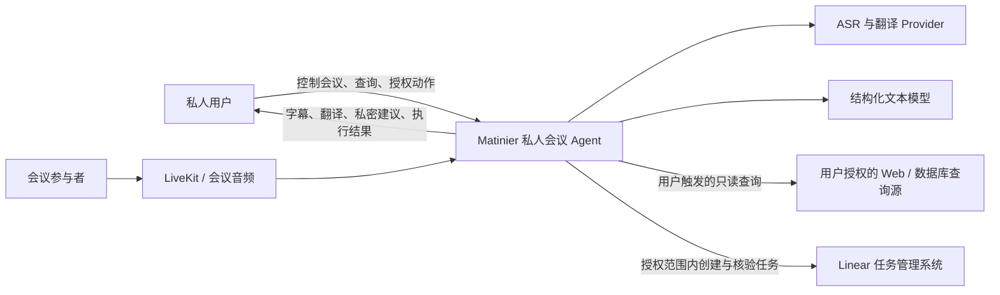
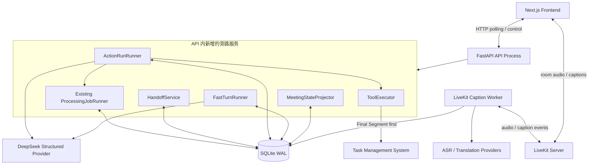
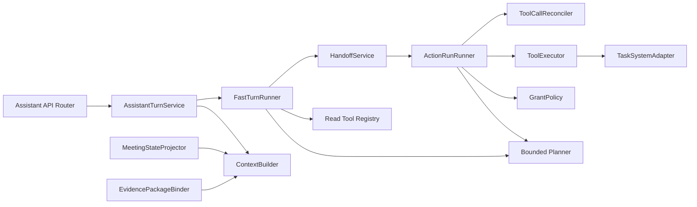

# Matinier 私人会议 Agent 架构设计

**状态：** 设计已确认，核心实现已落地；首个外部能力为 Linear 任务管理。真实 Linear 与两条
人工演示截至 2026-08-13 尚未执行，详见第 21 节。

**日期：** 2026-08-11

## 1. 背景与定位

Matinier 当前已经具备稳定的实时字幕、实时翻译、Final Segment 持久化、会后不可变 Package、Revision、Derived Artifact 和结构化文本处理流程。下一阶段不是把系统改造成一个会主动插话的会议参与者，而是扩展为低存在感的私人会议 Agent：会议中继续提供字幕和翻译，同时理解会议事项、保存重点、响应用户发起的私密查询，并在用户给定的授权范围内自主完成外部任务。

产品定义为：

> Evidence-grounded Private Meeting Agent：默认安静、证据可追溯、查询由用户发起、在授权范围内自主执行外部动作的私人会议助手。

Agent 的核心价值是围绕用户目标维护状态，选择证据，调用工具，观察结果，处理冲突或失败，直到任务完成或确实需要用户输入。ASR、翻译、摘要或固定 Prompt 流水线本身不算 Agent。

## 2. 范围

### 2.1 会中能力

- 实时字幕与翻译，沿用现有链路。
- 增量提取议题、决策、行动项候选、人物、时间和冲突。
- 手动标注与自动重点候选。
- 用户主动发起的联网或数据库查询。
- 用户发起目标后，在授权范围内创建外部任务。
- 私密呈现回答、风险提示和执行状态，不主动打断会议。

### 2.2 会后能力

- 将会中状态和执行证据重新绑定到 Frozen Package。
- 生成行动事项、重点、冲突和执行结果的可审计记录。
- 保留原始 Context Snapshot；Package 或 Revision 更新不能静默改写历史执行依据。

### 2.3 非目标

- Agent 不自主决定是否联网查询；查询必须由用户触发。
- Agent 默认不语音插话或代表用户发言。
- 不重写 LiveKit、ASR、翻译、Package 或 ProcessingJobRunner。
- MVP 不建设多租户身份、企业 OAuth 管理和分布式消息队列。
- MVP 不开放任务删除、批量修改、自动关闭等高风险能力。

## 3. 已确认的关键决策

1. 采用 Fast Turn 和 Action Run 双通道。
2. 两条通道拥有不同状态机，但共享持久化状态底座。
3. Fast Turn 是有严格时间和步骤预算的独立 Agent 执行，不等于严格的一次模型 HTTP 请求。
4. 外部写操作始终进入 Action Run；本地可逆操作和用户发起的只读查询可以留在 Fast Turn。
5. Fast Turn 无法完成时通过持久、原子 Handoff 提升为 Action Run。
6. A2A 第一版是进程内逻辑协议；HandoffEnvelope 保持可序列化，为未来拆分预留边界。
7. 会中的 Action Run 可以绑定 Live Context Snapshot；会后再追加 Frozen Package Binding。
8. Meeting State 通过 SQLite 增量轮询构建，不阻塞 Final Caption 热路径。
9. 用户授权目标和能力边界，Agent 在边界内自主选择证据、步骤和工具调用。
10. 第一个外部能力域为任务管理，先支持 search、get、create。

## 4. C4 Level 1：系统上下文



## 5. C4 Level 2：容器架构



MVP 保持当前单实例部署。新增服务由 FastAPI lifespan 启停，使用相同 Database 和 SQLite WAL；它们是代码组件而不是新微服务。未来只有在并发、隔离或独立扩缩容成为真实需求时才拆分。

## 6. API 内组件



### 6.1 MeetingStateProjector

- 每约 400ms 扫描 Final Segment 变更；该轮询只查询数据库，不等于每 400ms 调用一次模型。
- 使用 `(session_id, segment_id, processed_revision)` 幂等处理。
- 查询 `updated_at` 时保留约 2 秒重叠窗口，避免相同时间戳或旧段修订漏读。
- 只接收 Final Caption；Partial Caption 永远不进入 Meeting State。
- 每个 session 独立缓冲。累计 10 条 Final Segment、约 2,000 字符、最老待处理内容达到 4 秒、会议结束或收到高优先级 catch-up 请求时，任一条件满足即触发一次投影。
- 投影模型调用不持有数据库事务；只有模型输出通过校验后，才在同一短事务中更新 Head、Candidate Revision、offset 和 source frontier。失败时不推进 offset。
- Projector 使用独立并发上限 2，并在 session 间公平调度。高优先级 catch-up 优先；连续两个高优先级批次后，如存在普通批次，则执行最老的普通批次一次。
- 产出可重建的 Meeting State Head，不成为外部动作 Agent。
- Provider 失败时保留最后一个成功 Head，并按每个 session 独立的 1、2、5、10、30 秒退避重试；不影响字幕链路或其他 session。
- 会议结束时强制 flush 当前 session 的全部 Final Segment。

### 6.2 ContextBuilder

- 从当前 Meeting State 选择相关议题、人物、决策、事项和冲突。
- 加入相关 Final Segment、手动标注、已确认自动标注和历史 Observation。
- 将尚未被 Projector 消费的最新 Final Segment 作为尾部增量补入。
- Fast Ask 直接使用“最近成功 Head + 未投影 Final tail + 当前用户消息”，只触发高优先级 catch-up 而不等待其完成。
- Action Run 可以等待当前 session 的高优先级 catch-up；外部写入前仍必须通过 relevant-context freshness check。
- 生成不可变 Context Snapshot 和 `relevant_context_hash`。
- 默认不将完整会议转写发送给模型。

### 6.3 FastTurnRunner

- 无工具回答最多一次模型推理。
- 明确按钮操作可以跳过规划，完成后最多一次总结。
- 自然语言只读查询最多两轮模型推理、两个并行只读工具。
- 总时间预算建议 3～5 秒。
- 外部写操作、超预算、长等待或复杂恢复立即 Handoff。

### 6.4 ActionRunRunner

- 使用有界自主 Agent Loop，而不是由固定 Linear Workflow 决定完整推理顺序。
- 主 Orchestrator 可以在每个复杂规划轮次并行运行 Evidence、Conflict 和 Linear Research 三个只读 Subagent。
- Subagent 结果经过 Observation Join 和 Critic/Synthesizer 后，由主 Orchestrator 自主决定继续调查、重新规划、NeedsInput 或提交写入。
- 确定性组件只执行 schema、Grant、上下文新鲜度、幂等、外部动作 claim 和串行写入校验，不决定业务策略。
- 每次写操作后必须保存 Observation 并回读外部结果；如何处理回读结果由 Agent Loop 决定。
- 支持 WaitingExternal、NeedsInput 和 Reconciling。只有必要信息缺失、授权不足或副作用未知且不可核验时询问用户。

### 6.5 ProcessingJobRunner 适配

现有 Package ProcessingJobRunner 保持独立。Action Run 通过内部 typed tool 提交现有 ProcessingJob，保存 job ID，进入 WaitingExternal，完成后读取 Artifact 并继续。不得把现有 Package workflow 迁入新的 Agent Runner。

### 6.6 慢通道内部 Subagent

三个 Subagent 使用同一个不可变 Context Snapshot，但实施最小上下文和最小权限：

- Evidence Agent：核对 Candidate、字段证据、Revision、明确表达与推断，只读会议数据。
- Conflict Agent：检查事项重复、依赖、矛盾、取消和修正，只读会议状态与证据。
- Linear Research Agent：搜索相似 Issue、候选负责人、Team/Project 和相关任务，只获得必要任务摘要与身份信息，只能调用 Linear read tools。

Subagent 不能持有外部写 Grant、不能调用 task.create、不能自行 Handoff。每个分支保存独立状态、预算、输入、结构化结果和错误。单个分支失败默认重试一次；若 Evidence 分支无法给写入提供最低证据，主 Run 必须阻塞写入，其他非关键分支失败可由 Critic 标记分析不完整后继续。

建议预算为每轮最多三个并行分支、每个分支最多两次模型调用、主规划/重规划最多四轮、总模型调用最多八次、总 Agent Step 最多二十。简单任务允许跳过不必要的分支，但复杂任务的三个职责必须可独立调度。

### 6.7 多个 Action Run 并发

每个慢请求创建独立 AssistantExecution、Context Snapshot、Grant、Subagent 分支、ToolCall、事件流和取消状态。后一个慢请求不等待前一个完成。

默认同时运行三个 Action Run；每个 Run 最多三个 Subagent；全局最多六个 Subagent 同时调用模型。超出并发上限的请求仍立即返回独立 queued execution，并按 execution 公平轮转，避免一个复杂 Run 占满全部分支资源。

模型调用和 Linear 网络请求期间不得持有数据库事务。每个状态变化使用独立短事务和 `state_version` 乐观锁。取消、NeedsInput 或失败只影响当前 execution。

## 7. 状态模型

### 7.1 Fast Turn

```text
received -> contextualizing -> deciding
deciding -> responding -> completed
deciding -> executing_reads -> responding -> completed
deciding/executing_reads -> handed_off
任意非终态 -> failed/cancelled
```

### 7.2 Action Run

```text
queued -> planning -> executing -> observing -> planning
executing -> waiting_external -> observing
executing -> reconciling -> observing/needs_input
planning -> needs_input -> planning
observing -> completed/partial
任意允许状态 -> failed/cancelled
```

状态转换使用乐观锁：`UPDATE assistant_executions ... WHERE id=:id AND state_version=:expected`。每次成功转换同时增加 `state_version` 并追加 AssistantEvent。

## 8. 数据模型

### 8.1 会议投影

`meeting_projection_offsets`：`session_id`、`segment_id`、`processed_revision`、`processed_at`，唯一键为 `(session_id, segment_id)`。

`meeting_state_heads`：`session_id`、`version`、`status`、`state_json`、`state_hash`、`source_frontier_json`、`latest_final_updated_at`、`projected_through`、`lag_ms`、`pending_segment_count`、`last_success_at`、`last_error_at`、`last_error_code`、`updated_at`。`status` 为 `ready | lagging | stale | rebuilding`：无待处理 Final 时为 ready；正常批处理中且最老待处理内容不超过 10 秒时为 lagging；超过 10 秒或最近一次投影失败时为 stale；全量重建时为 rebuilding。Head 是当前可变投影；被执行引用的上下文另存不可变 Snapshot，避免高频完整历史写入。

`meeting_marks`：`id`、`session_id`、`origin`、`kind`、`status`、`title`、`note`、`confidence`、`source_segment_ids_json`、音频范围、`source_state_version`、创建与更新时间。自动标注先是 candidate，手动标注立即可用。

`action_candidates`：保存稳定 candidate identity、当前 revision、content status、execution status、`superseded_by` 和时间戳。

`action_candidate_revisions`：按 `(candidate_id, revision)` 唯一，保存不可变字段内容、readiness、change kind、父 revision、变更摘要和创建时间。Meeting State Head 只引用当前 Candidate ID 和摘要。

`identity_bindings`：保存 actor、Linear Team、标准化会议称呼、Linear user ID、confirmed/revoked 状态、确认者、最近验证时间和时间戳。绑定只在当前 actor 与 Linear Team 内有效。

### 8.2 Agent 共享状态底座

`assistant_context_snapshots`：不可变保存 `session_id`、会议状态版本、相关状态切片、证据引用、`relevant_context_hash` 和创建时间。

`action_grants`：保存 actor、goal、允许 capability、资源范围、最大副作用数量、有效期和 active/consumed/revoked/expired 状态。

`assistant_executions`：保存 session、profile、`root_execution_id`、`parent_execution_id`、snapshot、grant、goal、status、乐观锁版本、步骤数、预算、结果、错误和时间戳。普通 Fast Turn 与直接创建的 Action Run 以自身为 root；Fast→Slow Handoff 的目标 Action Run 继承来源 root，并把来源 execution 记为 parent。

`assistant_steps`：按 execution 和 sequence 唯一，保存 plan/tool/observe/reconcile/respond 类型、输入输出、审计理由和时间戳。只保存简短 decision summary，不保存模型隐藏思维链。

`assistant_tool_calls`：保存 tool/capability/effect、参数及哈希、logical action key、幂等键、状态、外部引用、结果、错误、次数和时间戳。`idempotency_key` 唯一。

`assistant_observations`：保存来自 tool/model/system/user 的结构化观察及来源引用。

`assistant_handoffs`：来源 execution 和目标 execution 分别唯一，保存不可变 envelope。

`assistant_subagent_runs`：保存 execution、planning round、Evidence/Conflict/Linear Research 角色、状态、Context Snapshot、任务、预算、结构化结果、错误和时间戳。

`external_action_claims`：按 `(provider, capability, logical_action_key)` 唯一，保存持有 execution、`reserved | requesting | unknown | succeeded | failed_safe` 状态、参数哈希、外部引用和 lease 期限。并发 Run 写入同一逻辑事项时，只有一个可以获得 claim；其他 Run 等待、观察或复用结果。过期 claim 必须先 reconciliation，不能直接抢占并重复写入。

`assistant_events`：使用全局自增整数 ID 作为 session 级前端增量游标，保存 execution/root execution、state version、schema version、事件类型、phase、status、受限 typed payload 和时间。事件不保存模型隐藏推理或原始第三方错误。

`assistant_client_operations`：保存 execution、`client_operation_id`、input/cancel 操作类型、请求哈希、响应摘要和时间戳，按 `(execution_id, client_operation_id)` 唯一。相同 ID 和相同请求返回原结果；相同 ID 对应不同请求时拒绝。

`assistant_package_bindings`：追加保存 execution/snapshot 到具体 Package 版本和 evidence mapping 的绑定。

幂等键由 `grant_id + capability + logical_action_key` 派生。相同幂等键对应不同 arguments hash 时拒绝执行，而不是覆盖旧调用。

## 9. Fast/Slow Handoff

`HandoffEnvelope` 包含：

```text
handoff_id
parent_execution_id
session_id
goal
action_grant
context_snapshot_id
meeting_state_version
evidence_refs
completed_steps
observations
unresolved_conflicts
candidate_plan
remaining_budget
idempotency_scope
```

同一数据库事务中保存 Fast Turn 步骤与观察、固化 Snapshot、创建或引用 Grant、创建 Action Run、创建 Handoff、把 Fast Turn 标记为 handed_off 并追加事件。事务提交后才把 Action Run 放入进程内队列。若提交后入队前崩溃，启动恢复重新扫描 queued Action Run。

## 10. Action Grant

用户授权目标和能力，不逐步批准 Agent 的内部交接与工具调用。

| 等级 | 示例 | 规则 |
|---|---|---|
| R0 本地可逆 | 标注、本地草稿 | Fast Turn 可直接执行 |
| R1 外部只读 | 用户要求联网或数据库查询 | 仅在用户发起后执行 |
| R2 外部可逆写 | 创建任务 | Grant 范围内自主执行 |
| R3 高影响 | 发送邮件、删除或批量修改 | 用户请求必须明确覆盖动作和对象 |

Grant 至少检查 capability、资源范围、有效期、最大副作用数量和 actor。用户明确请求创建任务时，该请求可以同时形成 Grant，不需要再为搜索、去重、创建、核验逐步批准。

### 10.1 显式 Ask/Execute 双模式

外部写授权不能从自然语言语气中推断。用户必须显式选择提交模式：

```text
intent_mode=ask      -> 只允许回答、读取、查询和本地标注
intent_mode=execute  -> 必须同时提交目标级 ActionGrant
```

前端提供独立的“询问”和“执行到 Linear”动作。ask 请求即使包含“最好建个任务”等文字，也不能调用外部写工具，只能返回建议卡片。execute 请求的按钮点击本身构成一次明确授权，不再生成逐步骤确认。

Grant 可限制 candidate IDs、固定 Linear Team、最大副作用数量、身份占位策略和有效期。Agent 可以少创建，但不能超过 `max_side_effects`。成功复用已有 Issue 不消耗新副作用名额；成功创建时在同一事务中增加 `used_side_effects`。

MVP 不提供跨请求或整场会议的长期写授权。Grant 只服务当前目标，状态为 active/consumed/revoked/expired。ToolCall 准备执行前再次校验。用户在外部请求发出前可以撤销；请求已经发出后，取消只能阻止后续步骤，不能声称撤回已发生的副作用。Grant 过期后可以继续只读 reconciliation，但不能创建新 Issue。

## 11. Typed Tool 契约

```python
class ToolSpec:
    name: str
    version: str
    capability: str
    effect: Literal["read", "local_write", "external_write"]
    input_model: type[BaseModel]
    output_model: type[BaseModel]
    timeout_seconds: float
    supports_idempotency: bool
    supports_reconciliation: bool
```

Planner 只能返回 `respond`、`invoke_tools`、`handoff`、`needs_input` 或 `complete` 等结构化决策。ToolExecutor 依次执行 Schema 校验、Grant 校验、幂等检查、Adapter 调用、结果持久化和 Observation 生成。

工具结果统一为 succeeded、pending、failed 或 unknown。unknown 表示请求可能成功但本地未收到确认，必须先 reconciliation，不能盲目重试。

## 12. 首个任务管理能力

MVP 定义平台无关的 `TaskSystemAdapter`：

```text
task.search
task.get
task.create
```

统一 `TaskDraft` 包含必填 title 和 source evidence，以及可选 description、assignee、due time、priority 和 related task references。workspace、project 和默认标签由服务器连接配置提供，不能由模型自由指定。

### 12.1 ActionCandidate 可执行分级

会议事项的“内容成熟度”和“是否已经获得外部执行授权”必须分开判断。`ActionCandidate.readiness` 使用以下四级：

```text
detected -> recordable -> executable -> fully_specified
```

- `detected`：可能是事项，但仍可能只是讨论、愿望或假设，只能作为自动候选显示。
- `recordable`：存在明确工作目标或交付物，至少有一条当前有效的 Segment 证据，且没有被后续发言取消；可以保存为会议事项。
- `executable`：在 recordable 基础上，用户明确请求外部执行，存在有效 `task.create` Grant，标题与交付物可由证据确定，没有阻塞性冲突，证据 Revision 当前有效，且未超过副作用上限。
- `fully_specified`：在 executable 基础上，负责人、截止时间、优先级等可选字段也已可靠解析。它不是创建 Linear Issue 的必要条件。

负责人和截止时间允许为空。是否阻塞取决于缺失字段是否违反用户的明确要求：

- 用户只要求创建任务且未指定负责人时，可以创建未分配 Issue。
- 用户明确要求存在责任主体，但 Linear 身份存在歧义时，不得错绑真实用户；可以按已确认的 placeholder 策略创建未分配 Issue，并把原文责任主体显式标注为未解析。
- 会议没有截止日期时保持为空，不能推断一个日期让任务看起来完整。
- 用户明确要求某个时间，但表达无法唯一解析时，必须进入 NeedsInput。
- 优先级没有会议证据时保持为空或使用明确标记为 server default 的值，不能声称来自会议。

ActionCandidate 可以在 Meeting State 中自动从 detected 提升到 recordable，但没有用户请求和 Action Grant 时不能提升到 executable。readiness 是派生结果；执行授权被撤销后，事项内容仍可保持 recordable，但不再可执行。

### 12.2 字段级来源与消息快照

ActionCandidate 的关键字段不能只共享一组事项级证据。`title`、`deliverable`、`assignee`、`due` 和 `priority` 分别使用 `GroundedValue`：

```text
GroundedValue[T]
├── value
├── origin
├── resolution
├── evidence_message_ids
├── confidence
└── explanation
```

`origin` 取值为 `meeting_explicit`、`meeting_inferred`、`user_supplied`、`external_resolved` 或 `server_default`。`resolution` 取值为 `known`、`missing`、`ambiguous` 或 `conflicting`。confidence 只用于候选排序和 UI 展示，不能单独决定是否执行。explanation 只保存简短的用户可见依据说明，不保存模型隐藏思维链。

证据进入 Fast Turn 或 Action Run 的 Context Snapshot 时，必须把消息文本和消息相关信息一起冻结，而不是只保存 Segment ID：

```text
EvidenceMessageSnapshot
├── message_id
├── message_kind: caption | user_input
├── session_id
├── actor_id
├── speaker_label
├── track_id
├── segment_id
├── segment_revision
├── language
├── raw_text
├── display_text
├── audio_start_ms
├── audio_end_ms
├── confidence
├── received_at_ms
├── finalized_at / created_at
└── content_hash
```

caption 消息保存当前 Segment 的 revision、track、语言、原始/展示文本、音频范围、置信度和接收/Final 时间。当前系统没有稳定 speaker identity 时，`speaker_label` 保持为空，不能根据 track ID 猜人。user input 消息保存 actor、原始文本和创建时间；不适用的音频字段为空。

Context Snapshot 中的 `evidence_messages_json` 不可变，GroundedValue 只引用其中的 `message_id`。这样即使 Segment 表随后更新到新 revision，仍能复现 Agent 当时看到的消息和元数据。Snapshot 同时保存 content hash，并在使用前验证字段引用的 message ID 全部存在。

### 12.3 Candidate 修订、合并和冲突

Candidate 使用稳定 `candidate_id` 和不可变 revision。内容成熟度、内容生命周期和执行生命周期分开保存：

```text
readiness: detected | recordable | executable | fully_specified
content_status: active | dismissed | superseded | cancelled
execution_status: not_requested | handed_off | executing | executed | failed
```

补充负责人/截止时间、修正标题但保持同一交付目标、增加证据、消解字段歧义或明确纠正旧值时，保留 candidate ID 并追加 revision。旧 revision 永不覆盖。

两个候选确认属于同一交付目标且都未进入外部执行时，保留较早 Candidate ID，追加合并 revision，并把另一个标记为 superseded。若任一候选已 handed_off/executing/executed，或两者交付物、负责人存在实质冲突，则禁止自动合并。

一个候选包含多个独立交付物时，原 Candidate 标记为 superseded，为每个交付物创建新的 Candidate ID，并保存 `derived_from_candidate_id` 和 `derived_from_revision`。每个拆分项使用不同 logical action key。

同一字段出现不同值但没有明确纠正关系时，GroundedValue.resolution 变为 conflicting，readiness 降级。明确的“不是 A，是 B”产生 correction revision。明确取消产生 `content_status=cancelled`：Linear 调用尚未开始时停止写入；Issue 已创建时 MVP 不自动修改或删除，只记录外部任务与最新会议状态不一致并通知用户。

模型只能提出 `create`、`revise`、`merge`、`split` 或 `cancel` 操作。确定性的 CandidateMergePolicy 必须校验 session、revision、证据引用、执行状态和操作前置条件后才能写库。

### 12.4 会议人物到 Linear 用户的解析

身份解析以预防错绑为第一目标，按以下顺序执行：用户直接提供的 Linear user ID、唯一邮箱、当前 actor 与 Team 内已确认的别名绑定、Team 内唯一的标准化精确姓名。拼音、编辑距离、模糊昵称或模型主观判断只能生成候选，不能自动绑定。

“我”只有在消息存在经过认证的 speaker→actor 绑定时才能解析。当前只有 track ID 而没有可靠 speaker identity 时必须保持 ambiguous。“负责人”等角色称呼只有存在用户确认过的角色绑定时才能解析，不能从上下文猜测真实身份。

用户确认一次称呼映射后，可以创建 team-scoped IdentityBinding；使用前仍需核验 Linear 用户有效且属于配置的 Team。绑定可以撤销，不能全局跨 Team 套用。

无法确定身份时使用以下占位语义：

```text
assignee.value.spoken_text = 会议原文
assignee.value.linear_user_id = null
assignee.resolution = ambiguous | missing
assignee.value.is_placeholder = true
```

Linear `assigneeId` 必须省略，不能把原文伪装成真实用户。Issue description 增加明确区块：

```text
Unresolved meeting assignee: <原文>
matinier-identity-status: unresolved
```

前端和最终执行结果同步展示“已创建未分配 Issue，负责人仍为原文占位”。这种执行记为 `partial`，因为任务创建成功但身份绑定尚未完成。MVP 不自动更新已经创建的 Issue；用户完成身份确认后，只保存绑定并给出后续处理提示。

创建流程：

1. 从会议证据生成 TaskDraft。
2. task.search 查找相似事项和负责人现有任务。
3. 完全重复时不创建，返回 deduplicated 和已有 external reference。
4. 相关但目标不同可以创建并关联已有任务。
5. 负责人或截止时间存在实质冲突时重新检查证据；仍不明确则 NeedsInput。
6. task.create 使用稳定 logical action key。
7. task.get 重新读取外部任务，确认关键字段。
8. 返回任务链接、规范化字段和会议证据。

MVP 不开放 update、delete、close 和批量写入。核心代码使用 Port/Adapter，单元测试使用 FakeTaskSystemAdapter，首个真实实现采用 LinearTaskSystemAdapter。

Linear MVP 通过 `httpx.AsyncClient` 调用 `https://api.linear.app/graphql`：

- 单用户本地版本使用个人 API Key；Token 仅从服务端环境变量读取。
- `LINEAR_TEAM_ID` 必填，`LINEAR_DEFAULT_PROJECT_ID` 可选，二者不能由模型覆盖。
- `task.search` 使用 team、title、assignee 和 due date 等 GraphQL filter，并限制最多返回 20 条。
- `task.create` 使用 `issueCreate`，将会议证据和 `matinier-action-key` 写入 Markdown description。
- `task.get` 通过 issue ID 回读 identifier、title、description、priority、dueDate、assignee、team、project 和 URL。
- GraphQL HTTP 200 响应仍必须检查 `errors`；data 与 errors 同时存在时按部分失败处理，不能直接认定成功。
- 创建响应丢失时，先按稳定 action key 搜索 reconciliation，不能直接再次调用 `issueCreate`。
- 未来多用户产品改用 OAuth，并优先申请 `read` 与 `issues:create` 等最小权限；MVP 不实现 OAuth。

### 12.5 Linear 去重、幂等与未知写入恢复

系统明确区分三类问题：同一逻辑动作的重试属于幂等；会议事项与现有 Issue 是否表达同一交付物属于语义去重；请求可能已成功但响应丢失属于未知写入恢复。三者不能只靠标题相似度处理。

创建 Issue 的稳定 logical action key 为：

```text
SHA256("linear.issue.create:v1" + linear_team_id + candidate_lineage_root_id)
```

同一 Candidate 的后续 Revision 继续使用同一 key；merge 后保留存活 Candidate 的 key；split 产生的子 Candidate 使用不同 key。用户再次执行同一 Candidate 时只能复用已有结果。确实需要第二个独立任务时，必须先形成新的 Candidate，不能通过改写参数绕过幂等边界。

Claim 在真正发送请求前处于 `reserved`。只要尚未进入 `requesting`，新 Candidate Revision 可以在同一个 Claim 下替换待发送 payload 并更新 arguments hash。一旦进入 `requesting`，payload 不得再变更，也不得为同一 logical action key 创建第二个 ToolCall。明确的请求前失败进入 `failed_safe`；超时、断连或响应解析失败且无法证明未写入时进入 `unknown`，后续只能先 reconciliation。

语义比较由 TaskSystemService 汇总 Evidence、Conflict 和 Linear Research 结果，输出：

- `same_action`：本地 key 或外部 description 中的 action-key marker 精确一致，始终复用。
- `duplicate`：同一 Team、交付物等价、已有 Issue 仍有效、负责人和截止时间不存在冲突，并且 Evidence 确认没有第二个独立交付物、Linear Research 与 Conflict 结论一致；Agent 可以自主复用并报告。
- `related`：目标相关但交付物独立，创建新 Issue，并在 description 中关联已有 Issue。
- `distinct`：创建新 Issue。
- `ambiguous`：无法可靠区分复用还是新建，进入 NeedsInput，向用户提供“复用已有 Issue / 新建 Issue”两个选择。

未知写入恢复流程固定为：ToolCall 标记 `unknown`，Action Run 进入 `reconciling`，并保留原 Claim；分别在约 1 秒、3 秒、10 秒后按精确 action-key marker 查询。找到唯一匹配时执行 `task.get` 回读并转为 `succeeded`；找到多个匹配时记录 `duplicate_external_side_effect` 并进入 NeedsInput；三次均未找到时仍保持 `unknown` 并进入 NeedsInput，绝不自动重发 mutation。

Grant 计数按真实副作用处理：新建 Issue 消耗一个名额；复用已有 Issue 不消耗；`unknown` 暂时保留一个名额。只有在能够确认未创建且用户明确批准重试后，才可继续使用原预留名额。多个 Action Run 竞争同一个 Claim 时，只有持有者可以消耗该名额。

## 13. API 契约

### 13.1 Meeting State 与标注

- `GET /api/sessions/{session_id}/meeting-state`
- `GET /api/sessions/{session_id}/marks`
- `POST /api/sessions/{session_id}/marks`
- `PATCH /api/sessions/{session_id}/marks/{mark_id}`

### 13.2 Agent 执行

- `POST /api/sessions/{session_id}/assistant/turns`：输入 `intent_mode=ask|execute`、message、client_request_id 和可选 grant，返回 `202 Accepted`、execution 与当前 event cursor。ask 携带外部写 Grant或 execute 缺少有效 Grant 均返回 422。
- `GET /api/sessions/{session_id}/assistant/state`：在同一只读事务快照内返回所有活动 execution、最近 20 个终态 execution、root/parent 关系、未解决 NeedsInput、结果摘要与 `snapshot_cursor`，供首次进入或刷新恢复。
- `GET /api/sessions/{session_id}/assistant/events?after={event_id}&limit={limit}`：按全局整数游标返回该 session 内所有 execution 的有序增量事件，单次最多 100 条，并返回 `next_cursor` 和 `has_more`。
- `GET /api/assistant/executions/{execution_id}`
- `POST /api/assistant/executions/{execution_id}/input`
- `POST /api/assistant/executions/{execution_id}/cancel`

`client_request_id` 在同一 session 内唯一；创建请求超时后必须使用原 ID 重试。input/cancel 请求携带 `client_operation_id` 和 `expected_state_version`：重复请求幂等返回，旧版本操作返回 409 及最新 execution，避免用户在过期 NeedsInput 上提交选择或取消已终止任务。

前端只维护一个 session 级事件游标：任一非终态 Fast Turn 存在时约每 250ms 拉取；只有 Action Run 活动时约每 2s；无活动 execution 时停止 Agent 事件轮询。每个 execution 仍由自己的 `state_version` 独立演进，低版本或重复事件不能覆盖新状态。MVP 不增加 SSE；未来可在不改变事件结构的前提下替换传输方式。

## 14. 新鲜度、恢复与错误处理

每个 Snapshot 保存 meeting state version、source frontier 和 relevant context hash。Fast Ask 不等待投影追平，而是把未投影 Final tail 直接冻结进 Snapshot，因此后台投影延迟不能拖慢快路。Action Run 请求高优先级 catch-up，并在外部写操作前只比较相关上下文：无关字幕变化不触发重规划；负责人、时间、金额、承诺、取消、冲突或证据变化时自动刷新；投影未追平或授权、目标因此不明确时不得写入，进入重规划或 NeedsInput。

手动标注和用户纠正由对应命令服务立即持久化，并作为 user-input evidence 进入上下文，不排队等待 Caption Projector。Projector 的批处理边界只负责 Final Caption。Meeting State Head 即使处于 lagging/stale，最后一个成功版本仍可供读取，但 API 和 UI 必须同时暴露 freshness 字段，不能把旧状态伪装成最新结果。

启动恢复规则：

- Projector 从 offset 和重叠窗口继续扫描。
- 每个 session 独立恢复缓冲、退避状态和结束时 flush；一个 session 的失败不能阻塞其他 session。
- queued Action Run 重新入队。
- 未执行外部副作用的 planning/observing 状态回到 queued。
- running 外部 ToolCall 进入 reconciling。
- 有 external reference 或 Provider 查询能力时自动核验。
- 无法确认副作用时标记 unknown 并进入 NeedsInput，不自动重复写入。

Action Run 采用 at-least-once 调度加幂等工具执行，不宣称 exactly-once。第三方 Token、模型原始请求、第三方完整错误体和 traceback 不进入前端或普通日志。

## 15. Package 重绑定

会中执行依赖不可变 Context Snapshot 和 Segment evidence。Frozen Package 生成后，EvidencePackageBinder 使用 Package Item 的 `source_segment_ids` 建立 source item 映射，并追加 PackageBinding。历史 execution、snapshot 和 tool call 不修改；新 Revision 只能追加 binding 或 revalidation。

## 16. 前端形态

现有 Room Studio 增加私人 Assistant 侧栏，展示会议重点、自动候选、手动标注、私密输入、授权摘要、Fast Turn 状态、Action Run 后台步骤、NeedsInput、外部链接和取消入口。输入区使用显式分离的“询问”和“执行到 Linear”动作，不能由模型切换模式。执行按钮旁显示目标、capability、候选范围、Linear Team、最大创建数量、身份占位策略和有效期。

前端以 `executionsById`、`rootCardsById` 和一个 `sessionEventCursor` 保存规范化状态，不能使用单一 `activeExecutionId`。每个用户请求对应一张 root 卡片；Fast→Slow 的目标 execution 聚合到原卡片中，不重复显示。不同 root 卡片完全独立，用户可以在前一个慢任务执行时继续提交新任务，刷新后通过 session state 快照统一恢复。

任务卡默认只显示用户可理解的阶段，如“检查会议证据”“查找 Linear 重复任务”“创建并核验任务”“需要确认”和终态结果；Subagent 与 Orchestrator 细节默认折叠，只展示职责、状态和简短结论。NeedsInput 只解锁对应卡片。`unknown` 显示“正在核验外部结果”，不得提供直接重发按钮。已产生副作用后取消时显示“已停止后续处理，已创建的 Linear Issue 保留”。默认不播放 TTS，也不向其他参会者广播回答。

## 17. 展示目标

- Final Caption 热路径不增加同步 Agent 调用。
- Fast Ask 能基于 Meeting State Head 和最新 Final tail 返回私密回答。
- Fast→Slow Handoff 保持一张 root 卡片和可追踪的 parent execution。
- Action Run 能调用三个只读 Subagent，完成 Linear 搜索、创建和回读。
- 多个 Action Run 可以独立推进；相同 client request/logical action 复用已有结果。
- 设计中的 unknown、reconciliation、Grant、身份防错和恢复机制保留，但本面试 MVP 不通过专项错误测试证明生产可靠性。

## 18. 最小测试与演示策略

为了控制 Token、开发时间和演示成本，只新增两个测试文件、五个正向功能测试：

1. Final Caption 批量形成 Meeting State，Fast Ask 使用 Head 与最新 Final tail 回答。
2. Fast Turn 正常 Handoff，并保留 root/parent execution 关系。
3. Action Run 通过 FakeTaskSystemAdapter 完成 search/create/get，重复提交复用同一任务。
4. 两个 Action Run 独立推进，前一个等待时后一个仍能完成。
5. LinearTaskSystemAdapter 使用 mock HTTP 完成一次正常 search/create/get GraphQL 映射。

不新增非法输入、超时、崩溃、429/5xx、数据库锁、错误响应、unknown 或其他故障注入测试；不建立会议评测集、真实模型多轮统计、性能压测或前端单元测试框架。开发期间只运行当前相关的正向测试；最终运行现有 backend 全量测试、frontend typecheck/build 和迁移检查。

面试只准备两条手动演示：实时字幕→私密询问→快速回答；选择会议事项→执行到 Linear→搜索、创建、回读并展示链接。真实 Linear 仅在专用测试 Team 中创建一个 Issue。

## 19. ADR 摘要

### ADR-01：API 进程内旁路服务，而非新微服务

备选是独立 Agent 服务或消息队列驱动。MVP 复用 FastAPI lifespan 和 SQLite，以较小改动获得持久执行；Port 和 Handoff 协议保留未来拆分能力。

### ADR-02：SQLite 增量轮询，而非 Caption 热路径调用

备选是 CaptionRuntime 同步回调或 Outbox/Event Bus。选择轮询 Final Segment、revision offset 和重叠窗口，避免影响字幕延迟；ContextBuilder 使用尾部追平补偿亚秒级最终一致性。

### ADR-03：两状态机、共享持久化底座

备选是两个隔离系统或一个无限制通用 Agent。选择 Fast Turn 与 Action Run 独立预算、持久 Handoff，以兼顾低延迟和可靠恢复。

### ADR-04：目标级 Grant，而非逐工具审批

备选是无限授权或每步审批。选择目标、能力、范围、数量和有效期授权，保留自主性并限制副作用半径。

### ADR-05：任务管理作为首个外部能力

备选是日历、邮件和通用 Webhook。任务与行动项提取最匹配、可撤销且适合展示冲突处理，因此选择任务管理作为首个能力。

### ADR-06：Linear 作为首个 Task System Adapter

备选是 Asana 和 Notion Database。Linear 的 Issue 模型、Team 边界、GraphQL filter 和创建后回读流程更适合展示搜索、去重、创建、核验和恢复的完整 Agent Loop。代价是产品场景偏软件研发；通过平台无关的 TaskSystemAdapter 保留后续接入通用办公平台的能力。

## 20. 分阶段交付

1. Agent persistence foundation。
2. Meeting State 和标注。
3. Fast Turn 与私密侧栏。
4. Action Grant、Tool Registry 和原子 Handoff。
5. Action Run 与 Fake Task Adapter。
6. Linear Task System Adapter。
7. Package Binding、最小正向测试与两条面试演示准备。

核心架构不依赖第 6 阶段的平台选择，因此前五阶段可以先行实施。

## 21. 当前实现与验收边界（2026-08-13）

### 21.1 已实现

- Meeting State 增量 Projector、修订失效、Mark、ActionCandidate 和字段级证据快照。
- ContextBuilder 的 Head + Final tail 冻结策略，以及持久化 Context Snapshot。
- Fast Turn、独立 Action Run 状态机、原子 Handoff 和并发慢任务调度。
- 三个并行只读 Subagent、Critic、结构化 Planner、typed tools、ActionGrant 和外部 action claim。
- 平台无关 TaskSystemAdapter、Fake Adapter、Linear search/get/create/reconciliation 和身份 exact-first
  解析；身份无法确定时保留原文，不自动选择近似用户。
- Execution 到 Frozen Package/version/hash/effective-source item 的不可变映射，以及复用现有
  ProcessingJobRunner 的本地工具。
- 私人 Assistant UI、Session state/event cursor、NeedsInput、取消、未知结果提示和健康检查。

### 21.2 尚未实现或存在偏差

- 第 2.1 节的通用联网/数据库查询仍是产品范围设计；当前没有 Web 或数据库 Query Adapter，
  已注册的外部系统只有 Linear。
- Linear 未知创建结果的 reconciliation 目前验证固定 Team、action key 和 evidence marker，尚未
  按第 12.5 节和任务书要求再次验证规范化标题。
- 后端会返回 unresolved identity 的 partial 任务结果，并在 Linear 描述中保留原文；当前执行详情
  API/UI 尚未将该占位作为固定的类型化提示展示，最终文案仍可能依赖 Planner 回复。
- 直接 Execute 路径会在创建 Action Run 前持久化 Snapshot，但没有单独产生
  `assistant_context_frozen` 生命周期记录；Fast Turn 路径已有该记录。
- 持久恢复合同已编码，但没有用故障注入、崩溃、429/5xx、数据库锁或性能压测证明生产可靠性。

### 21.3 验证状态

- 五个约定的正向测试通过；最近一次完整后端回归为 `314 passed, 1 skipped`。
- Frontend typecheck 和 production build 通过。
- SQLite 一致性备份已从 `20260811_0018` 成功迁移到 `20260812_0022 (head)`，关键历史表行数不变。
- 真实 Linear 专用 Team 集成和两条人工面试演示尚未执行，因此当前结论是“核心实现完成，最终
  人工验收待完成”，不是生产就绪。
