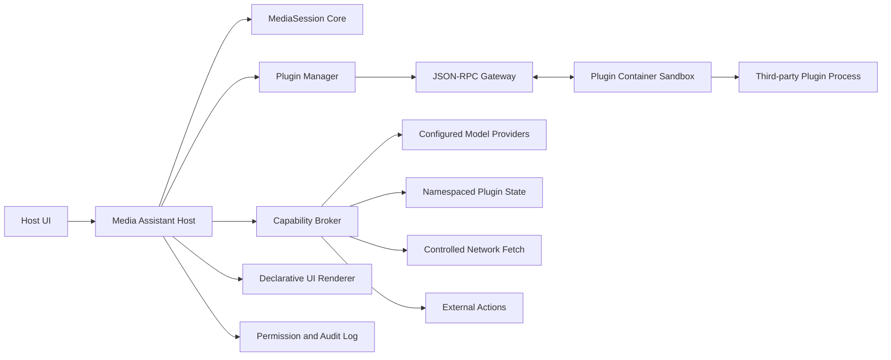

# Universal Media Assistant Plugin Framework Design

**Date:** 2026-08-27  
**Status:** Approved  
**Scope:** Framework only; no meeting, live-stream, video, learning, news, or other scenario assistant is implemented in this phase.

## 1. Goal

Generalize Matinier from a meeting-specific assistant into a host for installable media-assistant plugins. A plugin may later implement a meeting assistant, live-viewing assistant, video assistant, audio-learning assistant, or another scenario without receiving direct access to the host database, secrets, filesystem, model credentials, or network.

The first framework release supports local plugin packages, third-party isolation in containers, language-neutral JSON-RPC, layered permissions, declarative UI, and a unified `MediaSession` event model. Existing captions and the private meeting assistant must remain usable through a compatibility bridge.

## 2. Confirmed Decisions

| Area | Decision |
| --- | --- |
| Extension model | Runtime-installable plugins, not compile-time modules |
| Trust boundary | Third-party plugins are untrusted and isolated |
| Runtime protocol | Language-neutral JSON-RPC over a supervised child-container stream |
| Package source | Local directory or ZIP; first release standardizes ZIP |
| Package runtime | Prebuilt OCI image archive; no host-side install scripts |
| Sandbox | Container with no network, read-only root, dropped capabilities, and bounded resources |
| Authorization | Base permissions at install time; sensitive media can be session-scoped; network and external writes use short-lived action-time grants |
| UI extension | Declarative host-rendered schema; no arbitrary HTML, JavaScript, CSS, or iframe |
| Media model | Unified typed `MediaSession`; audio and captions first, video/OCR/chat contracts reserved |
| Process model | One persistent container per enabled plugin, with logical instances per MediaSession |
| Architecture style | Preserve the modular monolith; do not split the host into new microservices yet |

## 3. Goals and Non-goals

### Goals

- Install, inspect, enable, disable, update, and uninstall a local plugin package.
- Reject tampered, unsigned-in-production, incompatible, oversized, or malformed packages.
- Run each enabled plugin in a resource-bounded container with no direct host network or filesystem access.
- Deliver typed, revision-aware media events with cursors, batching, replay, and backpressure.
- Broker model, storage, network, playback, UI, and external-action capabilities.
- Render plugin output using safe host-owned UI components.
- Isolate plugin crashes and preserve the existing caption hot path.
- Maintain auditable permission, capability, lifecycle, and side-effect records.
- Provide a diagnostic plugin and a conformance kit without implementing a scenario assistant.

### Non-goals

- An online plugin marketplace, ratings, billing, or automatic remote download.
- Arbitrary plugin web pages or browser code.
- Direct plugin access to LiveKit, SQLite, provider tokens, `.env`, or user files.
- A production multi-tenant or horizontally scalable deployment.
- Full raw-audio, keyframe, OCR, or live-chat ingestion in the first framework increment.
- Migrating the current meeting assistant into a third-party plugin immediately.

## 4. Architecture and Trust Boundary



The host is the only trusted boundary. It owns MediaSessions, media-event sequencing, package installation, signature verification, container lifecycle, permissions, grants, capability invocation, declarative rendering, and auditing.

An enabled plugin runs in a dedicated container. The container:

- mounts the immutable plugin package read-only;
- mounts only its private writable data directory;
- uses a read-only root filesystem;
- has no network by default;
- receives no host secrets or database URL;
- drops Linux capabilities and enables `no-new-privileges`;
- applies CPU, memory, PID, and timeout limits;
- communicates only through the host JSON-RPC gateway;
- can be stopped independently without affecting captions or other plugins.

The initial sandbox adapter targets the local Docker-compatible OCI runtime already used by the project. A `ContainerRuntime` port keeps the host independent of a particular engine and leaves room for native OS sandbox adapters later.

## 5. Plugin Package and Manifest

The standard package is a ZIP with no executable host installer:

```text
example-assistant.plugin.zip
├── plugin.json
├── image.tar
├── assets/
├── README.md
└── signature.json
```

The manifest contains stable identity, semantic version, host compatibility, image digest, event subscriptions, permissions, commands, resource requirements, UI schema version, and plugin-state schema version.

```json
{
  "schema_version": 1,
  "id": "com.example.learning-assistant",
  "name": "Learning Assistant",
  "version": "1.0.0",
  "publisher": "Example",
  "host_api": ">=1.0 <2.0",
  "image_digest": "sha256:...",
  "subscriptions": ["transcript.final", "session.ended"],
  "permissions": ["media.transcript.final.read", "model.invoke", "plugin_state.write", "ui.publish"],
  "commands": ["summarize", "explain"],
  "ui_schema_version": 1,
  "state_schema_version": 1
}
```

Production mode accepts Ed25519-signed packages from a trusted publisher key. Development mode can explicitly allow unsigned packages and must preserve a visible unsafe status. A signature covers canonical manifest bytes, the OCI image digest, and a deterministic assets digest.

Installation is two-phase:

1. Inspect and stage the package, validate the archive, manifest, signature, digests, compatibility, and requested permissions.
2. Confirm the installation and selected base permissions, import the image, and create a disabled installation record.

The installer rejects path traversal, symbolic links, duplicate archive entries, compression bombs, excessive uncompressed size, invalid identifiers, incompatible API ranges, mismatched digests, and untrusted signatures.

Installed package content is stored in a content-addressed immutable directory. A new version never mutates the previous version.

## 6. Plugin Lifecycle and JSON-RPC

Host-to-plugin lifecycle methods:

```text
plugin.initialize
plugin.health
session.open
session.events
session.command
session.close
plugin.shutdown
```

Plugin-to-host broker methods:

```text
host.capability.invoke
host.state.get
host.state.put
host.ui.publish
host.audit.annotate
```

Every request carries `request_id`, plugin identity and version, session scope, protocol version, deadline, idempotency key where applicable, and trace ID. JSON-RPC is line-delimited and size-bounded. Binary payloads are never embedded in JSON; the host exposes short-lived, scoped Blob Handles.

The supervisor starts one container per enabled plugin. `session.open` creates a logical instance inside that process. Every request uses a host-created opaque session scope. A plugin cannot invent or expand a scope.

Update behavior pins active sessions to their current plugin version. New sessions use the new healthy version. Uninstall prevents new bindings, drains existing sessions, and terminates after a bounded grace period.

## 7. Unified MediaSession and Event Model

`MediaSession` is independent of meeting semantics:

```text
MediaSession
├── identity and owner scope
├── mode: live | playback
├── source metadata
├── tracks: audio | video | transcript | chat
├── unified media clock
├── ordered typed events
└── enabled plugin bindings
```

The generic event envelope is:

```json
{
  "schema_version": 1,
  "event_id": "evt_...",
  "session_id": "media_...",
  "sequence": 128,
  "event_type": "transcript.final",
  "media_time_ms": 42600,
  "duration_ms": 3100,
  "logical_id": "segment:10",
  "revision": 3,
  "finality": "final",
  "source": "host.transcription",
  "payload": {},
  "created_at": "..."
}
```

Reserved event families are `session.*`, `playback.*`, `transcript.*`, `translation.*`, `timeline.*`, `audio.*`, `video.*`, `ocr.*`, `chat.*`, and `user.*`.

The first implementation bridges durable caption Final records, translation Final records, and terminal Session state into MediaEvents without adding model calls or synchronous plugin work to the caption hot path. Draft audio/video/chat delivery remains a reserved extension.

Delivery uses monotonically increasing per-session sequence numbers, cursor acknowledgements, bounded batches, replay, idempotent duplicate delivery, revision-aware logical identities, and explicit backpressure. Plugin-derived events are namespaced as `plugin.<plugin-id>.*` and are not reflected back to the producer by default.

## 8. Capability and Permission Model

Stable broker capabilities include:

```text
media.query
model.invoke
state.get
state.put
network.fetch
action.execute
playback.control
ui.publish
```

Base permissions are accepted during installation. Sensitive media such as drafts, raw audio, video frames, OCR, chat, and private user marks can be limited to one MediaSession. Network access and external writes always require an action-time grant.

A grant fixes plugin ID and version, MediaSession, capability, destination, operation or HTTP methods, purpose, maximum calls or side effects, expiry, and idempotency/reconciliation policy. The host executes all provider, network, and external calls. Plugins never receive credentials.

Network requests validate scheme, domain allowlist, DNS results, redirects, method, response type, response size, and timeout. Model calls validate provider visibility, input data class, token budget, concurrency, and timeout. Plugin state is namespaced and quota-limited. Cross-plugin state access is forbidden.

Every capability invocation records an audit-safe argument summary, grant, result, error, and confirmed side effects. Unknown external-write outcomes enter reconciliation and cannot be retried directly.

## 9. Declarative UI

Supported host-owned surfaces:

- `assistant_panel`
- `media_overlay`
- `timeline_lane`
- `command_palette`
- `notification`

Supported component families:

```text
Text / SafeMarkdown
Card / Section / Tabs
List / Table
Timeline / MediaAnchor
Badge / Metric / Progress
Input / Textarea / Select / Checkbox
Button / Confirmation
EmptyState / ErrorState
```

The host validates schema version, tree depth, node count, string length, URLs, Markdown, action IDs, media anchors, and expected view version. Plugins cannot produce arbitrary scripts, HTML, CSS, iframes, permission prompts, or deceptive system UI.

User interactions become scoped `session.command` messages. Only the host can render grants, permission prompts, destructive confirmations, and external-side-effect status.

## 10. Persistence

Additive persistence keeps the existing Session and Segment tables intact. New tables hold:

- MediaSession bridge records and MediaEvents;
- plugin installations and versions;
- publisher trust records;
- staged installation tickets;
- granted base and session permissions;
- plugin runtime health;
- plugin-to-MediaSession bindings and cursors;
- namespaced plugin state items;
- declarative UI views;
- short-lived capability grants;
- capability invocation and lifecycle audit events.

The existing caption Session maps one-to-one to a MediaSession through a bridge record. A background projector emits generic MediaEvents from existing Final rows. This preserves the rule that Final captions commit before downstream processing.

## 11. Fault Handling, Updates, and Recovery

Runtime states are `installed`, `disabled`, `starting`, `ready`, `degraded`, `crashed`, `quarantined`, and `incompatible`.

- Health checks and container exit monitoring update runtime health.
- Ordinary RPC uses short deadlines; long work returns an asynchronous task handle.
- Slow plugins receive larger batches and lose only explicitly droppable low-priority events.
- Final events and user commands remain replayable by cursor.
- Repeated crash loops quarantine the plugin.
- A plugin failure cannot block captions, playback, other plugins, or host shutdown.
- Unconfirmed external writes become `unknown` and require reconciliation.

Updates are staged, validated, and health-checked before becoming the preferred version. State migration runs inside the new sandbox against a copy-on-write snapshot and is atomically swapped only after validation. Failure retains the previous state and version.

Uninstall retains a recoverable data snapshot by default. Explicit data deletion is a separate destructive operation. Audit history is retained.

## 12. Compatibility Strategy

Host API, MediaEvent schema, UI schema, and Capability API have independent versions. Plugins declare compatible ranges. A major version is required for removals, renames, or semantic changes. A minor version may add optional fields, event types, components, or capabilities.

The current private meeting assistant stays in the host through a compatibility bridge during the framework phase. It consumes the existing MeetingState pipeline and does not need to become a third-party plugin immediately. New plugin infrastructure must not change existing API behavior or caption/assistant tests.

## 13. Security and Test Strategy

Tests cover:

1. Package signature, digest, archive traversal, compression, duplicate, compatibility, and schema attacks.
2. JSON-RPC negotiation, framing, size limits, timeouts, cancellation, duplicate requests, and error codes.
3. Sandbox inability to read host files, environment secrets, or the network.
4. Media-event ordering, revisions, duplicates, replay, cursor recovery, backpressure, and Blob Handle expiry.
5. Permission denial, grant expiry and revocation, scope confinement, state isolation, and unknown external effects.
6. UI Schema fuzzing, XSS, malicious Markdown, oversized trees, unsafe URLs, and fake permission prompts.
7. Container crash, hang, crash loop, quarantine, state migration failure, update rollback, and host shutdown.
8. Regression of the existing caption and private-assistant paths.

A non-scenario diagnostic plugin exercises event subscription, state, model brokering, declarative UI, denied permissions, crash recovery, and protocol conformance. Unit tests use a fake container runtime; a separately marked local smoke test uses the real Docker runtime.

## 14. Acceptance Criteria

- A valid local signed package can be inspected, installed disabled, enabled, updated, disabled, and uninstalled.
- A tampered, malformed, oversized, untrusted, or incompatible package cannot start.
- An enabled plugin container has no host network, secrets, project mount, or user-directory mount.
- A plugin subscribes to a MediaSession, receives Final events, acknowledges a cursor, crashes, restarts, and resumes without losing durable events.
- A plugin publishes validated side-panel and timeline UI and receives version-checked commands.
- Unauthorized capabilities always fail closed; grants cannot be expanded by plugin input.
- Plugin crashes and hangs do not affect captions, the current meeting assistant, or other plugins.
- A failed update rolls back to the previous healthy version and state.
- Backend tests, frontend tests, TypeScript checks, production build, migration checks, and opt-in Docker smoke tests pass.

## 15. Alternatives Considered

### Compile-time modules

Simpler and more type-safe, but every assistant requires rebuilding the host and cannot be installed independently. Rejected by product direction.

### Cooperative child processes without an OS sandbox

Provides crash isolation but cannot prevent direct filesystem or network access. Rejected because third-party plugins are untrusted.

### WebAssembly

Provides a strong portable sandbox, but media/model SDK interoperability and multi-language packaging are more constrained. Retained as a possible future runtime adapter, not the first runtime.

### Per-session plugin containers

Improves session isolation but multiplies process and model initialization cost. The first release uses one container per plugin with host-enforced session scopes. Multi-user deployment can later key the container by plugin and user.

### Plugin-provided iframe UI

Maximizes visual flexibility but materially increases XSS, impersonation, permission-spoofing, theme, and accessibility risks. Rejected for the first framework.

### Immediate microservice and distributed queue split

Would improve independent scaling but adds coordination and deployment complexity before the framework has real load. The host remains a modular monolith until PostgreSQL, multi-instance scheduling, or independent scaling becomes a demonstrated requirement.
