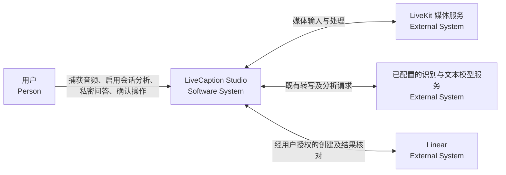
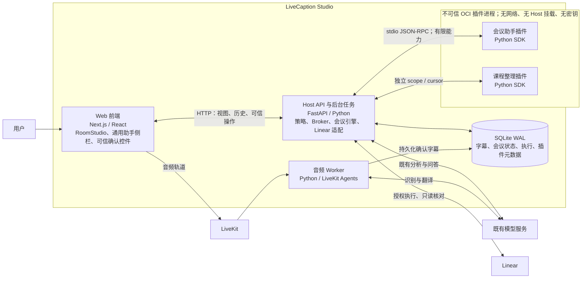
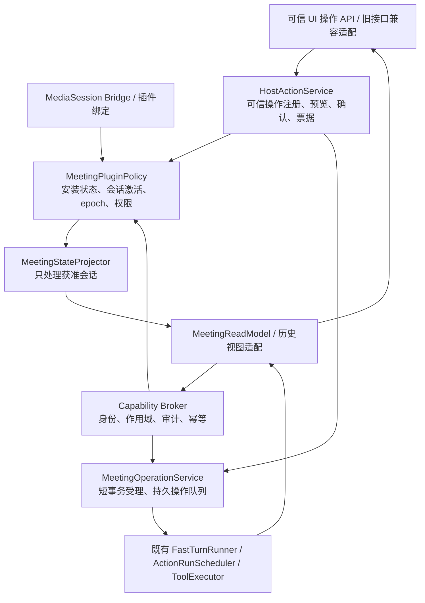

# 会议助手统一插件化设计

日期：2026-08-31  
状态：用户已确认设计；Batch A 后端基础已完成，Batch B–E 与运行切换尚未完成  
配套实施计划：`docs/plans/2026-08-31-meeting-assistant-plugin.md`

## 1. 目标与已确认范围

将原私人会议助手迁入统一助手工作区，作为标准、可安装、可启停的会议插件，取代 RoomStudio 中的独立会议助手卡片。采用“标准会议插件 + 复用现有 Host 会议引擎”，不把整个引擎迁进容器。

完整保留：私密问答、Fast Turn / Action Run、待办候选选择、手动和自动重点标记、Linear 执行、补充信息、取消、执行详情、证据坐标及历史。此次不新增会议总结文档、外部连接器、账户系统或新的媒体处理流水线。

用户已分段确认：

1. 统一管理；插件负责展示和交互，Host 保存引擎、密钥、权限和数据；按会话启用会议分析；隐藏侧栏或切换插件不停止音频和分析。
2. 正在进行的会话启用时补齐已有确认字幕，之后消费新增和修订字幕；结果保留来源；历史沿用原数据；明确展示处理状态。
3. 安装权限不等于 Linear 执行授权；停用阻止新分析和执行；未知外部结果先核对、不重复创建；旧接口同步收口；默认模拟 Linear，真实写入另行授权。

## 2. 代码核对结论

| 现有位置 | 事实 | 迁移要求 |
| --- | --- | --- |
| `frontend/components/room-studio.tsx`、`private-meeting-assistant.tsx` | 独立卡片直接调用会议和执行 API | 迁移交互后移除挂载；保持 RoomStudio 媒体所有权 |
| `frontend/components/plugins/use-media-assistant-workspace.ts` | 统一 hook 连接 MediaSession，轮询视图与文档 | 继续只保留一个会话数据入口，不额外挂会议专用全局 hook |
| `backend/app/assistant/bootstrap.py` | Host 已有问答、规划、执行、恢复和 Linear 适配 | 注入会话策略，复用原引擎与原记录 |
| `backend/app/meeting_state/projector.py` | Projector 目前全局扫描 Final，主动 catch-up 也未受插件启停限制 | 扫描、排队、模型调用、提交都检查会话资格 |
| `backend/app/main.py` | 助手与插件运行时分别启动 | 组合时共用同一个策略实例，启动恢复阶段也默认拒绝未授权工作 |
| `backend/app/plugins/bootstrap.py` | RPC 能力执行持有数据库写锁；只有 model.invoke 特别释放锁等待模型 | 会议能力只在短事务内受理任务，不在 Broker 中等待引擎或 Linear |
| `backend/app/plugins/permissions.py` | 安装权限和短期 scope grant 已存在 | 增加会议作用域校验及主程序可信操作票据，不只相信插件提交的字段 |
| `backend/app/plugins/builtin_packages.py`、`builtins.py` | 内置目录、源码采集、镜像命名和 builder 仍绑定课程插件 | 建立有限的内置源码构建注册表，同时保留课程兼容入口 |
| `frontend/lib/assistant-workspace-state.ts` | 目录来自安装、视图、PluginDocument；旧会议记录不是 PluginDocument | 增加通用历史描述来源，未安装/停用时仍可发现旧会议记录 |

当前没有有效 Git 仓库。实施使用现工作区、备份与 `docs/stage-records.md`，不新建仓库、不伪造 commit/worktree。此前并行架构审查因额度限制未完成；本文由主代理根据代码核对编写，不标记为已通过独立审查。

## 3. 架构模型

以下用 Mermaid flowchart 表达 C4 各层的角色与边界，不依赖额外渲染插件。

### 3.1 C4 Level 1：系统上下文

### 3.2 C4 Level 2：容器与信任边界

### 3.3 C4 Level 3：Host 内部组件

UI 只能获得 Host 整理过的公开结果；不得暴露隐藏推理、原始供应商错误、管理 token、签名密钥或 Linear 凭据。

## 4. 运行语义

### 4.1 三种状态不能混为一谈

- **插件状态**：已安装、启用、停用、异常、卸载，由现有插件管理系统拥有。
- **会话分析状态**：本次会话尚未启用、分析中、结束收尾、已结束，由 Host 持久化。
- **界面显示状态**：侧栏显示/折叠、选中哪个助手，仅影响展示。

默认不因安装、打开工作区、建立插件 session binding 或选中会议插件而启动分析。Host 可信控件提供“启用会议分析”；插件不能靠自己的启动事件或伪造命令激活会话。

正在进行的会话激活后，明确读取本会话已有的 Final backlog，再持续扫描本会话的新字幕和修订。不能仅使用原全局时间游标，否则激活前已产生的字幕会漏掉。保留按原字幕 ID/revision 的投影 offset，不把修订当成重复知识。

epoch 分为 `analysis_epoch` 和 `authority_epoch`。用户停止本会话分析时仅失效自动分析资格并递增 analysis_epoch，不取消已明确授权的交互执行；取消执行有独立入口。停用/卸载插件则同时关闭分析与操作准入、撤销未消费操作票据并递增两类 epoch。重新启用插件只恢复插件可用性；失效的会话分析需用户重新启用，未完成外部执行需新授权。明确停用与短暂容器崩溃/Host 重启分别记录，不将崩溃等同于撤销用户会话选择。

会话自然结束时，只允许已经激活的会话处理截至终止 frontier 的已确认字幕及收尾，随后停止自动分析。首次打开已结束会话不创建新分析，也不默认补算历史。

**分析资格与交互资格分开**：用户可对已结束会话明确发起问答、标记或执行；这些交互需要启用的会议插件及对应用户操作/授权，但不重新打开后台自动分析。ContextBuilder 不可借历史问答隐式调用未获准的 Projector catch-up。

### 4.2 停用和外部请求的竞态

在扫描、入队、模型调用前和投影提交时检查资格及 analysis_epoch。交互操作/票据和外部写入检查 authority_epoch。停用前已开始的模型请求可能完成，但过期 analysis_epoch 的分析不得覆盖当前视图/状态。

外部写入在 ToolExecutor 的最终准入检查与 `requesting` 状态持久化处线性化，检查和插件撤权共享明确的串行化机制。停用前已经获得准入并发出的请求可能完成，不能承诺撤回。停用完成后不得再准入任何新写入。

已发出请求只由可信 Host 进行结果核对；核对代码禁止转回 planner 或发出新 mutation。不能验证的结果保持 unknown/needs_input。已创建的 Linear Issue 不删除。历史取消通过 Host 可信控件仍可用，取消同样不表示撤回已有副作用。

### 4.3 多插件、版本与恢复

每个 legacy Session 只有一份会议引擎状态和一个有效会议分析 owner。插件 state/view 按版本隔离，会议历史按原 Session/Execution ID 保留。版本升级不得让两个插件版本重复投影同一份字幕，也不得自动把旧版本票据授权给新版本。

恢复时先建立默认拒绝的策略、读取持久激活/停用记录，再恢复运行时和任务。没有插件 ownership 的旧活动执行进入“待确认”或只读 reconciliation；不得以历史兼容为由自动继续写 Linear。保留原执行链、claim 和结果，不批量重建任务。

## 5. 数据与接口契约

以下是新增接口的目标契约，不表示接口目前已存在。实现时可调整局部命名，但不能改变安全与持久化语义。

### 5.1 最小新增持久状态

1. `meeting_plugin_sessions`：唯一 `legacy_session_id` / `media_session_id` 映射、owner plugin/version、analysis state、analysis_epoch、authority_epoch、激活者/时间、停用原因、终止 frontier。无安装删除级联，不能删除旧会议数据。
2. `meeting_plugin_operations`：operation ID、plugin/version、MediaSession/legacy Session、authority_epoch、用户 intent、规范化请求 hash、client request ID、状态、原 execution ID、失败码。唯一键 `(plugin_id, plugin_version, media_session_id, client_request_id)`；同键不同请求返回冲突。
3. `assistant_action_intents`：由 Host 生成的随机票据 hash、actor、action、plugin/version、会话、authority_epoch、payload hash、候选修订/快照、目标团队、授权数量、期限、消费/撤销状态。分析控制动作另外绑定 analysis_epoch。不得保存可重放明文票据到插件 state 或日志。

所有迁移为增量；原 meeting/assistant 表及历史 ID 不改写。必要的历史映射可幂等建立，不复制历史文本，不强制导出为 PluginDocument。现有 ActionGrant、ExternalActionClaim 和 AssistantClientOperation 继续作为执行授权、外部幂等和版本控制的依据，新增表不替代它们。

### 5.2 受控会议能力

| 能力 | 效果 | 接收与返回 | 附加约束 |
| --- | --- | --- | --- |
| `meeting.state.query` | read | 分页游标/已知版本 → 状态、候选、标记、计数、执行摘要 | 当前绑定会话；已接受读取权限；禁止通过请求覆盖 actor/Session |
| `meeting.operation.query` | read | operation/execution ID、事件游标 → 原执行结果与增量 | 校验 ID 属于同一会话和授权 owner，不泄漏其他插件/会话 |
| `meeting.turn.submit` | local_write | 用户 intent、request ID、message、mark IDs → accepted operation ID | 仅 ask；必须源于用户操作；后台调用模型，禁止携带写 Grant |
| `meeting.mark.write` | local_write | 用户 intent、request ID、operation、evidence/version → 更新结果 | 手动标记、确认/忽略自动标记；校验来源 revision 和状态版本 |
| `meeting.execution.submit` | external_write | 可信确认票据、request ID → accepted operation ID | 必须为本次候选、团队和数量的短期授权；支持幂等和只读恢复 |
| `meeting.execution.input` | local_write | intent、execution ID、expected state version、补充信息 → accepted | 若继续外部执行，还必须有对应有效写授权；local_write 分类不是绕过许可 |
| `meeting.execution.cancel` | local_write | intent、execution ID、expected state version → 取消受理 | 只取消原执行；停用时另有 Host 历史控制通道，不启动插件 |

采用 Pydantic `extra="forbid"`、有界字符串/列表/JSON 和固定动作枚举。不启用通用 `action.execute(action, arbitrary_payload)` 作为会议接口，不允许插件传任意 Host URL。

所有产生持久效果的能力均使用 client request ID 与幂等键。Broker 在受理事务内保存 operation、消费票据及 invocation 对应关系，提交后后台才运行引擎。RPC 返回 accepted 不等于问答或 Linear 已成功。重试同一请求只能返回同一 operation；未知状态只能查询已有映射。

不能在 Broker 的 `_database_write_lock` 内 await FastTurnRunner、ActionRunScheduler 完成、Projector catch-up 或外部网络。使用数据库持久队列恢复“事务已提交但尚未来得及入内存队列”的操作。既有引擎的执行状态仍是最终事实来源，不在插件容器再建一套执行状态机。

### 5.3 可信主程序操作通道

增加 Host-owned action registry 和 API，例如：

- `POST /api/media-sessions/{id}/assistant-actions/prepare`：校验已安装插件/绑定、当前视图版本、注册动作和输入，从服务端真实数据生成预览及短期 intent。
- `POST /api/media-sessions/{id}/assistant-actions/confirm`：用户在主程序控件确认后，以 request ID 和预览 hash 消费 intent，受理激活/停用或向插件交付绑定后的命令。
- `GET /api/media-sessions/{id}/assistant-history`：返回通用历史来源描述及只读展示材料，不执行分析。
- 可信历史取消使用同一 registry 的受限 cancel 动作；不允许将停用例外复用为 resume/execute。

按钮与表单可由通用插件视图展示，但真正授予权力的注册动作描述、预览、确认和 intent 来源均在 Host。现有插件 `confirmation` 组件只是说明性内容，绝不作为授权证明。禁止插件在 JSON 中声明 `trusted: true` 后获得主程序权力。

普通问答/标记的点击可由可信操作通道自动完成受理，不额外弹重复确认。Linear 必须展示并确认真实候选、固定服务端团队、最多创建数量及 15 分钟有效期。候选修订、会话、插件版本、epoch、消息或团队改变时重新预览和确认。

沿用本地单用户边界：actor 由 Host 产生，不能沿用浏览器/插件任意提交的 `actor_id`。可信 UI 请求使用允许的应用 Origin、JSON/custom-header 防跨站检查及短期 UI nonce；凭据不交给插件。没有 Origin 的自动化写调用必须具备明确的主程序授权上下文，不能默认当成用户确认。此机制不声称提供多用户账户隔离，也不将插件管理 token 放进沙箱。

安装能力白名单 + scope grant + 主程序确认 intent + 原 ActionGrant 分层检查。最终每次外部写入再次检查剩余额度、有效期、撤权状态和候选范围；不能只在按钮点击时检查一次。

## 6. 插件包与界面

插件 ID：`com.matinier.meeting-assistant`。源码目标目录：`plugin-sdk/examples/meeting-assistant/`。使用与课程插件相同的签名 ZIP、管理员检查/确认安装、Publisher 信任、OCI Supervisor 和无网络沙箱，不提供“内置免授权”通道。

权限为所需 `meeting.*` 能力及 `state.get/state.put/ui.publish`；会议分析由 Host 引擎调用模型，插件自身不需要 `network.fetch`、任意 `model.invoke`、数据库或秘密。

插件使用现有 `session.open`、`media.events`、`ui.command` 和 SDK 自有 task 生命周期。MediaEvent 可用于提醒刷新，但收到字幕本身不触发会议分析或写动作。私密问答/执行事件不写入其他插件可消费的通用 MediaEvent。

激活或存在未完成操作时，插件按会话串行、低频查询版本/游标并发布新视图；默认约 2 秒，无变化不增长 view_version。历史/未启用状态首次读取和显式操作后刷新，不循环触发模型。需要处理“最后一条字幕之后才得到问答结果”的情况，不能仅依靠下次媒体事件刷新。重连从 Host 状态重建；插件视图只是可重建投影。

视图区域：

1. 会话分析开关和状态：未启用、等待字幕、分析中、已更新、失败/可重试、停用；显示已处理的当前 Final 数、待处理数、最近更新时间。
2. 私密问答与回复。
3. 待办候选及选择。
4. 重点标记及来源坐标。
5. 执行进度、需补充信息、取消、Linear 链接。
6. 历史记录与执行详情。

计数基于本会话当前字幕 ID/revision 的投影进度，不把插件 event ACK、翻译事件或重放次数当成知识提取数量。“插件 ready”与“分析已更新”分开显示。错误保留上次成功结果并显示更新时间，不能用空列表覆盖成“没有内容”。

前端继续使用闭合声明式组件；只增加跨插件复用的 HostActionPanel / 历史来源适配，不复制整个 PrivateMeetingAssistant 到新的隐藏分支。历史描述包含 source kind 和 owner；Host 生成的只读历史来源不可被插件伪造。停用、卸载或容器异常时仍由 Host 查询旧历史，且不会借历史视图发放新写授权。

## 7. 错误处理与兼容

- 缺少插件、未启用、会话未激活、模型不可用、Linear 未配置、scope 失效分别显示明确状态；Linear 不可用不应阻断私密问答和本地标记。
- 用户取消正在确认的操作：不生成写授权、不入队、不消耗外部额度。
- 同键不同 payload、过期视图/候选/执行版本：返回冲突，刷新后由用户再次确认，不能自动升级授权。
- RPC 超时：按原 request ID 查询 accepted operation；不生成新 request ID 自动重做。
- `getAssistantState`、执行详情、MeetingState 等历史读取改为依赖只读服务，不因运行时关闭而丢失历史。
- 旧 POST/PATCH 路由逐一接入相同策略和可信 intent，或明确返回迁移错误；不得接受旧客户端自带 Grant 绕过确认。兼容 GET 不触发分析。
- 移除独立卡片前，必须证明七类旧能力在统一插件视图中可用；保留必要的旧 DTO/查询服务，不以删文件数量作为完成标准。
- 多版本课程插件、已生成课程文档、已修复事件持续分发和侧栏媒体生命周期不在本次迁移范围内，必须回归保护。

## 8. 关键架构决策（ADRs）

### ADR-01：标准插件 + Host 引擎

**背景**：需要统一管理，同时保留复杂的历史、执行恢复及外部权限。  
**备选**：标准 OCI 插件通过受控能力复用 Host 引擎；只把旧 React 卡片嵌入侧栏；整个引擎搬入 OCI。  
**决定**：采用第一种，即用户确认的方案一。  
**影响**：生命周期真实统一，历史与安全机制可复用；需明确 Host 能力适配，不能把插件化理解为完全移除 Host 会议领域代码。

### ADR-02：持久会话激活 + 多检查点 epoch

**背景**：全局 Projector 会在用户未选择会议用途时处理课程字幕。  
**备选**：由界面显示决定处理；仅检查全局配置；持久会话选择并在实际工作检查 epoch。  
**决定**：使用第三种，显式会话激活，显示状态不参与资格判断。  
**影响**：可以可靠停用和补齐字幕；要处理停用竞态、终止收尾、升级 owner 和启动恢复，不能只改入口判断。

### ADR-03：主程序可信确认 + 短事务持久受理

**背景**：声明式插件按钮并非可信授权；现有 Broker 持锁调用会阻塞慢操作。  
**备选**：相信插件确认字段并同步调用引擎；把管理员密钥/旧 API 交给插件；Host 预览和确认后持久受理，后台复用原执行器。  
**决定**：使用第三种，不增加外部队列或新数据库。  
**影响**：明确用户意图、防重复和并发边界；增加 intent/operation 映射、恢复及授权版本测试。

### ADR-04：原历史为事实来源，插件视图可重建

**背景**：旧会议数据不符合课程 PluginDocument 模型，卸载不能造成历史消失。  
**备选**：复制历史到插件私有 state；强制生成所有历史文档；Host 只读历史来源适配并保留原 ID。  
**决定**：使用第三种，在通用目录支持历史来源。  
**影响**：避免双写和证据断链；通用 UI 必须区分 Host 历史与不可信插件视图来源。

## 9. 验收与迁移边界

| 验收面 | 必须证明 |
| --- | --- |
| 功能等价 | 问答、候选选择、两类标记、Linear、补充信息、取消、原详情/历史/坐标全部可用 |
| 会话资格 | 未激活零模型调用；当前会话 backlog 补齐；新 Final/修订持续更新；历史打开零自动分析 |
| 生命周期 | 隐藏/切换不中断音频；停用/卸载/崩溃/重启/升级各自有明确语义；两个版本不重复投影 |
| 可信授权 | 伪造 actor/scope/intent/候选/团队、过期/replay/跨会话请求均拒绝；输入恢复也不能绕过写授权 |
| 外部幂等 | 重复点击、RPC 超时、进程重启和 unknown 均不增加重复任务；停用后仅核对已发请求 |
| 并发 | 问答/Linear 被测试闸门挂起时，其他插件查询、视图发布及字幕持久化继续完成 |
| 历史 | 增量迁移前后原 ID、数量及证据关联保留；插件停用或卸载后仍可查看和取消已有执行 |
| 回归 | 课程实时笔记、最终文档、连续事件分发、字幕及悬浮窗口、原音频清理行为不回退 |

实现默认用 FakeModel/FakeLinear 和临时 SQLite。真实 Docker 冒烟只创建自己拥有的临时容器/镜像/目录，不重置 Docker，不触碰生产课程包。真实模型调用、生产字幕回放及真实 Linear 创建必须有明确用户授权；不得以测试名义默认执行。

切换生产前先完成一致性备份和只读基线记录；在无活跃音频或用户接受影响时再进行必要重启。数据库增量迁移不删除旧表，失败时停止切换，保留原数据和备份。任何恢复操作先停止写入、确认目标和授权，禁止覆盖运行中的数据库。当前文档阶段不执行迁移、安装、模型调用或重启。
