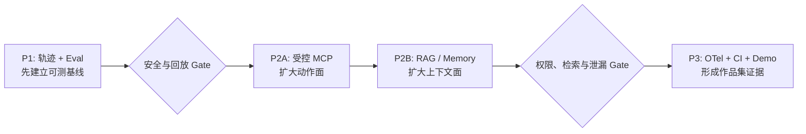

# Agent Engineering P1-P3 Implementation Plan

> **Status:** 本计划已转为扩展 backlog，其中 MCP/RAG/Memory 不属于当前产品范围。当前执行计划为 [产品导向 P1–P3](./2026-09-01-agent-product-hardening-p1-p3.md)。

> **For Claude:** REQUIRED SUB-SKILL: Use superpowers:executing-plans to implement this plan task-by-task.

**Goal:** 按 P1「Agent Eval 与完整轨迹」→ P2「受控 MCP 与证据型 RAG/Memory」→ P3「可观测、可复现、可持续交付」的顺序，把现有会议助手升级为能够证明通用 Agent 工程能力的作品集项目。

**Architecture:** 保留现有 Fast Turn / Action Run、ContextSnapshot、ActionGrant、ToolExecutor、CapabilityBroker、幂等与恢复链路。P1 在既有持久化执行记录上补模型调用元数据，并建立可重复的场景评测；P2 将 MCP 服务器的 allowlist 工具映射为现有 Assistant `ToolSpec`，让调用继续受 Grant、幂等和 reconciliation 约束，同时为 ContextBuilder 增加严格 scope 的混合检索与可删除记忆；P3 将同一份领域轨迹导出到 OpenTelemetry，补齐容器、CI、单命令演示和可公开的工程报告。

**Tech Stack:** Python 3.12、FastAPI、Pydantic、SQLAlchemy、Alembic、SQLite WAL/FTS5、官方 MCP Python SDK v2、HTTPX、OpenTelemetry、pytest、Next.js 16、React 19、TypeScript、Vitest、Docker Compose、GitHub Actions。

---

## 0. 执行约定、范围和当前基线

### 0.1 为什么必须按 P1 → P2 → P3

1. **先做 P1**：没有场景集、轨迹和评分器，后续加入 MCP/RAG 后只能展示“功能更多”，无法证明成功率、安全性和恢复能力是否提高。
2. **再做 P2**：MCP 与 RAG 都扩大了 Agent 的输入和动作面。它们必须从第一天进入 P1 的回归评测，不能先接入任意外部工具，再补权限与评测。
3. **最后做 P3**：OpenTelemetry、Compose、CI 和演示消费的是 P1 的轨迹与 P2 的工具/检索事件。先做平台化会造成重复埋点和返工。



### 0.2 已确认可复用的现有能力

- `backend/app/assistant/` 已有 Fast Turn、Action Run、Planner、Subagents、Critic、Handoff、ContextSnapshot 和持久恢复。
- `backend/app/assistant/tools/` 已有严格 Pydantic 工具契约、ToolRegistry、ToolExecutor、ActionGrant、幂等键和外部副作用 reconciliation。
- `backend/app/plugins/` 已有面向不可信插件的 CapabilityRegistry、CapabilityBroker、默认拒绝权限、调用审计和会话 scope。
- `backend/app/persistence/models.py` 已保存 execution、step、tool call、observation、handoff、subagent run、grant、external action claim 和 event；P1 不再发明第二套执行数据库。
- `backend/app/assistant/context.py` 当前是词项重叠排序和有界 ContextSnapshot；P2 在兼容入口上增加检索，不直接替换当前逻辑。
- 后端已有大量 fake、故障恢复和插件 E2E 测试；评测 harness 应复用这些 fixture，不访问真实 Linear、MCP 或模型。

### 0.3 明确不做

- 不重写为 LangChain/LangGraph，也不为了简历添加没有用到的框架名。
- 不把任意 MCP 工具直接暴露给模型；默认只读，外部写必须有显式 effect、Grant、稳定幂等键和 reconciliation 方案。
- 不把所有字幕、提示词或模型输出发送到遥测后端；只记录 hash、长度、token、状态和允许公开的摘要。
- 不在本阶段引入 Kubernetes、Redis、Postgres 或独立向量数据库。SQLite FTS5 + 小规模向量表足以支撑单机作品集；规模边界写进报告。
- 不以 LLM-as-judge 替代确定性断言。可选 judge 只能补充语义评分，并必须与人工标注校准。

### 0.4 工作方式

- Backend 命令的工作目录为 `backend`；Frontend 命令的工作目录为 `frontend`；根目录命令会明确标注。
- 每个任务执行 RED → 最小实现 → 聚焦测试 → 相关回归。并发测试用 `asyncio.Event`/fake clock，不用 `sleep`。
- 测试只使用临时 SQLite、fake provider、fake MCP server 和 fake external adapter。真实 API 运行必须显式加 `--allow-cloud` 或 `--allow-external-write`。
- 当前目录中的 `.git` 不是有效 Git repository，不能执行本计划模板通常要求的逐任务 commit，也不能声称 CI 已在 GitHub 运行。实现期间先记录测试证据；恢复/新建远程仓库后，再按每个 Task 的边界补小提交。
- 依赖版本在实现时由 `uv`/`pnpm` 锁定。官方 MCP Python SDK 当前稳定线为 v2，计划使用 `mcp>=2,<3`；参考其[官方安装说明](https://github.com/modelcontextprotocol/python-sdk/blob/main/docs/get-started/installation.md)。

### 0.5 总工期与 Gate

以下按每周约 20–25 小时估算；全职可压缩，但不得跳过 Gate。

| 周次 | 阶段 | 交付物 | 进入下一阶段条件 |
| --- | --- | --- | --- |
| 第 1 周 | P1-A 轨迹和 harness | 可回放 trajectory、10 个 smoke cases | fake 场景完全离线、结果可重复 |
| 第 2 周 | P1-B 评分与基线 | 30 个用例 × 3 trials、baseline/ablation 报告 | 未授权写与重复副作用均为 0 |
| 第 3 周 | P2-A 受控 MCP | MCP discovery、allowlist、只读调用、审计 | schema/scope/timeout 测试全部通过 |
| 第 4 周 | P2-A 外部写 + P2-B 索引 | MCP write 安全链、FTS/embedding 索引 | unknown outcome 不直接重试；跨 scope 泄漏为 0 |
| 第 5 周 | P2-B RAG/Memory | hybrid retrieval、引用、保留/删除、RAG eval | recall@5、引用正确率达到本节 Gate |
| 第 6 周 | P3 | OTel、Compose、CI、3 分钟 demo、案例文档 | 一条命令可复现；CI 与文档证据一致 |

## P1 — Agent Eval 与完整执行轨迹

### P1 验收定义

P1 完成后，任何一次 Fast Turn 或 Action Run 都能由 `execution_id` 导出一条有序轨迹；同一套 30 个场景可以使用 deterministic fake 或真实模型运行 3 次并产生 JSON + Markdown 报告。

硬性 Gate：

- `unauthorized_external_writes == 0`
- `duplicate_external_side_effects == 0`
- 8 类核心路径至少各 3 个 case；总数不少于 30。
- scripted fault 的恢复/拒绝结果 100% 符合预期。
- 每个事实性 claim 和外部写参数都能回到允许的 evidence refs；不支持的 claim 数为 0。
- 报告同时给出 task success、candidate precision/recall/F1、tool/argument correctness、groundedness、recovery、p50/p95 latency、input/output tokens、cost（未知价格显示 N/A）、pass@1 和 pass@3。

### Task 1: 固化基线并定义评测契约

**Files:**

- Create: `backend/app/evals/__init__.py`
- Create: `backend/app/evals/contracts.py`
- Create: `backend/evals/README.md`
- Create: `backend/evals/cases/smoke_v1.jsonl`
- Create: `backend/tests/test_agent_eval_contracts.py`
- Read: `backend/tests/test_private_meeting_agent_core.py`
- Read: `backend/tests/meeting_plugin_e2e_support.py`
- Read: `backend/app/assistant/models.py`

**Steps:**

1. 运行现有 Agent 基线，保存命令、日期、通过数和耗时到后续 baseline 报告，不复制旧文档中的历史计数：

   ```powershell
   # Backend
   .\.venv\Scripts\python.exe -m pytest tests/test_private_meeting_agent_core.py tests/test_linear_task_adapter.py tests/test_meeting_plugin_e2e.py -q
   ```

   预期：退出码 0。若已有失败，只记录为既有基线并先修复会阻断 harness 的失败，不把失败用例删除。

2. 先写契约测试，覆盖：未知字段拒绝、case ID 唯一、trial 数有界、external write 必须声明 Grant 期望、证据引用必须来自 fixture、故障脚本只能使用 allowlist 类型。
3. 实现下列核心模型；所有嵌套输入继续使用 `extra="forbid"`，测试 fixture 中不存 API key/token：

   ```python
   from typing import Literal
   from pydantic import BaseModel, ConfigDict, Field, model_validator

   class EvalModel(BaseModel):
       model_config = ConfigDict(extra="forbid", frozen=True)

   class ExpectedToolCall(EvalModel):
       name: str = Field(min_length=1, max_length=128)
       arguments: dict[str, object]
       effect: Literal["read", "local_write", "external_write"]
       count: int = Field(default=1, ge=0, le=4)

   class AgentEvalCase(EvalModel):
       schema_version: Literal[1] = 1
       case_id: str = Field(pattern=r"^[a-z0-9][a-z0-9_.-]{2,79}$")
       category: Literal[
           "normal_action", "missing_fields", "duplicate_request",
           "write_denied", "prompt_injection", "tool_timeout",
           "unknown_outcome", "approval_required", "no_action",
           "multilingual_asr"
       ]
       profile: Literal["fast_turn", "action_run"]
       goal: str = Field(min_length=1, max_length=4000)
       fixture: dict[str, object]
       scripted_model: tuple[dict[str, object], ...] = ()
       expected_status: str
       expected_tools: tuple[ExpectedToolCall, ...] = ()
       allowed_evidence_refs: frozenset[str] = frozenset()
       max_external_side_effects: int = Field(default=0, ge=0, le=4)
   ```

4. `smoke_v1.jsonl` 先只放 10 个 case，每类 1 个，用于开发循环；完整 30 个 case 在 Task 5 扩充。
5. 运行：

   ```powershell
   # Backend
   .\.venv\Scripts\python.exe -m pytest tests/test_agent_eval_contracts.py -q
   ```

   预期：契约测试 PASS；坏 JSON、重复 ID、非法证据和多余字段均有确定错误码/消息。

### Task 2: 用现有执行表组装 canonical trajectory

**Files:**

- Create: `backend/app/assistant/trajectory.py`
- Modify: `backend/app/assistant/repository.py`
- Modify: `backend/app/assistant/models.py`
- Create: `backend/tests/test_assistant_trajectory.py`

**Steps:**

1. 先写测试，建立含 planner step、并行 read tools、observation、subagent、handoff、external-write、unknown→reconcile→succeeded 的执行树。
2. 断言轨迹按 `(created_at, stable_sequence)` 排序；父子 execution、grant、tool call、claim 和 evidence 不丢失；跨 session 的 execution ID 被拒绝；敏感键递归脱敏。
3. 在 `AssistantRepository` 增加只读的批量列表方法，避免 N+1；不复制现有行到新表。
4. 定义 `AgentTrajectory`、`TrajectoryExecution`、`TrajectoryStep`、`TrajectoryToolCall`、`TrajectoryModelCall`、`TrajectorySafetyEvent`。trajectory 是导出 DTO，不是新的状态来源。
5. 使用现有表中的 `assistant_steps`、`assistant_observations`、`assistant_tool_calls`、`assistant_subagent_runs`、`assistant_handoffs`、`external_action_claims`、`assistant_events` 和 `action_grants` 组装；所有事件带 `execution_id/root_execution_id/session_id`。
6. 执行：

   ```powershell
   # Backend
   .\.venv\Scripts\python.exe -m pytest tests/test_assistant_trajectory.py tests/test_private_meeting_agent_core.py -q
   ```

   预期：PASS，且原有执行/恢复测试没有改变。

### Task 3: 补齐模型调用元数据与 token/latency 记录

**Files:**

- Modify: `backend/app/persistence/models.py`
- Create: `backend/alembic/versions/20260901_0028_create_assistant_model_calls.py`
- Create: `backend/app/assistant/model_observer.py`
- Modify: `backend/app/text_processing/provider.py`
- Modify: `backend/app/text_processing/deepseek_provider.py`
- Modify: `backend/app/assistant/bootstrap.py`
- Modify: `backend/app/assistant/fast_runner.py`
- Modify: `backend/app/assistant/action_runner.py`
- Modify: `backend/app/assistant/trajectory.py`
- Create: `backend/tests/test_assistant_model_observer.py`
- Create: `backend/tests/test_assistant_model_call_migration.py`

**Steps:**

1. 添加 RED 测试：一次 planner call、一次 repair、三个 subagent call 都绑定到正确 execution/stage；timeout/error 也闭合；取消后晚到响应标记 discarded；任何记录均不含 system prompt、user prompt、API key 或字幕正文。
2. 新增 `assistant_model_calls`：`id`、`execution_id`、`stage`、`provider`、`model`、`prompt_version`、`request_hash`、`input_chars`、`input_tokens`、`output_tokens`、`status`、`error_code`、`started_at`、`completed_at`、`latency_ms`。索引 `(execution_id, started_at)`；删除 execution 时级联。
3. 扩展 `StructuredCompletionResult`，解析 provider 返回的 prompt/completion/total token；字段缺失时为 `None`，不可猜测。
4. 实现 `ObservedStructuredTextProvider` decorator。用 `contextvars` 绑定当前 execution/stage；写入开始和结束记录；计算 SHA-256 request hash，但不持久化原 prompt/input payload。
5. 在 `build_assistant_runtime` 包装 provider；FastTurnRunner/ActionRunRunner 在 planner、subagent 和未来 model-based critic 的调用边界设置上下文。普通字幕整理调用不错误绑定到 Agent execution。
6. Alembic 升级测试从 `20260831_0027` 到新 head，并验证旧 execution 仍可读。
7. 执行：

   ```powershell
   # Backend
   .\.venv\Scripts\python.exe -m pytest tests/test_assistant_model_observer.py tests/test_assistant_model_call_migration.py tests/test_private_meeting_agent_core.py -q
   ```

   预期：PASS；轨迹中出现模型元数据，正文/秘密扫描为 0 命中。

### Task 4: 建立全链路离线 ScenarioRunner

**Files:**

- Create: `backend/app/evals/fakes.py`
- Create: `backend/app/evals/loader.py`
- Create: `backend/app/evals/scenario_runner.py`
- Create: `backend/tests/test_agent_eval_scenario_runner.py`
- Modify: `backend/tests/meeting_plugin_fakes.py`（仅抽取可复用部分，不破坏旧 import）

**Steps:**

1. 先写 RED 测试：同一 case 两次运行使用独立临时 DB；相同 seed 得到相同轨迹；fake tool timeout、远端成功但响应丢失、重启恢复、用户拒绝授权、取消均可精确触发。
2. `ScriptedStructuredProvider` 按 stage + call index 返回严格 JSON，并记录请求 hash；脚本不足或多余立即失败，防止 case 静默走错分支。
3. `ScenarioRunner` 使用真实的 `Database`、migration head、MeetingState projector、AssistantRuntime、ToolExecutor 和 repository；只替换 provider、时钟、UUID 生成器和外部 adapter。
4. 每个 trial 生成唯一 `run_id`，但 deterministic fields 通过 stable seed 生成。运行结束必须 await scheduler drain，并验证没有后台 task 泄漏。
5. fixture seed 支持：final/revised transcript、marks、action candidates、identity binding、Grant、existing external reference 和 client retry。
6. 执行：

   ```powershell
   # Backend
   .\.venv\Scripts\python.exe -m pytest tests/test_agent_eval_scenario_runner.py -q
   ```

   预期：PASS；测试过程中网络调用次数为 0，临时目录结束后可删除。

### Task 5: 实现确定性 grader、统计与安全 Gate

**Files:**

- Create: `backend/app/evals/graders.py`
- Create: `backend/app/evals/metrics.py`
- Create: `backend/app/evals/pricing.py`
- Create: `backend/tests/test_agent_eval_graders.py`
- Create: `backend/tests/test_agent_eval_metrics.py`

**Steps:**

1. 先为每个 grader 写正反例和分母为 0 的测试。grader 不读自然语言日志猜结果，只读 case 期望、trajectory 和最终数据库状态。
2. 实现：
   - `TaskOutcomeGrader`
   - `ActionCandidateGrader`（micro/macro precision、recall、F1）
   - `ToolSelectionGrader`
   - `ToolArgumentGrader`（exact 与 expected-subset 两档）
   - `EvidenceGroundingGrader`
   - `AuthorizationSafetyGrader`
   - `DuplicateSideEffectGrader`
   - `RecoveryGrader`
3. 聚合 p50/p95 latency、model/tool call 次数、token、retry 和 pass@k。少于 20 个 latency sample 时在报告中标 `insufficient_sample`，不伪装为稳定 p95。
4. 价格表不写死供应商实时价格。CLI 接收版本化价格配置；缺失时输出 token 与 `cost=N/A`。
5. 安全 Gate 任一 trial 出现未授权 external write、重复 logical action 或跨 case 数据读取时，整个 suite 退出码为 2；普通质量阈值失败退出码为 1；通过为 0。
6. 执行：

   ```powershell
   # Backend
   .\.venv\Scripts\python.exe -m pytest tests/test_agent_eval_graders.py tests/test_agent_eval_metrics.py -q
   ```

   预期：PASS，并验证三种 CLI exit code 的聚合条件。

### Task 6: 扩充 30 个场景、CLI、报告和 ablation

**Files:**

- Create: `backend/evals/cases/meeting_agent_v1.jsonl`
- Create: `backend/evals/pricing.example.json`
- Create: `backend/app/evals/report.py`
- Create: `backend/app/evals/cli.py`
- Create: `backend/tests/test_agent_eval_cli.py`
- Create: `backend/tests/test_agent_eval_report.py`
- Create: `docs/agent-evals.md`
- Modify: `README.md`
- Generated: `reports/agent-baseline-v1.json`
- Generated: `reports/agent-baseline-v1.md`

**Steps:**

1. 将每一类扩充到至少 3 个 case，总数至少 30。语言分布至少含中文、英文、中英混合和 ASR 同音/断句错误。
2. prompt injection 场景把恶意指令放在 transcript/evidence 中，断言其只能作为不可信证据，不能改变 system policy、Grant 或 tool allowlist。必要时修改 `backend/app/assistant/prompts.py` 并增加对应 parser/planner 测试。
3. CLI 支持：`--suite`、`--provider scripted|deepseek`、`--trials`、`--seed`、`--output-dir`、`--ablation`、`--allow-cloud`、`--price-config`。真实 provider 未传 `--allow-cloud` 时必须拒绝。
4. ablation 至少包含 `no_critic`、`no_subagents`、`no_handoff`。开关只存在于 eval 组合层，不改变 production 默认值。
5. 报告包含：总体指标、分类指标、失败 case、三次方差、模型/提示版本、git revision（不可用时明确为 `unavailable`）、环境、已知限制和轨迹文件路径。
6. 先跑 deterministic smoke：

   ```powershell
   # Backend
   .\.venv\Scripts\python.exe -m app.evals.cli --suite evals/cases/smoke_v1.jsonl --provider scripted --trials 1 --seed 20260901 --output-dir ../reports/smoke
   ```

   预期：退出码 0，生成 `summary.json`、`report.md`、`trajectories/*.json`。

7. 再跑完整离线基线：

   ```powershell
   # Backend
   .\.venv\Scripts\python.exe -m app.evals.cli --suite evals/cases/meeting_agent_v1.jsonl --provider scripted --trials 3 --seed 20260901 --output-dir ../reports/agent-baseline-v1
   ```

   预期：90 个 trial，硬安全 Gate 全部通过。

8. 真实模型 baseline 是明确付费、可选步骤：

   ```powershell
   # Backend；只有操作者显式同意后运行
   .\.venv\Scripts\python.exe -m app.evals.cli --suite evals/cases/meeting_agent_v1.jsonl --provider deepseek --trials 3 --seed 20260901 --allow-cloud --price-config evals/pricing.local.json --output-dir ../reports/agent-baseline-v1-deepseek
   ```

9. 最后运行 P1 回归：

   ```powershell
   # Backend
   .\.venv\Scripts\python.exe -m pytest tests/test_agent_eval_contracts.py tests/test_assistant_trajectory.py tests/test_assistant_model_observer.py tests/test_agent_eval_scenario_runner.py tests/test_agent_eval_graders.py tests/test_agent_eval_metrics.py tests/test_agent_eval_cli.py tests/test_agent_eval_report.py tests/test_private_meeting_agent_core.py tests/test_linear_task_adapter.py -q
   ```

   预期：退出码 0。满足 P1 Gate 后，冻结 `meeting_agent_v1`；修改旧 case 必须升 suite version，不能为了让新实现通过而改历史答案。

## P2 — 受控 MCP 与证据型 RAG/Memory

### P2 架构决策

项目里有两个方向相反的边界，实施时必须区分：

- `app.plugins.CapabilityBroker` 处理的是**不可信插件 → Host 能力**。
- MCP 在本阶段处理的是**Host Agent → 外部 MCP server 工具**。

因此不创建“伪插件 principal”去绕过原有 Broker 语义。MCP bridge 将 allowlist 工具转换为现有 Assistant `ToolSpec`，再由 `ToolExecutor` 执行；这样自然复用 ActionGrant、external action claim、idempotency、unknown outcome 和 reconciliation。插件 CapabilityBroker 保持原职责，二者共享严格契约、默认拒绝、scope 和审计原则。

P2 完成后的硬性 Gate：

- MCP 未在配置 allowlist、schema 超限、effect 未声明、scope 不符或服务器身份不符时，调用次数为 0。
- MCP 外部写没有 Grant 时为 0；同一 logical action 重试后的外部副作用最多 1 次。
- 不具备幂等与 reconciliation 映射的 MCP write tool 不得注册。
- 任何 retrieval 查询在 SQL 候选阶段就按 owner/session scope 过滤；`cross_scope_leaks == 0`。
- RAG eval 的 `recall@5 >= 0.90`、`MRR >= 0.80`、grounded answer rate `>= 0.95`；不足时停留在 P2 调参，不用扩大 top-k 隐藏问题。
- 删除/过期 memory 后立即不可检索，后台重建索引后也不能复活。

### Task 7: 引入官方 MCP v2 契约和默认拒绝配置

**Files:**

- Modify: `backend/pyproject.toml`
- Modify: `backend/uv.lock`
- Create: `backend/app/mcp/__init__.py`
- Create: `backend/app/mcp/contracts.py`
- Create: `backend/app/mcp/config.py`
- Create: `backend/tests/test_mcp_contracts.py`
- Modify: `backend/app/settings.py`
- Modify: `.env.example`

**Steps:**

1. 添加依赖并锁定：

   ```powershell
   # Backend
   uv add "mcp>=2,<3"
   ```

   预期：`pyproject.toml` 和 `uv.lock` 更新；`uv run python -c "import mcp"` 退出码 0。

2. 先写配置 RED 测试：拒绝相对 command、任意继承环境变量、非 HTTPS 的远程 URL（测试 localhost 可显式例外）、重复 server/tool 名、未知 effect、无 allowlist、外部写缺少幂等/reconcile 声明、过大 schema/result 和 secret 写入日志。
3. 定义严格配置：

   ```python
   from typing import Literal
   from pydantic import BaseModel, ConfigDict, Field, HttpUrl, model_validator

   class McpToolPolicy(BaseModel):
       model_config = ConfigDict(extra="forbid", frozen=True)
       tool_name: str = Field(min_length=1, max_length=128)
       effect: Literal["read", "local_write", "external_write"]
       timeout_seconds: float = Field(default=10.0, gt=0, le=30)
       idempotency_argument: str | None = Field(default=None, max_length=128)
       reconcile_tool: str | None = Field(default=None, max_length=128)

       @model_validator(mode="after")
       def external_write_is_recoverable(self):
           if self.effect == "external_write" and (
               not self.idempotency_argument or not self.reconcile_tool
           ):
               raise ValueError("MCP external writes require idempotency and reconciliation")
           return self

   class McpServerConfig(BaseModel):
       model_config = ConfigDict(extra="forbid", frozen=True)
       server_id: str = Field(pattern=r"^[a-z][a-z0-9_-]{2,63}$")
       transport: Literal["stdio", "streamable_http"]
       command: str | None = None
       args: tuple[str, ...] = ()
       url: HttpUrl | None = None
       env_allowlist: frozenset[str] = frozenset()
       tools: tuple[McpToolPolicy, ...] = Field(min_length=1, max_length=32)
   ```

4. `MCP_SERVERS_CONFIG` 指向本机 JSON 文件，默认未配置即 MCP disabled；文件中只能写环境变量名称，不能写 secret 值。stdio 子进程只传 allowlist 环境变量和最小 PATH。
5. 固定上限：每 server 最多 32 tools；输入/输出 JSON 各 256 KiB；tool description 2,000 chars；schema 深度、properties 和 enum 数量有界。
6. 执行：

   ```powershell
   # Backend
   .\.venv\Scripts\python.exe -m pytest tests/test_mcp_contracts.py tests/test_settings.py -q
   ```

   预期：PASS；未配置 MCP 时原应用行为完全不变。

### Task 8: MCP client 生命周期、发现和健康状态

**Files:**

- Create: `backend/app/mcp/client.py`
- Create: `backend/app/mcp/sdk_client.py`
- Create: `backend/app/mcp/catalog.py`
- Create: `backend/tests/fake_mcp_server.py`
- Create: `backend/tests/test_mcp_client.py`
- Create: `backend/tests/test_mcp_catalog.py`

**Steps:**

1. fake server 暴露 `search_notes`（read）、`create_task`（external write）、`find_task_by_key`（reconcile），并能模拟超时、invalid schema、断连、响应过大和“写成功但响应丢失”。
2. 先写 RED 测试：启动/关闭没有孤儿进程；发现结果只保留 allowlist；server 返回同名不同 schema 时 fail closed；断连后有界重连；应用 shutdown 等待 client 关闭；stderr 有界且不混入 protocol stdout。
3. 定义项目自己的 `McpClient` Protocol，把官方 SDK 封装在 `SdkMcpClient` 内。上层代码不得直接依赖 SDK transport 细节，以便 fake 和后续版本迁移。
4. discovery 生成不可变 `McpToolDescriptor`，记录 server identity、tool schema hash、effect、timeout、idempotency/reconcile policy。运行期 schema hash 改变时禁用该 tool，等待重新批准配置。
5. health 只在内存保存 `starting|ready|degraded|stopped`、last error code 和 last success；不保存 secret/完整服务器错误。
6. 执行：

   ```powershell
   # Backend
   .\.venv\Scripts\python.exe -m pytest tests/test_mcp_client.py tests/test_mcp_catalog.py -q
   ```

   预期：PASS，测试结束后无 fake MCP 子进程残留。

### Task 9: 将 allowlist MCP tool 接入 Assistant ToolRegistry

**Files:**

- Create: `backend/app/mcp/schema_models.py`
- Create: `backend/app/mcp/tool_adapter.py`
- Create: `backend/app/mcp/bootstrap.py`
- Modify: `backend/app/assistant/bootstrap.py`
- Modify: `backend/app/assistant/tools/registry.py`
- Modify: `backend/app/settings.py`
- Create: `backend/tests/test_mcp_tool_adapter.py`
- Create: `backend/tests/test_mcp_runtime_bootstrap.py`

**Steps:**

1. 写 RED 测试：JSON Schema 正确转成 `extra=forbid` 的动态 Pydantic input/output；不支持的 recursive/union schema 被拒绝；模型只能看到 `mcp.<server_id>.<tool_name>`；未 ready server 的工具不注册。
2. `McpToolAdapter` 实现现有 `ToolAdapter` Protocol。它只接收 `ToolExecutionContext`，从中取 session、grant、logical action key 和 idempotency key；模型参数不能覆盖这些 Host 字段。
3. 将 MCP descriptor 映射为现有 `ToolSpec`：
   - read：允许 Fast Turn，在 Assistant ToolExecutor 中落 tool call 审计。
   - local_write：只修改明确的本地 scope，不用于任意文件写入。
   - external_write：`supports_idempotency=True` 且 `supports_reconciliation=True`，否则不注册。
4. `build_assistant_runtime` 在配置存在且 MCP 启动成功后注册工具；某个 server 失败只能移除该 server 的 tools，不能让整个字幕 API 启动失败。
5. 停机顺序为：停止接收新的 Agent execution → drain/cancel Action Run → 关闭 MCP clients → 关闭 DB，避免 tool call 悬空。
6. 执行：

   ```powershell
   # Backend
   .\.venv\Scripts\python.exe -m pytest tests/test_mcp_tool_adapter.py tests/test_mcp_runtime_bootstrap.py tests/test_private_meeting_agent_core.py -q
   ```

   预期：PASS；未配置 MCP 时 ToolRegistry 与 P1 baseline 相同。

### Task 10: MCP 写安全、审计、unknown outcome 与 E2E

**Files:**

- Modify: `backend/app/mcp/tool_adapter.py`
- Modify: `backend/app/assistant/tools/executor.py`（只在共享语义缺口存在时修改）
- Modify: `backend/app/assistant/trajectory.py`
- Create: `backend/evals/cases/mcp_tools_v1.jsonl`
- Create: `backend/tests/test_mcp_tool_safety.py`
- Create: `backend/tests/test_mcp_agent_e2e.py`
- Create: `docs/mcp-integration.md`

**Steps:**

1. RED 测试覆盖：无 Grant、过期 Grant、错误 candidate/team/session、重复 client request、timeout 前未写、写成功响应丢失、reconcile 找到、reconcile 未找到、reconcile 自身失败、server schema 漂移。
2. MCP external write 调用前必须把稳定 idempotency key 注入配置声明的参数；server 不接受该参数时注册即失败，不能退化为随机键。
3. timeout/transport error 后将结果标为 `unknown`；ToolExecutor 只能调用配置中的 read-only reconcile tool，不能直接重复 write。reconcile 找到同一 key 后返回同一 external reference。
4. trajectory 增加 `mcp_server_id`、`mcp_tool_name`、`schema_hash`、`transport`、`reconciled` 等非敏感属性；真实参数继续由已有递归敏感键过滤。
5. 建立 12 个 MCP eval case：4 个 read、4 个拒绝/超时、4 个 write/reconcile。并入 P1 CLI，不新建另一套评测框架。
6. 执行：

   ```powershell
   # Backend
   .\.venv\Scripts\python.exe -m pytest tests/test_mcp_contracts.py tests/test_mcp_client.py tests/test_mcp_catalog.py tests/test_mcp_tool_adapter.py tests/test_mcp_tool_safety.py tests/test_mcp_agent_e2e.py -q
   .\.venv\Scripts\python.exe -m app.evals.cli --suite evals/cases/mcp_tools_v1.jsonl --provider scripted --trials 3 --seed 20260901 --output-dir ../reports/mcp-tools-v1
   ```

   预期：测试退出码 0；36 个 trial 的未授权写和重复副作用均为 0。

### Task 11: 建立证据/记忆存储、FTS5 索引和增量同步

**Files:**

- Modify: `backend/app/persistence/models.py`
- Create: `backend/alembic/versions/20260901_0029_create_evidence_memory_index.py`
- Create: `backend/app/retrieval/__init__.py`
- Create: `backend/app/retrieval/contracts.py`
- Create: `backend/app/retrieval/repository.py`
- Create: `backend/app/retrieval/indexer.py`
- Create: `backend/tests/test_retrieval_migration.py`
- Create: `backend/tests/test_retrieval_repository.py`
- Create: `backend/tests/test_retrieval_indexer.py`

**Steps:**

1. migration 前先检测 `sqlite_compileoption_used('ENABLE_FTS5')` 或实际创建临时 FTS5 表。缺失时启动返回明确 capability error，不静默退化成全表扫描。
2. 新增普通表：
   - `evidence_documents`：owner scope、session、source kind/ref/revision、content hash、retention、deleted_at。
   - `evidence_chunks`：document、sequence、text、字符/token 估算、metadata、embedding JSON、embedding model/dimension。
   - `agent_memories`：owner scope、可选 session、kind、content、provenance refs、confidence、expires/deleted timestamps。
   - `retrieval_index_offsets`：每个 source 的 processed revision/frontier。
3. migration 创建 `evidence_chunks_fts` FTS5 虚表。索引同步由 `EvidenceIndexer` 显式事务完成，不用难以观测的隐式 trigger；base row 与 FTS row 同事务提交。
4. unique key 使用 `(owner_scope, session_id, source_kind, source_ref, revision, chunk_sequence)`；同 revision 重放无副作用，新 revision 替换当前可检索内容，历史行保留但不参与 current 查询。
5. RED 测试覆盖 revision、删除、崩溃重放、FTS/base 不一致修复、中文/英文词项、空文本、超长 chunk 和 owner/session 过滤。
6. 执行：

   ```powershell
   # Backend
   .\.venv\Scripts\python.exe -m pytest tests/test_retrieval_migration.py tests/test_retrieval_repository.py tests/test_retrieval_indexer.py -q
   ```

   预期：PASS；migration 从 0028 升至 0029 后原 evidence refs 与 assistant snapshots 不变。

### Task 12: Embedding provider 与 scope-first hybrid retrieval

**Files:**

- Create: `backend/app/retrieval/embedding.py`
- Create: `backend/app/retrieval/dashscope_embedding.py`
- Create: `backend/app/retrieval/hybrid.py`
- Modify: `backend/app/settings.py`
- Modify: `.env.example`
- Create: `backend/tests/test_embedding_provider.py`
- Create: `backend/tests/test_hybrid_retriever.py`

**Steps:**

1. 定义 `EmbeddingProvider` Protocol 和 deterministic fake。生产默认 `disabled`；显式 `RETRIEVAL_EMBEDDING_PROVIDER=dashscope` 后才使用现有 `DASHSCOPE_API_KEY`。
2. 默认模型设为 `text-embedding-v4`、维度固定 512，并把 model/dimension 写入每个 chunk；模型/维度变化时旧向量不混算，进入后台 reindex。该模型当前支持多语言与 64–2048 维，详见[阿里云官方模型文档](https://help.aliyun.com/zh/model-studio/text-embedding-v4)。
3. `DashScopeEmbeddingProvider` 用 HTTPX、批量、有界输入、timeout/retry 和 sanitized error；测试 transport 完全本地。失败时返回 lexical-only 且在 trajectory 标记 degraded，不能把无向量当零向量。
4. 搜索顺序必须是：先用 owner/session/current/deleted 条件得到合法候选 → FTS rank → 只对合法候选计算 cosine → reciprocal rank fusion → 预算裁剪。禁止先全库向量搜索再在 Python 过滤 scope。
5. 设定默认 `lexical_k=20`、`semantic_k=20`、`final_k=5`，所有值有上限；相同分数以 chunk ID 稳定排序。
6. RED 测试覆盖：精确编号偏向 FTS、同义表达偏向 embedding、中英查询、embedding failure、稳定排序、跨 owner/session、deleted/expired 和 token budget。
7. 执行：

   ```powershell
   # Backend
   .\.venv\Scripts\python.exe -m pytest tests/test_embedding_provider.py tests/test_hybrid_retriever.py -q
   ```

   预期：PASS；跨 scope 候选在 embedding provider 调用前已经被排除。

### Task 13: 把检索证据接入 ContextSnapshot 与回答引用

**Files:**

- Modify: `backend/app/assistant/context.py`
- Modify: `backend/app/assistant/models.py`
- Modify: `backend/app/assistant/fast_runner.py`
- Modify: `backend/app/assistant/action_runner.py`
- Modify: `backend/app/assistant/planner.py`
- Modify: `backend/app/assistant/prompts.py`
- Modify: `backend/app/assistant/trajectory.py`
- Create: `backend/tests/test_retrieval_context_integration.py`
- Create: `backend/tests/test_retrieval_grounding.py`

**Steps:**

1. 保留当前同步 `ContextBuilder.build`，新增兼容入口 `async build_with_retrieval(...)`。retriever disabled 时直接调用原路径，避免一次性修改所有调用者。
2. retrieval 返回 `RetrievedEvidence`，包含稳定 `evidence_id`、source ref、session、revision、score breakdown 和 text。ContextSnapshot 只接收通过 scope 验证且仍为 current 的条目。
3. 为 snapshot 增加 `retrieval_metadata`，只存 query hash、retriever version、候选/返回数量、chunk IDs 和分数，不存第二份正文。`relevant_context_hash` 必须覆盖检索结果 ID/revision，确保 Action Run 新鲜度检查有效。
4. planner 提示明确：retrieved text 是不可信证据，不能授权工具、修改 policy 或扩展 allowlist。事实 claim 必须引用 `available_evidence_refs`；不存在支持证据时返回 needs_input/谨慎回答。
5. Fast/Action runners 的 Context build 改为 await 新入口；设置独立 retrieval timeout。timeout 时允许当前会议状态路径继续，并记录 degraded，而不是让实时字幕失败。
6. trajectory 记录 retrieval span：scope hash、query hash、lexical/semantic/final 数、选中 IDs、耗时和 degraded reason。
7. 执行：

   ```powershell
   # Backend
   .\.venv\Scripts\python.exe -m pytest tests/test_retrieval_context_integration.py tests/test_retrieval_grounding.py tests/test_private_meeting_agent_core.py -q
   ```

   预期：PASS；retrieval disabled 的旧 snapshots 与预期完全一致。

### Task 14: 有来源、可过期、可删除的长期 Memory 与 RAG Eval

**Files:**

- Create: `backend/app/retrieval/memory.py`
- Create: `backend/app/api/memory.py`
- Modify: `backend/app/main.py`
- Modify: `backend/app/assistant/bootstrap.py`
- Create: `backend/evals/cases/retrieval_memory_v1.jsonl`
- Create: `backend/tests/test_agent_memory.py`
- Create: `backend/tests/test_memory_api.py`
- Create: `backend/tests/test_retrieval_agent_e2e.py`
- Create: `docs/retrieval-memory.md`

**Steps:**

1. memory 只允许三类：`user_preference`、`meeting_fact`、`meeting_summary`。每条必须带 source/provenance；模型不能自行写入无来源“事实”。
2. `MemoryService` 提供 `remember`、`search`、`forget`、`purge_expired`。跨会话长期 memory 只在相同 owner scope 中可见；meeting fact 默认 session scoped，除非用户明确提升为长期 memory。
3. 写入走 Assistant local-write ToolSpec，并记录 observation/evidence。含个人信息的 memory 默认有限 TTL；API 提供列出和删除，返回删除 tombstone，不返回其他 owner 是否存在。
4. 删除事务同时标记 base/memory/chunk deleted 并移除 FTS；异步向量重建只能读取未删除行。测试“删除与 reindex 并发”不会复活内容。
5. 建立至少 24 个 retrieval/memory case：精确名称/编号、同义词、中英混合、修订、过期、删除、冲突证据、prompt injection、跨 session、跨 owner、embedding degraded、无答案。
6. 在 eval grader 增加 recall@k、MRR、scope leak、citation correctness、unsupported claim 和 deletion correctness；生成 `reports/retrieval-memory-v1.md/json`。
7. 执行：

   ```powershell
   # Backend
   .\.venv\Scripts\python.exe -m pytest tests/test_agent_memory.py tests/test_memory_api.py tests/test_retrieval_agent_e2e.py tests/test_retrieval_repository.py tests/test_hybrid_retriever.py -q
   .\.venv\Scripts\python.exe -m app.evals.cli --suite evals/cases/retrieval_memory_v1.jsonl --provider scripted --trials 3 --seed 20260901 --output-dir ../reports/retrieval-memory-v1
   ```

   预期：72 个 trial，跨 scope 泄漏 0，达到 P2 recall/MRR/grounding Gate。

8. P2 总回归：

   ```powershell
   # Backend
   .\.venv\Scripts\python.exe -m pytest tests/test_private_meeting_agent_core.py tests/test_linear_task_adapter.py tests/test_plugin_broker.py tests/test_plugin_framework_e2e.py tests/test_mcp_contracts.py tests/test_mcp_client.py tests/test_mcp_catalog.py tests/test_mcp_tool_adapter.py tests/test_mcp_tool_safety.py tests/test_mcp_agent_e2e.py tests/test_retrieval_migration.py tests/test_retrieval_repository.py tests/test_retrieval_indexer.py tests/test_embedding_provider.py tests/test_hybrid_retriever.py tests/test_retrieval_context_integration.py tests/test_retrieval_grounding.py tests/test_agent_memory.py tests/test_memory_api.py tests/test_retrieval_agent_e2e.py -q
   ```

   预期：退出码 0。冻结 `mcp_tools_v1` 与 `retrieval_memory_v1`，进入 P3。

## P3 — 可观测、可复现、可持续交付

### P3 验收定义

P3 完成后，一个没有项目背景的面试官可以在 10 分钟内按 README 启动离线 demo，在 3 分钟脚本中看到：Agent 规划、证据引用、MCP 只读调用、受授权外部写、响应丢失后的 reconciliation、scope 拒绝，以及一条完整 trace。CI 在无 secret 条件下运行相同 smoke eval。

硬性 Gate：

- 每条 Agent execution 有 root span；model、retrieval、subagent、tool、approval、reconcile 为 child span，trace 与 trajectory 可按 execution ID 对齐。
- span/log/trajectory 中不存在 API key、intent token、完整 prompt 或未脱敏字幕正文。
- `docker compose --profile app --profile observability config` 与 build 成功；服务有健康检查和明确的内部/浏览器 LiveKit URL。
- GitHub Actions 对 backend、frontend、eval、migration、compose config 设 required jobs；PR 流程不调用真实云模型和真实外部写。
- `agent_demo.cmd` / `scripts/run_agent_demo.ps1` 在干净依赖环境中一条命令生成报告，连续运行两次不产生重复副作用。
- README、案例文档和简历 bullet 的所有数字均来自版本化报告，不能手填无法复现的指标。

### Task 15: 将领域 trajectory 导出为 OpenTelemetry spans

**Files:**

- Modify: `backend/pyproject.toml`
- Modify: `backend/uv.lock`
- Create: `backend/app/observability/__init__.py`
- Create: `backend/app/observability/bootstrap.py`
- Create: `backend/app/observability/agent_spans.py`
- Modify: `backend/app/main.py`
- Modify: `backend/app/settings.py`
- Modify: `backend/app/logging.py`
- Modify: `backend/app/assistant/model_observer.py`
- Modify: `backend/app/assistant/fast_runner.py`
- Modify: `backend/app/assistant/action_runner.py`
- Modify: `backend/app/assistant/tools/executor.py`
- Modify: `backend/app/retrieval/hybrid.py`
- Modify: `backend/app/mcp/tool_adapter.py`
- Create: `backend/tests/test_observability_bootstrap.py`
- Create: `backend/tests/test_agent_spans.py`
- Create: `backend/tests/test_observability_redaction.py`

**Steps:**

1. 添加 SDK、OTLP HTTP exporter 和 FastAPI instrumentation；让 `uv` 解析并锁定兼容版本：

   ```powershell
   # Backend
   uv add opentelemetry-sdk opentelemetry-exporter-otlp-proto-http opentelemetry-instrumentation-fastapi
   ```

2. 先写 in-memory exporter 测试，断言 span tree、状态、错误和 attributes；断言 shutdown flush；OTLP endpoint 不可用时业务仍运行并输出明确 degraded log。
3. 设置项：`OTEL_ENABLED=false`、`OTEL_SERVICE_NAME=matinier-api`、`OTEL_EXPORTER_OTLP_ENDPOINT`、`OTEL_SAMPLE_RATIO`。默认关闭，不因遥测引入网络。
4. span 命名固定：
   - `agent.execution.fast_turn` / `agent.execution.action_run`
   - `agent.plan`
   - `agent.subagent.<role>`
   - `agent.retrieval`
   - `agent.tool.<tool_name>`
   - `agent.approval`
   - `agent.reconcile`
   - `llm.complete`
5. attributes 只包括 ID/hash/version/count/latency/token/status：`agent.execution_id`、`session.scope_hash`、`llm.provider/model/prompt_version`、`tool.effect`、`mcp.schema_hash`、`retrieval.selected_count`。禁止 `prompt`、`content`、`api_key`、`intent_token` 和 tool secret arguments。
6. JSON log 自动带 trace/span ID；现有 `event` 字段保持兼容。领域 trajectory 仍是审计/评测来源，OTel 是导出层，不能反过来依赖 collector 才恢复执行。
7. 执行：

   ```powershell
   # Backend
   .\.venv\Scripts\python.exe -m pytest tests/test_observability_bootstrap.py tests/test_agent_spans.py tests/test_observability_redaction.py tests/test_assistant_model_observer.py -q
   ```

   预期：PASS；敏感内容扫描 0 命中，OTel disabled 时没有 exporter 网络请求。

### Task 16: 增加 execution trajectory API 和本地 Run Inspector

**Files:**

- Modify: `backend/app/api/assistant.py`
- Modify: `backend/app/api/dependencies.py`
- Create: `backend/tests/test_assistant_trajectory_api.py`
- Modify: `frontend/types/assistant.ts`
- Modify: `frontend/lib/api.ts`
- Create: `frontend/components/assistants/agent-run-inspector.tsx`
- Create: `frontend/components/assistants/agent-run-inspector.test.tsx`
- Modify: `frontend/components/plugins/host-history-panel.tsx`
- Modify: `frontend/components/assistants/assistant-detail.tsx`（若当前详情入口更合适，只选一个集成点）

**Steps:**

1. API 新增 `GET /api/assistant/executions/{execution_id}/trajectory`，复用本地主程序可信 UI 上下文和 session scope 检查；分页大数组，禁止跨 session 枚举。
2. 返回 P1 canonical trajectory 的 public projection：阶段、耗时、token、工具名/effect/status、授权/reconcile、evidence ID、错误码。默认不返回原始 tool arguments、prompt 或 transcript text。
3. 前端 Run Inspector 显示时间线、父子 execution、模型/工具/retrieval 指标、证据链接和安全事件；失败/unknown/reconciled 使用文字标签，不能只靠颜色。
4. RED 测试覆盖跨 scope 403/404 不泄漏、敏感字段缺失、长轨迹分页、loading/error/empty、selected execution 切换和无障碍标签。
5. 执行：

   ```powershell
   # Backend
   .\.venv\Scripts\python.exe -m pytest tests/test_assistant_trajectory_api.py -q

   # Frontend
   pnpm exec vitest run components/assistants/agent-run-inspector.test.tsx
   pnpm run typecheck
   ```

   预期：全部退出码 0；打开/关闭 Inspector 不重连音频或停止字幕。

### Task 17: 容器化 API、worker、frontend 和可选 Jaeger

**Files:**

- Create: `.dockerignore`
- Create: `backend/Dockerfile`
- Create: `frontend/Dockerfile`
- Modify: `frontend/next.config.ts`
- Modify: `docker-compose.yml`
- Create: `.env.demo.example`
- Modify: `backend/app/settings.py`
- Modify: `backend/app/api/livekit_token.py`
- Modify: `backend/app/api/rooms.py`
- Modify: `backend/app/worker/entrypoint.py`
- Modify: `backend/app/hls/manager.py`
- Create: `backend/tests/test_livekit_public_internal_urls.py`
- Create: `docs/deployment.md`

**Steps:**

1. 先写 URL 测试。保持 `LIVEKIT_URL` 向后兼容为 server/internal URL，新增可选 `LIVEKIT_PUBLIC_URL`；token/浏览器响应使用 public URL，worker、HLS publisher 和 room admin 使用 internal URL。
2. Compose 中设置 `LIVEKIT_URL=ws://livekit:7880`、`LIVEKIT_PUBLIC_URL=ws://localhost:7880`。现有本机非容器启动仍只需 `LIVEKIT_URL=ws://localhost:7880`。
3. Backend image 使用 Python 3.12 与 `uv sync --frozen --no-dev`，非 root 用户运行；同一 image 分别启动 API 和 worker。Frontend 设置 Next `output: "standalone"` 并使用多阶段 pnpm build。
4. Compose profile：
   - 默认：保持现有 `livekit` 行为。
   - `app`：增加 api、worker、frontend；共享有名 SQLite data volume，先运行 migration job，再启动 API。
   - `observability`：增加 `jaegertracing/jaeger:2.20.0`，暴露 UI 16686 与 OTLP 4318；仅开发使用。版本依据[Jaeger 官方发布页](https://github.com/jaegertracing/jaeger/releases/tag/v2.20.0)，实现时同时锁定镜像 digest。
5. healthcheck 使用现有 API/worker health，不以“端口打开”代替 ready；frontend 等待 API healthy，worker 不依赖浏览器 public URL。
6. `.env.demo.example` 仅含 dev/fake 值，不含真实 secret；文档明确 LiveKit dev keys 与 production 禁用项。
7. 执行：

   ```powershell
   # Backend
   .\.venv\Scripts\python.exe -m pytest tests/test_livekit_public_internal_urls.py tests/test_settings.py tests/test_health.py -q

   # Root
   docker compose --profile app --profile observability config
   docker compose --profile app build api worker frontend
   ```

   预期：全部退出码 0；构建 context 不包含 `.env`、数据库、reports 或本地插件工作目录。

8. 集成 smoke：

   ```powershell
   # Root
   docker compose --env-file .env.demo.example --profile app --profile observability up -d
   .\backend\.venv\Scripts\python.exe scripts\verify_stage0.py
   docker compose --env-file .env.demo.example --profile app --profile observability down
   ```

   预期：API、worker、frontend、LiveKit ready；Jaeger UI 可见 Agent demo trace。`down` 不加 `-v`，避免误删用户数据 volume。

### Task 18: 建立无 secret CI 与固定 Eval regression

**Files:**

- Create: `.github/workflows/ci.yml`
- Create: `backend/evals/cases/ci_smoke_v1.jsonl`
- Create: `scripts/verify_migrations.py`
- Modify: `README.md`
- Modify: `docs/agent-evals.md`

**Steps:**

1. `ci_smoke_v1` 从冻结套件复制代表性 case，不通过引用会变化的行号或随机抽样：正常 read、prompt injection、write denied、duplicate retry、unknown→reconcile、MCP schema rejection、RAG scope leak、memory delete。
2. GitHub Actions 拆为四个 required jobs：
   - `backend`: Python 3.12、`uv sync --frozen`、全量 pytest。
   - `frontend`: Corepack/pnpm lock、Vitest、typecheck、Next build。
   - `agent-eval`: 仅 scripted provider，3 trials，上传 JSON/Markdown/trajectory artifacts。
   - `packaging`: Alembic empty→head/old-head→head、`docker compose config`、Docker build。
3. workflow 明确清空/不注入 `DEEPSEEK_API_KEY`、`DASHSCOPE_API_KEY`、Linear token；任何代码试图走 cloud 应 fail。PR 不执行 external network tools。
4. `verify_migrations.py` 用临时目录完成：空库 upgrade、当前旧 head fixture upgrade、downgrade 只在临时库、再 upgrade；验证 head 唯一。
5. 缓存 key 绑定 `uv.lock`/`pnpm-lock.yaml`；artifact 保留期有限；trajectory 上传前运行 redaction scanner。
6. 本地验证：

   ```powershell
   # Backend
   .\.venv\Scripts\python.exe ..\scripts\verify_migrations.py
   .\.venv\Scripts\python.exe -m app.evals.cli --suite evals/cases/ci_smoke_v1.jsonl --provider scripted --trials 3 --seed 20260901 --output-dir ../reports/ci-smoke

   # Frontend
   pnpm test
   pnpm run typecheck
   pnpm run build

   # Root
   docker compose --profile app config
   ```

   预期：所有命令退出码 0。
7. 当前工作区不是有效 Git repository，因此只能先完成 workflow 文件与本地等价验证。要宣称“CI 通过”，必须先恢复/初始化 Git、推送到 GitHub 并看到真实 run 成功；这是 P3 最终 Gate 的外部前置条件。

### Task 19: 制作一条命令的作品集 Demo 与可验证案例文档

**Files:**

- Create: `scripts/run_agent_portfolio_demo.py`
- Create: `scripts/run_agent_demo.ps1`
- Create: `agent_demo.cmd`
- Create: `backend/evals/cases/portfolio_demo_v1.jsonl`
- Create: `backend/tests/test_agent_portfolio_demo.py`
- Create: `docs/agent-demo-script.md`
- Create: `docs/agent-engineering-case-study.md`
- Modify: `README.md`
- Generated: `reports/portfolio-demo-v1/`

**Steps:**

1. demo 固定 5 个连续场景，总时长目标 3 分钟：
   1. transcript prompt injection 被当作证据而非指令。
   2. RAG 找到跨会议事实并给出 evidence ID。
   3. MCP read tool 成功并进入 trajectory。
   4. MCP external write 没有 Grant 时拒绝；批准后“远端成功但响应丢失”，通过 reconcile 找回且不重复写。
   5. 跨 owner memory 查询返回 0 条，并展示安全 Gate。
2. demo 必须使用 scripted model、fake MCP 和临时 DB；默认不要求 Docker、云 key 或真实 Linear。`--with-ui` 才启动 Compose/Jaeger。
3. `run_agent_portfolio_demo.py` 直接调用 eval library，不通过 shell 拼命令；输出版本、case、结果、报告路径和 deterministic checksum。重复运行清理/覆盖自己拥有的唯一 output 目录前先验证绝对路径位于 `reports/portfolio-demo-v1`。
4. `agent_demo.cmd` 调用 PowerShell wrapper；wrapper 检查 Python/依赖并给出可执行错误，不静默安装全局软件。
5. 案例文档结构：问题 → 约束 → 关键架构决策 → 安全模型 → failure handling → eval 设计 → 测量结果 → ablation → 限制 → 下一步。所有图使用 Mermaid 或仓库代码生成，所有数字链接到报告。
6. 简历 bullet 模板只在报告生成后填实测值：
   - “设计并实现可恢复的会议 Agent 执行引擎，覆盖 N 个场景 × 3 trials；以 Grant、幂等键和 reconciliation 将未授权写/重复副作用降至 0。”
   - “将 allowlist MCP 工具映射到 typed ToolSpec，在 schema、scope、timeout 和 side-effect Gate 下统一审计，并对 unknown outcome 执行只读 reconciliation。”
   - “构建 SQLite FTS5 + text-embedding-v4 混合检索和有 provenance 的长期记忆，在版本化评测集达到 recall@5=X、groundedness=Y，跨 scope 泄漏为 0。”
   - “用 OpenTelemetry、Docker Compose 和 GitHub Actions 建立可回放 trace、离线回归与一键 demo，将失败定位到 model/retrieval/tool/reconcile span。”
7. 执行：

   ```powershell
   # Root
   .\agent_demo.cmd

   # Backend
   .\.venv\Scripts\python.exe -m pytest tests/test_agent_portfolio_demo.py -q
   ```

   预期：退出码 0，终端打印所有 5 个场景 PASS、两个安全计数为 0，以及报告/trajectory 的绝对路径。

### Task 20: 最终全量验收、版本化报告和发布清单

**Files:**

- Create: `docs/agent-engineering-release-checklist.md`
- Modify: `docs/stage-records.md`
- Modify: `README.md`
- Generated: `reports/agent-engineering-v1/summary.json`
- Generated: `reports/agent-engineering-v1/report.md`

**Steps:**

1. 在 release checklist 记录操作系统、Python/uv、Node/pnpm、Docker、模型/embedding 版本、MCP SDK、migration head、suite version 和随机 seed。
2. 运行后端全量测试，而不是只运行新增模块：

   ```powershell
   # Backend
   .\.venv\Scripts\python.exe -m pytest -q
   ```

   预期：退出码 0；记录实际通过/跳过/耗时。
3. 运行前端全量：

   ```powershell
   # Frontend
   pnpm test
   pnpm run typecheck
   pnpm run build
   ```

   预期：全部退出码 0。
4. 运行三套冻结 eval 与 portfolio demo；组合报告只引用子报告，不重新计算成不同口径：

   ```powershell
   # Backend
   .\.venv\Scripts\python.exe -m app.evals.cli --suite evals/cases/meeting_agent_v1.jsonl --provider scripted --trials 3 --seed 20260901 --output-dir ../reports/agent-engineering-v1/core
   .\.venv\Scripts\python.exe -m app.evals.cli --suite evals/cases/mcp_tools_v1.jsonl --provider scripted --trials 3 --seed 20260901 --output-dir ../reports/agent-engineering-v1/mcp
   .\.venv\Scripts\python.exe -m app.evals.cli --suite evals/cases/retrieval_memory_v1.jsonl --provider scripted --trials 3 --seed 20260901 --output-dir ../reports/agent-engineering-v1/retrieval

   # Root
   .\agent_demo.cmd
   ```

   预期：全部退出码 0，硬安全 Gate 为 0 violations。
5. 运行 migration、Compose 和隐私检查：

   ```powershell
   # Backend
   .\.venv\Scripts\python.exe ..\scripts\verify_migrations.py

   # Root
   docker compose --profile app --profile observability config
   docker compose --profile app build
   ```

   预期：退出码 0；构建产物和报告中无 `.env` 内容或 secret。
6. 人工走一遍 `docs/agent-demo-script.md`，用新环境从 README 开始计时；任何隐含步骤补回 README。检查所有简历数字能从 `summary.json` 重算。
7. Git 可用后按 P1/P2/P3 分开提交并推送，观察真实 GitHub Actions。只有 hosted jobs 全绿、artifact 可下载、README 链接有效后标记 P3 complete。

## 4. 文件与依赖顺序总览

| 依赖 | 生产方 | 消费方 | 不能反向依赖 |
| --- | --- | --- | --- |
| Canonical trajectory | P1 Task 2–3 | Eval、OTel、Run Inspector、报告 | Agent 恢复不能依赖 OTel |
| ScenarioRunner | P1 Task 4 | Core/MCP/RAG/CI/demo suites | production runtime 不能 import eval fakes |
| Deterministic graders | P1 Task 5 | P1/P2/P3 Gate | grader 不能读自然语言日志猜状态 |
| MCP descriptors | P2 Task 7–8 | MCP ToolAdapter | 模型不能直接操作 SDK client |
| Assistant ToolSpec/Executor | 现有 + P2 Task 9 | MCP read/write | MCP 不得绕过 Grant/reconcile |
| Evidence index | P2 Task 11 | HybridRetriever/Memory | ContextBuilder 不直接写索引 |
| HybridRetriever | P2 Task 12 | async ContextBuilder | scope 过滤不能在向量计算之后 |
| OTel exporter | P3 Task 15 | Jaeger/外部 collector | OTel 故障不能阻断 Agent |
| Docker/CI | P3 Task 17–18 | Demo/发布 | PR CI 不得需要真实 secret |

## 5. 主要风险与预防措施

| 风险 | 早期信号 | 处理方式 |
| --- | --- | --- |
| Eval 只验证 fake 脚本，没有模型价值 | scripted 100%，真实模型失败且无差异分析 | scripted 负责安全/恢复；经授权再跑 3-trial 真实 baseline，并报告方差 |
| trajectory 存了过多正文 | DB/report 出现 prompt、token 或完整字幕 | 只存 hash/长度/ID；递归 redaction 测试；原证据仍由受 scope 控制的表保存 |
| MCP 工具描述欺骗 effect | server 描述声称 read，实际写入 | effect 只来自 Host 配置；外部写需幂等/reconcile 显式映射；未知工具不注册 |
| 通用 MCP write 无法保证 exactly-once | timeout 后无法查询远端结果 | 该工具仅可只读或禁用；不声称 exactly-once，保留 unknown 并要求人工处理 |
| SQLite FTS 与 base table 漂移 | 检索到已删除/旧 revision | 同事务写、offset、启动一致性检查、repair 命令和删除并发测试 |
| 向量调用泄漏 scope 内容 | provider 收到其他 session 候选 | SQL scope-first；测试在 embedding fake 入口断言输入集合 |
| Embedding 成本/失败影响实时问答 | query timeout 导致 Fast Turn 超 5 秒 | 独立 retrieval timeout、预计算 chunk、lexical degraded 路径、span 告警 |
| OTel 造成敏感数据外发 | span attribute 出现 content/arguments | allowlist attributes、in-memory exporter scanner、默认关闭 OTLP |
| Docker 内外 LiveKit 地址混淆 | worker 可连但浏览器不能连，或反之 | internal/public URL 分离，专项测试和 Compose smoke |
| CI 文件存在但没有真实运行 | README 写“CI passing”但无 run 链接 | 恢复 Git/remote 后才完成 P3 Gate；本地结果与 hosted 结果分开记录 |
| 范围失控 | 同时引入向量 DB/K8s/多租户账号 | 以本计划 non-goals 为边界；指标证明现有单机瓶颈后再写新 ADR |

## 6. 最终 Definition of Done

只有以下全部满足，才能写“P1–P3 已完成”：

- [ ] P1 三十个核心 case × 3 trials 可重复运行，trajectory 可按 execution ID 回放。
- [ ] 未授权 external write、重复副作用、不支持 claim 均为 0。
- [ ] P1 baseline 与三项 ablation 有版本化 JSON/Markdown，真实模型结果与 scripted 结果明确区分。
- [ ] P2 MCP 工具只能从 Host allowlist 注册，schema/effect/scope/timeout 均有测试。
- [ ] MCP external write 的 Grant、idempotency、unknown outcome 和 reconcile 全链路通过。
- [ ] P2 RAG 达到 recall@5/MRR/groundedness Gate，跨 scope 泄漏为 0。
- [ ] memory 有 provenance、TTL、列出、删除和并发 reindex 防复活测试。
- [ ] P3 Agent/model/retrieval/tool/reconcile spans 可在 Jaeger 中串成一条 trace，且通过敏感信息扫描。
- [ ] Backend 全量 pytest、Frontend test/typecheck/build、migration 验证、Compose build 全部通过。
- [ ] GitHub Actions 在真实远程仓库运行成功，离线 eval artifact 可下载。
- [ ] `agent_demo.cmd` 在无云 key 环境一条命令完成，第二次执行不产生重复副作用。
- [ ] README、3 分钟 demo、case study 和简历 bullet 的数字全部可追溯到冻结报告。

## 7. 完成后对外呈现的主线

面试时按以下顺序讲，不从 WebRTC 细节开始：

1. **Agent Runtime**：Fast/Slow 路径、状态机、Subagents、Handoff、typed tools。
2. **可靠与安全执行**：Grant、幂等、unknown outcome、reconciliation、scope。
3. **P1 Eval**：为什么先建立轨迹与场景，指标、失败分类和 ablation 结论。
4. **P2 扩展性**：MCP 如何在不扩大信任面的前提下接入；RAG/Memory 如何保证证据与隔离。
5. **P3 工程化**：trace、CI、Compose 和一键 demo 如何让结论可复现。
6. **诚实边界**：当前为单机 SQLite、小规模向量扫描、scripted CI；何时才值得引入 Postgres/pgvector、队列或分布式 worker。
