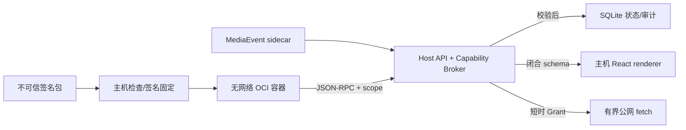

# 插件框架安全模型

## 保护目标与信任边界

第三方插件包、manifest、容器输出、状态迁移结果、事件处理结果和 UI 文档全部视为不可信。主机
API、Capability Broker、SQLite、签名信任库和前端声明式 renderer 属于可信计算基。Docker daemon、
宿主操作系统和管理员账户在当前本地部署模型中是受信任基础设施。

## 强制控制

- 包：两阶段安装、Ed25519 签名、发布者 fingerprint 固定、image/assets digest、Host API 范围、
  ZIP 路径/链接/数量/压缩与解压上限。
- 内置插件：公开目录只来自服务端固定 allowlist，不接收源码路径、Dockerfile、命令、镜像标签、输出
  路径或签名路径。动态签名只允许非生产环境显式开启，工作根必须是仓库外绝对目录；构建后仍进入
  同一检查票据、精确权限接受、发布者固定、安装和 Docker 导入链，不能以“内置”身份绕过控制。
- 进程：插件不进入 API/Worker/浏览器；Docker 使用 `--network none`、`--read-only`、
  `--cap-drop ALL`、`no-new-privileges`、PIDs/CPU/内存上限，仅有 `noexec,nosuid` 的临时 `/tmp`。
- 数据：不挂载项目、数据库、Docker socket、主机目录或 Secret；子进程只继承 PATH、SYSTEMROOT、
  WINDIR 等启动所需 allowlist。
- 身份：主机从已启动容器对应的 `plugin_id@version@generation` 建立 principal，不信任插件请求里
  自报身份。每个 binding 使用随机 scope，重启即失效，不能跨插件或跨 MediaSession 使用。
- 能力：默认拒绝；能力必须在 Host Registry、manifest 权限和已接受权限中同时存在。
  `media.*`、network effect、external_write 还要求未到期、未撤销、身份/版本/会话/范围/调用预算匹配
  的 Grant。
- 模型：`model.invoke` 只经过 Host adapter，第三方容器不会收到模型 API key、Authorization header
  或 Provider 原始响应；共享并发、输入字符、输出 token/bytes 和 timeout 都由 Host 限制。
- 交付：`delivery.prepare/query` 和 `document.publish` 只接受当前随机 session scope 所绑定会话的
  Package。发布文档必须匹配 Package evidence index，并禁止 raw HTML 与不安全 Markdown URL。
- 网络：容器不能直连。`network.fetch` 只允许 HTTPS 公网地址，DNS 与每次重定向都重新检查，
  拒绝 loopback、私网、link-local 和元数据地址，并限制方法、MIME、响应大小、重定向和超时。
- UI：插件不能提供 HTML/JS/CSS、webview 或 iframe；未知输入从 `dict/unknown` 解析为闭合 Pydantic
  schema，限制深度、节点、字符串、表格、选项和 action 数，再由主机组件渲染。
- 协议：newline JSON-RPC 有行、消息、pending request、timeout 和公开错误码上限。RPC 错误不回显
  traceback、数据库内容、密钥或原始 Provider payload。
- 持久化：状态按 package version 和 session namespace 隔离，使用乐观版本和总配额；事件先记录
  delivered 再记录 ack。迁移结果有数量、shape、namespace、key、版本、重复项和配额校验，并与
  preferred version 切换处于同一事务。
- 幂等与审计：声明支持幂等的本地写能力必须提供 key，调用记录与 session-bound adapter 共享事务；
  审计只记录 capability、invocation ID、结果状态和稳定错误类型，不记录模型 prompt、输入 payload、
  文档正文或源字幕正文。安装及每次调用都会重新核对 Host Registry 和已接受权限。

课程整理插件的 manifest 只含 `state.get`、`state.put`、`ui.publish`、`model.invoke`、
`delivery.prepare`、`delivery.query`、`document.publish` 七项权限。七项都不授予插件容器直接网络，
且该 manifest 不含 Host 代理网络能力 `network.fetch`。模型调用由 Host adapter 持有凭据；交付和
文档能力只接受当前 scope 对应 Package，并不能访问任意数据库、文件或其他会话。

## 外部写入原则

当前默认框架未注册第三方外部写 capability。未来即使加入，也必须满足：Host-only registry、
`effect=external_write`、短时 action Grant、显式用户动作、幂等键、调用预算、结果审计，以及未知结果
的 reconciliation；插件声明权限本身不能授权副作用。

## 威胁与处置

| 威胁 | 主要控制 | 失败时处置 |
| --- | --- | --- |
| 恶意/替换包 | 签名、fingerprint、摘要、版本不可变 | 拒绝安装，撤销发布者信任 |
| ZIP bomb/路径穿越 | 成员/字节上限、规范化路径、拒绝链接 | 删除 staging，不导入镜像 |
| 容器逃逸尝试 | Docker hardening、无挂载/网络/capability | 禁用插件，保留审计，升级 Docker/OS |
| 跨会话数据访问 | 随机 scope、generation、package namespace | stale scope 立即拒绝 |
| SSRF/内网探测 | 容器断网、broker DNS/redirect 公网校验 | capability denied/failed 审计 |
| UI 注入 | 闭合 schema、主机 renderer、无 raw HTML | 拒绝整个 view |
| 资源耗尽/崩溃循环 | 消息/状态/容器额度、timeout、quarantine | 隔离并人工审查 stderr/audit |
| 重放/重复副作用 | durable cursor、乐观状态、本地写入幂等、外部写 reconcile | 不盲重试未知外部结果 |

## 已知限制

当前保证限于受测试的本机 Docker boundary，不防御被管理员/root 控制的宿主、被攻陷的 Docker
daemon 或内核级容器逃逸。Docker Desktop/WSL2 的实际隔离仍依赖对应版本安全更新。单实例 SQLite
没有多租户加密、行级租户策略、分布式租约或跨主机容器所有权；插件状态静态加密也不在本阶段。

诊断与课程插件测试能证明当前启动参数下容器看不到 sentinel/主机 Secret、不能写根文件系统、
没有挂载、不能直接联网；课程 smoke 还检查 `NetworkMode=none`、只读根、`CapDrop=ALL` 和
`no-new-privileges`，并从真实内置检查端点完成动态构建和二阶段安装。双插件 E2E 进一步验证同一
MediaSession 的复合视图/命令寻址与 plugin ID 文档过滤不会交叉归属。这些不是形式化证明。每次 Docker、基础镜像、container arguments、Host
capability 或 mount 策略变化后必须重新运行三条真实 smoke，并人工检查 `docker inspect`。任何隔离检查失败都应阻止发布，不能
静默切换到 cooperative process。
